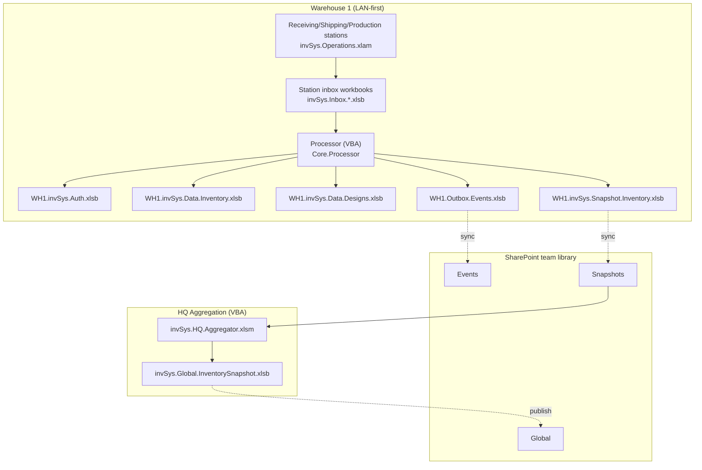
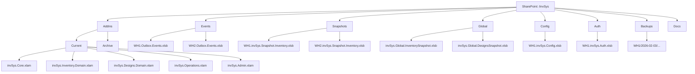
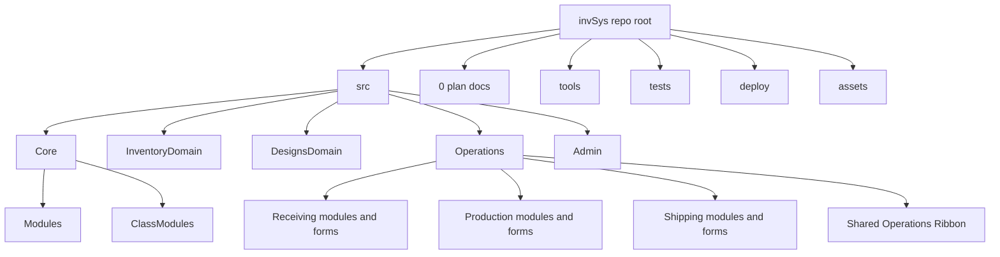
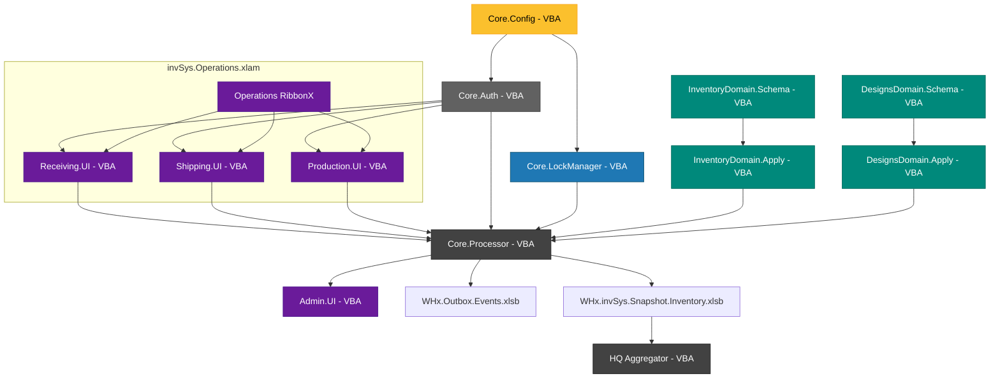
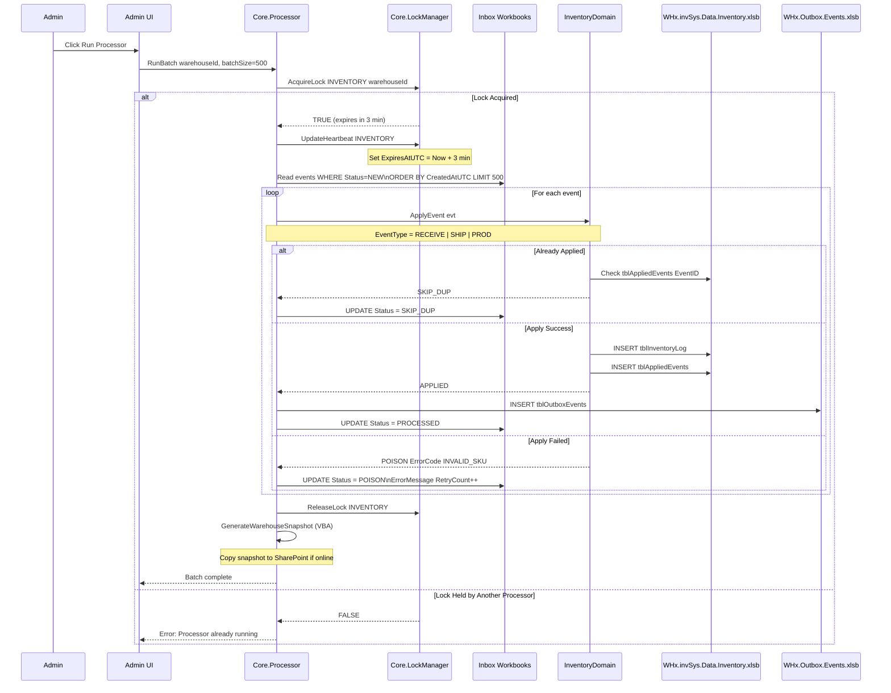

# invSys Architecture v4.11 - Release 1 Plan
**Project:** invSys Multi-Warehouse Inventory System  
**Version:** 4.11 (VBA Release 1)  
**Date:** July 26, 2026  
**Author:** Codex  
**Purpose:** Complete architectural specification for Release 1 (VBA/Excel only).

---
## Reference Links
- `https://www.perplexity.ai/search/https-github-com-soetrain-invs-IL_KZ22YSsW5kMph4kOzxA?preview=1#7`
- `https://www.perplexity.ai/search/this-is-my-retconned-plan-plan-1l63Rt2_SDSKyOklg90qdA#7`

### v4.11 Revision Summary
- Consolidates Receiving, Production, and Shipping deployment into `invSys.Operations.xlam`.
- Reduces operator-visible invSys ribbon tabs to one Operations tab, with a second Admin tab only on administrative setups.
- Keeps Core and both Domain XLAMs separate and headless.
- Preserves independent role modules, forms, capabilities, staging, inboxes, and event contracts.
- Adds legacy role-add-in retirement, coexistence prevention, selective project builds, package-manifest validation, and consolidated-package test gates.
- Adds a scoped test-first development rule for Core, Domain, service, and high-risk form-action work.
- Replaces worksheet `ROW` identity with immutable system-wide `System_Key`,
  establishes extensible-header rules with managed `Condition`, and adopts a
  greenfield Generate Warehouse/demo-seed boundary with no old-inventory import.
- Defines Production as reusable versioned Processes assembled into validated
  Recipe graphs, with multi-output completion and exact-key run allocation.

---
## Release Strategy
### Release 1: VBA-Only Foundation (AUTHORITATIVE FOR SHIPPING)
**Scope:** Complete event-sourced inventory system implemented entirely in VBA/Excel.
- Core: Auth, Config, LockManager, Processor (VBA)
- Domain: InventoryDomain, DesignsDomain (VBA)
- Role UIs: Receiving, Shipping, Production (VBA + RibbonX), packaged together in `invSys.Operations.xlam`
- Admin: Console, processor orchestration (VBA)
- HQ: Aggregation via VBA macro (Excel-based)
- Distribution: SharePoint team document library
- Published deployment set: Five XLAM add-ins (`Core`, `Inventory.Domain`, `Designs.Domain`, `Operations`, `Admin`) + workbooks

**No external dependencies:** R1 requires only Excel + SharePoint (no Python, .NET, or other runtimes).

### Operator Deployment Model (R1 Locked)
- XLAM installation is account-scoped. On a given Windows/Excel account, each installed invSys XLAM loads into every workbook opened in that Excel session.
- This is expected baseline behavior for the simplest end-user workflow and is not itself a defect.
- An operations-only account installs Core, both Domain XLAMs, and Operations. An administrative account also installs Admin.
- A normal operator sees one invSys ribbon tab, **Operations**. An administrative setup may show **Operations** and **Admin**. Core and both Domain XLAMs are headless.
- The normal operator path is a saved workbook (`.xlsm` or `.xlsb`) reopened under that shared XLAM session, not an unsaved transient `Book1`.
- `Book1` / new-blank-workbook testing remains useful as a diagnostic stress case, but Phase 6 completion cannot be claimed from that path alone.
- Phase 6 proving must explicitly cover four stages in order: one-account local use, multi-PC LAN use, LAN + WAN use, then central aggregation.

---
## Progress Tracking (v4.11)
**Legend:** `[ ]` not started, `[x]` complete

### Release 1 Milestones
- [x] Phase 1 complete: Foundation
- [x] Phase 2 complete: Event Processing
- [x] Phase 3 complete: Role UI
- [x] Phase 4 complete: Admin Tooling
- [ ] Phase 5 complete: Multi-Warehouse Sync
- [ ] Phase 6 complete: User Systems and XLAM Hardening
- [ ] Phase 7 complete: Polish and Release

### Key Architecture Deliverables
- [x] Core.ItemSearch module implemented (shared normalization/query/filter logic)
- [x] Shared Core item-search form implemented with role-aware columns and filters
- [x] Processor idempotency verified with duplicate-event test
- [x] Schema self-heal validation verified across required workbooks

---
## Executive Summary
### Purpose
This document provides a single, coherent, Codex AI-ready specification for the invSys retcon project. It converts a legacy VBA inventory management application into a modern, event-sourced, multi-warehouse system. Release 1 is the only shippable specification.

### Key Architectural Principles
1. **Event Sourcing:** All domain state changes happen via inbox/outbox event streams.
2. **Offline-First:** Each warehouse operates autonomously on LAN; SharePoint is a convenience layer.
3. **Clear Boundaries:** Core (orchestration) / Domain (writes) / Role (UI) separation.
4. **Idempotent Processing:** Crash-safe, restart-safe event application.
5. **VBA-First:** R1 runtime is 100% VBA; external runtimes are out of scope.
6. **Stable Entity Identity:** Durable inventory entities use immutable
   system-wide `System_Key`; worksheet position and business labels are not
   identity.

### System Capabilities
- Multi-warehouse inventory tracking (receiving, shipping, production).
- Offline-capable operations with eventual consistency.
- Role-based access control with capability enforcement.
- Event-driven architecture with processor-based batch application.
- Greenfield managed schemas with extensible headers and rebuildable
  projections; no old-business-inventory import.

**Advisory-only global visibility:** The central aggregator's global snapshot is advisory only. Each warehouse's `WHx.invSys.Data.Inventory.xlsb` remains the only authoritative inventory store for that warehouse.

### Technology Stack (Release 1)
**Core System:**
- **Platform:** Microsoft Excel 2016+ (Windows)
- **Language:** VBA (Visual Basic for Applications)
- **Persistence:** Excel workbooks (.xlsb, .xlsm, .xlam)
- **Distribution:** SharePoint Online document library (team library)
- **Scheduling:** Windows Task Scheduler (opens Excel, runs VBA macros)
- **Version Control:** Git (via VBA source export scripts)

**No runtime dependencies:** R1 requires only Excel + SharePoint.

---
## Architecture Decisions
### D1 -- One Write Model Everywhere: Inbox/Outbox + Processor
**Decision:** All domain state changes happen by **appending events** into an **inbox** (and/or publishing **outbox** events). A **processor** is the only component that applies events to authoritative data stores.

**Rationale:**
- Enforces single-writer pattern (processor only)
- Enables offline operation (append-only inboxes do not block)
- Provides audit trail and idempotency
- Crash-safe: unapplied events remain in inbox

**VBA Implementation Details:**
```text
RULE: Each station writes to its OWN inbox file (e.g., invSys.Inbox.Receiving.S1.xlsb).
Processor reads ALL station inboxes sequentially in a single warehouse run.
This avoids VBA file-locking conflicts when multiple stations append simultaneously.
```

**SharePoint Sync Strategy:**
```text
RULE: Outbox files are written atomically to local disk, then copied to SharePoint
team library when online. HQ Aggregator copies outbox files to a local temp
folder before reading to avoid corruption from incomplete syncs.
```

---
### D2 -- Multi-Warehouse, LAN-First, SharePoint as Convenience Layer
**Decision:** Each warehouse has **local authoritative Excel workbooks** (inventory and optionally designs) and can operate when internet is down. Warehouses **publish outbox workbooks** (and periodic snapshot workbooks) to a **SharePoint team document library** when online. HQ aggregates events and produces a **global snapshot workbook** for cross-warehouse visibility.

**Visibility rule:** Global totals are advisory only. Cross-warehouse views must never be treated as more authoritative than the local warehouse store that produced them.

**Conflict Resolution:**
```text
RULE: Global snapshot aggregation is last-write-wins by AppliedAtUTC. Conflicts
are logged but not blocked. Each warehouse's authoritative store remains
independent; global snapshot is advisory only for cross-warehouse visibility.

Example: If WH1 and WH2 both receive SKU-123 at 10:05 AM, HQ snapshot shows both
transactions with their respective AppliedAtUTC timestamps. No merge/
reconciliation is performed.
```

**Consistency Model:**
- **Warehouse-local:** Strongly consistent (single processor per warehouse)
- **Cross-warehouse:** Eventually consistent (via periodic sync)
- **Global snapshot:** Point-in-time consistent (rebuilt from warehouse snapshots)

**Operational guarantees by deployment scope:**

| Scope | Consistency guarantee | Processor ownership | Snapshot freshness expectation |
|---|---|---|---|
| One-account local | Strong, single writer in one Excel/account context | Same account/session | Immediate or operator-triggered |
| LAN warehouse | Strong within warehouse, processor serialized by lock | Designated warehouse PC/session | Minutes |
| LAN + WAN | Strong local, eventually consistent cross-warehouse | One processor lane per warehouse | Hours / shift depending on connectivity |
| Central aggregation | Advisory only; global totals are not authoritative | HQ aggregator / scheduled Excel session | Per publish/sync cycle |

**LAN + WAN warehouse hub note (v4.8):** For Release 1, the preferred LAN + WAN model is a **single authoritative warehouse hub on a NAS**, with WAN stations acting as **relay-first event sources** rather than live editors of canonical warehouse workbooks over the internet.

**Operational interpretation:**
- WAN is **eventually consistent by design**. Remote stations may feel "live" only in advanced deployments such as VPN-to-LAN, and that is not the primary Phase 6 proving path.
- A Synology `DS920+` or equivalent NAS is the **authoritative file host** for its warehouse. It stores the canonical warehouse runtime, including `WHx.invSys.Data.Inventory.xlsb`, `WHx.invSys.Auth.xlsb`, `WHx.invSys.Config.xlsb`, `WHx.invSys.Snapshot.Inventory.xlsb`, and the warehouse inbox/outbox workbooks.
- The NAS is **not** the processor host. One designated Windows/Excel PC on that warehouse LAN remains the single processor lane and reads/writes the warehouse runtime over SMB.
- **SharePoint remains the WAN relay for R1.** Remote WAN stations publish event bundles and sync artifacts through the existing SharePoint path rather than becoming direct internet-connected editors of the canonical warehouse `.xlsb` files.
- LAN stations may work directly against the warehouse hub; WAN stations publish into the same warehouse processor lane on next sync. Totals reconcile because the processor is still the sole writer to the authoritative warehouse store.
- Internet connectivity is optional for warehouse availability. The non-negotiable availability guarantee is that a warehouse continues operating on **LAN + NAS + one processor PC** even when WAN/internet is unavailable.

---
### D-NAS -- Three-Layer Warehouse Connection Model
**Decision:** Runtime warehouse access is a three-layer connection model owned by Core and shared by the role modules inside `invSys.Operations.xlam` and by `invSys.Admin.xlam`:
1. **NAS / Windows credential layer:** establishes the current Windows/Excel session's SMB access to a warehouse root such as `\\100.84.136.19\invSysWH1`.
2. **Warehouse target layer:** selects the active warehouse runtime root, config workbook, auth workbook, inbox roots, processor identity, and HQ publication context.
3. **invSys user layer:** signs in the operator against the selected warehouse's auth workbook and enforces role/capability access.

**Rationale:**
- Receiving, Shipping, and Production operators may not have `invSys.Admin.xlam` loaded, so Admin cannot be the only place where NAS access is established. The Operations ribbon must expose the normal operator connection and sign-in path.
- A valid NAS login does not identify the invSys operator; it only proves the Excel session can reach the files.
- A valid invSys user login is scoped to a selected warehouse target and must be validated against that target's auth workbook.
- A local fallback such as `C:\invSys\WH1` must not silently override a deliberately selected NAS/server warehouse.

**Resolver priority rule:**
```text
RULE: Runtime resolution must prefer explicit and remembered operator intent over local defaults.

Priority:
1. Current in-session warehouse target override
2. Remembered warehouse target from the current Office/Windows profile
3. Remembered warehouse scan roots / NAS roots that still contain valid config/auth workbooks
4. Open workbook-local or active runtime config, when explicitly selected or unambiguous
5. Default local development root such as C:\invSys\WH1

If a higher-priority NAS/server target is unreachable, Operations/Admin must surface
a clear connect/reconnect prompt. They must not silently fall back to a local
warehouse with the same or similar WarehouseId.
```

**Operational rule:** Core owns the shared NAS connection UI/API, remembered warehouse target, current user state, and runtime resolver. Admin may expose richer management forms, but the shared Operations ribbon must expose enough UI for Receiving/Shipping/Production operators to connect to a NAS/server root, select a warehouse target, and sign in as an invSys user. The Admin ribbon mirrors the same Core-owned live warehouse selector and selection callback; selecting a target from either ribbon invalidates and refreshes both displays.

**Operator sign-in workflow:** `invSys.Operations.xlam` must allow a normal operator to work without loading `invSys.Admin.xlam`:
1. **Server Sign In** on the Operations ribbon revalidates the remembered/current warehouse storage target and refreshes visible server status. It does not open the warehouse storage credential/selection form in normal Receiving, Shipping, or Production workflows unless Windows has no usable credential for the saved server root.
2. Storage credential/selection UI belongs in Admin/setup or Runtime Context troubleshooting, not in the normal role operator path. This is storage authority only.
3. **invSys Sign In** authenticates the operator as an invSys user against the selected warehouse auth workbook. If no live server session and usable target are selected, invSys Sign In tells the operator to use Server Sign In and select storage first; it must not revive a remembered target or show NAS credentials as an invSys login.
4. Ribbon labels show both server state (`Server: Connected ...` / `Server: Not connected`) and user state (`invSys Sign In` / `invSys Sign Out`). Windows, Office, and NAS account names must not be displayed as the invSys user.
5. **invSys Sign Out** clears only the invSys user session/capability cache. It retains the current NAS/server session so another invSys user can authenticate without reconnecting Windows storage.
6. **Server Sign Out** first clears the invSys user session, then clears the current warehouse target and disconnects the Windows SMB session established for that server root. Server and invSys controls return to their signed-out labels, server status changes immediately to `Server: Not connected`, and all capability-gated operator controls remain disabled until Server Sign In, warehouse selection, and invSys Sign In succeed again.
7. Operations write/send buttons require an allowed warehouse target, a signed-in invSys user, and the required capability. Admin remains the authority for creating invSys users and assigning capabilities, but Operations sign-in must not require Admin to be loaded.
8. A generated warehouse created before computer-name station identity may retain
   `S1` as a legacy placeholder. After, and only after, the submitted invSys
   secret validates for the exact user, Core may idempotently transition that
   same user's effective active `S1` capability rows to the selected station
   when the selected station exactly equals the current Windows computer name
   and `S1` remains configured in that warehouse. The transition preserves
   capability, warehouse scope, and validity dates; it does not overwrite any
   existing current-station row, does not override a current-station deny, and
   does not invent a capability absent from the user's effective `S1` scope.
   Authorization continues against exact current-station rows; `S1` is not a
   runtime wildcard or permanent alias.

**Procedure contract:** The binding VBA API, resolver behavior, ribbon callback rules, credential handling rules, and Phase 6 D-NAS tests are maintained in `D-NAS_Procedure_Contract.md`. This architecture section defines the model; the procedure contract defines the implementation surface.

---
### D3 -- Clear Ownership Boundaries
**Decision:**
- **Core:** Authorization gate, orchestration, config, lock manager, processor runner, shared utilities, NAS connection/session handling, warehouse target selection, current-user state, and runtime resolver
- **Domain XLAMs:** All writes to authoritative data stores + domain invariants
- **Operations XLAM:** Receiving, Production, and Shipping UI + event creation only; the three roles remain separate internal modules/forms
- **Admin XLAM:** Orchestration console only (invokes Core + domain routines; does not write domain tables directly)

**D-NAS implementation boundary:** Core-owned NAS connection, warehouse target, current-user, and capability-gate procedures must follow `D-NAS_Procedure_Contract.md`. Operations role modules and Admin consume that Core API; they must not implement independent NAS credential prompts, warehouse target resolvers, current-user caches, or direct capability checks.

**Packaging clarification:** Receiving, Production, and Shipping are packaged together in `invSys.Operations.xlam` per D12. Packaging them together does not permit one role module to mutate another role's local workflow state or bypass its event-creation contract.

**Boundary clarification:**
```text
RULE: `invSys.Inventory.Domain.xlam` is a domain engine. It contains code,
invariants, schema definitions, validators, and projection builders. It is NOT
an authoritative data store. All live inventory state is persisted in
`WHx.invSys.Data.Inventory.xlsb`, never inside the XLAM itself.

RULE: Operator workbooks own their local workflow/staging tables
(`ReceivedTally`, shipping staging, production staging, local workflow logs).
These are ephemeral work surfaces. They are not synced or aggregated as domain
truth. The domain only sees what the operator explicitly submits as an inbox
event.
```

**Clarification on Domain Reads:**
```text
RULE: Domain XLAMs expose READ-ONLY query functions (e.g., GetOnHandQty, GetBOM,
ListDesigns). Admin XLAM and Operations role modules may call these for UI display. WRITE
operations go through Core.Orchestrate only.

Example:
- OK: Admin calls InventoryDomain.GetOnHandQty(SKU) to display current inventory
- NO: Admin directly writes to tblInventoryLog (forbidden)
- OK: Admin calls Core.Orchestrate("ADJUST_INVENTORY", payload) (creates event in inbox)
```

---
### D4 -- Forms Strategy (Shared Search Form + Role Profiles)
**Decision:** Item search uses one runtime-built Core form, `frmItemSearch`, with role-aware profiles for Receiving, Shipping, Production, and Admin. The caller supplies the role profile; Core owns the shared form, normalization, query, filtering, and dynamic event wiring. Role packages must not carry empty role-named search forms or unused dynamic-form templates.

**Rationale:** Receiving, Shipping, Production, and Admin need different search priorities and defaults (vendor/PO focus vs available-to-pick focus vs BOM/WIP focus vs full diagnostics), but the Release 1 layouts are produced from one shared runtime builder. Role-aware profiles provide the required behavioral differences without retaining empty copied form shells or synchronizing duplicate designers.

**UI layout note (v4.8):** For complex VBA userforms, prefer the combined method of **Windows API resize plus Andy Pope's anchor-based layout**. The form receives native corner/edge drag resize behavior via Windows API, while controls resize or reposition declaratively through anchors (`Left`, `Top`, `Right`, `Bottom`) rather than per-form coordinate math. This is the preferred future pattern for Admin and other complex forms, and should be reused instead of introducing new one-off resize logic.

**Implementation Rules:**
```text
RULE: Core.ItemSearch contains:
  - Search normalization (trim, case normalization, synonym mapping)
  - Index query logic for tblItemSearchIndex (Scripting.Dictionary lookups)
  - Role-aware filtering (for example: RECEIVING includes expected receipts,
    SHIPPING defaults to available inventory, PRODUCTION includes BOM links/WIP)
  - The single runtime-built frmItemSearch and its dynamic event wiring

RULE: Each role module contains:
  - A role-profile selection for the shared item-search form
  - Role-specific entry-point behavior; business search rules and shared form
    event wiring stay in Core.ItemSearch

RULE: Empty role-named search forms and unused dynamic-form-template shells are
not Release 1 components and must not be packaged.

RULE: Packaging multiple role modules in invSys.Operations.xlam does not merge
their forms, staging state, event payloads, or capability requirements.
```

**Form Ownership Matrix:**
| Component | Receiving | Shipping | Production | Admin |
|---|---|---|---|---|
| `Core.ItemSearch` (module) | Shared | Shared | Shared | Shared |
| `frmItemSearch` (runtime-built Core form) | Shared profile | Shared profile | Shared profile | Shared profile |

---
### D5 -- Core.Config Contract (R1 Locked)
**Decision:** `WHx.invSys.Config.xlsb` is the single authoritative config source in R1 (no workbook-local overrides).

**Rules:**
- Precedence is fixed: `tblStationConfig` -> `tblWarehouseConfig` -> hardcoded defaults.
- Config is strongly typed and schema-validated at load; required missing keys fail validation.
- `Core.Config` is read-only in R1 with explicit `Load`/`Reload` support.
- Missing optional keys use defaults and log warnings.
- Missing required keys or missing workbook fails closed for write operations.

**Public API Contract:**
- `Load(Optional whId, Optional stId) As Boolean`
- `Get(key) As Variant`
- `GetRequired(key) As Variant`
- `TryGet(key, ByRef outVal) As Boolean`
- `Reload() As Boolean`
- `Validate() As String`
- `GetWarehouseId() As String`, `GetStationId() As String`

---
### D6 -- Locking Runtime Rules (R1 Locked)
**Decision:** Processor lock behavior is standardized across warehouses.

**Rules:**
- Lock order is always `INVENTORY` then `DESIGNS` (only when required).
- Heartbeat updates every 30 seconds while lock is held.
- `ExpiresAtUTC` is `Now + 3 minutes`, extended on heartbeat.
- If batch lock hold exceeds 2 minutes, log warning and tune batch size.
- Break-lock requires `ADMIN_MAINT` and an audit reason.

---
### D7 -- Poison Handling and Reissue (R1 Locked)
**Decision:** Poison rows are immutable audit history.

**Rules:**
- Failed rows are marked `POISON` with `ErrorCode`, `ErrorMessage`, `RetryCount`, `FailedAtUTC`.
- Admin reissue creates a new event row with a new `EventID`.
- Reissue links with `ParentEventId = <original EventID>`.
- Original poison row is never edited back to `NEW`.

---
### D8 -- Capability Enforcement and Audit (R1 Locked)
**Decision:** Core is the sole authorization authority for posting and processor actions.

**Rules:**
- Role UI gating is advisory; Core gate is authoritative.
- Gate decisions log: request/event id, user, capability, warehouse, station, result, timestamp, source.
- Capability cache uses TTL; if cache expires and cannot refresh, write operations fail closed.
- If TTL expires mid-processor-run, finish current run with current cache and refresh before next run.

---
### D9 -- Operator Read Models and Refresh Contract (R1 Locked)
**Decision:** Operator-facing inventory tables are read models refreshed from published or local warehouse snapshots. They are not authoritative write targets.

**Rules:**
```text
RULE: Operator read model tables (for example, the visible `invSys` table in an
operator workbook) are refreshed by snapshot copy/import only.

RULE: Refresh must not modify local workflow/staging tables such as
`ReceivedTally`, shipping staging, production staging, or workbook-local logs.

RULE: R1 default refresh trigger is manual. Optional on-open refresh is allowed
only when explicitly enabled (for example via `FF_AutoSnapshot = true`).

RULE: Missing or stale snapshots do NOT block inbox event posting. The operator
may continue working against cached/local state, but the workbook must expose
that staleness visibly.
```

**Required metadata exposed on operator read models:**
- `LastRefreshUTC`
- `SnapshotId`
- `SourceType` (`LOCAL`, `SHAREPOINT`, `CACHED`)
- `IsStale`

---
### D10 -- Inventory Command/Read Split (R1 Locked)
**Decision:** Inventory uses one write path and many rebuildable read models.

**Rules:**
```text
RULE: All inventory writes flow through inbox events + processor application to
`tblInventoryLog` / `tblAppliedEvents` in `WHx.invSys.Data.Inventory.xlsb`.

RULE: Detailed `tblInventoryEntities` plus aggregate `tblSkuBalance` and
`tblLocationBalance` projections are derived views only. They may be dropped
and rebuilt at any time from the event log and applied-event ledger without
data loss. Detailed entity rows preserve `System_Key`; aggregate rows group by
their declared SKU/Location dimensions.

RULE: If a projection conflicts with the event log, the event log wins.
Operator-facing inventory views must be regenerated from authoritative log state.
```

---
### D11 -- Shipping System Inventory Boundary and A+B Event Loop (R1 Locked)
**Decision:** Shipping system inventory display has one hard boundary: `NAS Inv` is the server/read-model value produced by the transaction loop. Local actions queue or stage transaction events, the processor applies those events to the server inventory log/read model, and users fetch that updated read model back into the role UI. `NAS Inv` must not be overwritten, reduced, inflated, or repaired by local Shipments math, Box Maker math, `Projected Inv` overlays, sent overlays, or `Locked` reservation display.

**Projected Inv rule:**
```text
Projected Inv = NAS Inv - active Shipments list quantity for the same package System_Key and BOM version
```

`Projected Inv` is a local display calculator only. It does not write to `invSys`, does not repair `NAS Inv`, and does not use sent overlays, backend fallback inventory, local `invSys.TOTAL INV`, or reservation totals as its base.

**Locked rule:** `Locked` is a reservation/floor guard. It can prevent over-ordering and show inventory reserved by active shipment rows, but it never changes `NAS Inv`.

**A+B event loop model:**
```text
A = immediate local/UI staging, validation feedback, reservation rows, and SHIPMENTS lock quantity.
B = queued backend/server event processing and read-model catch-up.
```

A may predict local availability and reserve inventory for the operator experience. A must also queue/log the transaction for server processing. B applies those queued events to the server inventory log/read model, and role UIs fetch the resulting values back from that read model. B is the only authority for NAS inventory, but the UI may show explicit pending/local state while the A-to-B-to-fetch loop is incomplete. The Shipping system must display backend/read-model inventory as `NAS Inv` until B publishes new values.

**Shipping system display rules:**
- `NAS Inv` comes from the loaded shippables/read-model value only.
- `Projected Inv` subtracts the current active Shipments list quantity from `NAS Inv`.
- Pending/sent projected overlays must not drive Shipments form display.
- Local `invSys.TOTAL INV` must not be mutated by shipment Add, To Shipments, Remove, or Shipments Sent reservation handling.
- Local `SHIPMENTS` may track the lock/staging quantity used by validation and release.
- If an inventory floor/minimum column is present, shipment locking must leave available inventory above that floor.

**Shipment flow:**
- Add queues or records a reservation/lock immediately and leaves `NAS Inv` unchanged.
- Add validation uses available quantity after current locks: `TOTAL INV - SHIPMENTS`, then applies any item floor as an orderable lower bound.
- Displayed availability is allowed only as an explicit override for stale local read-model cases; it still cannot change `NAS Inv`.
- Remove releases the row's local lock contribution and leaves `NAS Inv` unchanged.
- To Shipments moves the row to the dock/shipping area; it does not locally change `NAS Inv`.
- Shipments Sent queues the final shipment event, clears completed rows/locks, and waits for backend/read-model catch-up to change `NAS Inv`.

---
### D12 -- Operations Packaging Consolidation (R1 Locked)
**Decision:** Receiving, Production, and Shipping ship in one deployed add-in, `invSys.Operations.xlam`. It exposes one Excel ribbon tab named **Operations**, with independently capability-gated Receiving, Production, and Shipping groups. `invSys.Admin.xlam` remains a separately installed add-in with a separate **Admin** ribbon tab for administrative setups. `invSys.Core.xlam`, `invSys.Inventory.Domain.xlam`, and `invSys.Designs.Domain.xlam` remain separate headless add-ins with no ribbon tabs.

**Package set:**
```text
invSys.Core.xlam
invSys.Inventory.Domain.xlam
invSys.Designs.Domain.xlam
invSys.Operations.xlam
invSys.Admin.xlam
```

**Boundary rule:** This is a packaging and operator-navigation change, not a domain or role-responsibility merge. D3 remains binding. Receiving, Production, and Shipping retain separate internal modules, forms, local workflow state, capability checks, event builders, and tests inside the Operations VBA project. Combining the binary must not produce a shared mutable role-state module or a single monolithic role form.

**Ribbon rules:**
- The Operations tab owns shared server connection, invSys sign-in/sign-out, current-user, warehouse, and runtime-status controls.
- Receiving, Production, and Shipping appear as distinct groups or launch surfaces on that tab.
- Each group and each write action remains gated by its existing capability (`RECEIVE_POST`, `PROD_POST`, `SHIP_POST`, and any more specific capability).
- A user lacking a role capability must not gain that role merely because its code is present in the same XLAM.
- Operations-only installations do not require `invSys.Admin.xlam`. Administrative installations may load Admin beside Operations, producing at most two invSys ribbon tabs.
- Core and Domain packages remain headless and must not create tabs, groups, or operator buttons.

**Source and build rules:**
- Source responsibilities remain separated by role even if the build project imports them into one XLAM.
- `build-xlam.ps1` must support selecting the complete Operations project as a build target, plus any changed Core/Domain dependency. VBA modules are not independently deployable build products; selecting one changed Operations module still rebuilds the complete `invSys.Operations.xlam`.
- Integration checkpoints build and validate the complete five-XLAM package.
- Published packages require a manifest or equivalent validation proving that exactly the five expected XLAM filenames are present and version-coherent.
- Temporary staging, candidate, hotfix, and validation packages are disposable build outputs and must not be committed as deployed products.

**Upgrade and coexistence rules:**
- Installation or upgrade to v4.11 must unregister and remove `invSys.Receiving.xlam`, `invSys.Production.xlam`, and `invSys.Shipping.xlam` from the account-scoped Excel add-in load list.
- The three legacy role XLAMs must not load in the same Excel session as `invSys.Operations.xlam`; simultaneous loading risks duplicate ribbon tabs, callback collisions, duplicate startup mutation, and ambiguous macro routing.
- Setup and diagnostics must detect stale standalone role add-ins and provide a clear remediation path.
- Role inbox workbook names, operator workbook names, event types, and capability names do not change solely because of this package consolidation.

**Failure-isolation rule:** Because a compile or startup failure in the combined Operations package can affect all three operator roles, packaged validation must compile and initialize every role module and open every role form before publication. A failure in one role blocks publication of that Operations build; runtime error handling must still isolate a role-form failure so an already loaded Operations tab can report the failing role clearly.

**Rationale:**
- Reduces operator-visible invSys ribbon tabs from four to one for normal operations, or two when Admin is also installed.
- Removes duplicate role bootstrap, connection, sign-in, status, and RibbonX wiring.
- Shortens normal development packaging from three role binaries to one Operations binary.
- Preserves the Core/Domain/Role boundaries and distinct operator workflows.

---
### D13 -- Test-First Development for Core, Domain, Service, and Form-Action Contracts (R1 Locked)
**Decision:** New behavior and defect corrections must be driven by a failing automated test before implementation wherever VBA can exercise the contract deterministically. The required sequence is **RED -> GREEN -> REFACTOR**. Manual observation may discover a defect or clarify expected behavior, but it is not completion evidence.

**Core, Domain, processor, and service-layer rule:**
```text
Before changing Core, Inventory Domain, Designs Domain, processor application,
typed run-session logic, completion services, event builders, projection
builders, or other non-visual contract code:

1. Write or select the automated test that expresses the intended contract.
2. Run it and record RED: it fails for the expected missing/incorrect behavior.
3. Implement the smallest contract-compliant change.
4. Run it and record GREEN.
5. Refactor only while the focused test and relevant regression set remain green.
```

The RED result must be meaningful. A failure caused only by an unrelated compile error, missing fixture, unavailable workbook, or broken test harness does not prove the target behavior.

**Form, RibbonX, and worksheet-event rule:** Strict unit-level TDD is not required for purely visual layout, native window behavior, or Excel event wiring that cannot be isolated reasonably. High-risk form actions are still test-first at the integration boundary:
- The packaged reusable-Process and two-batch Operations/Production form-action
  tests must be written and observed failing before the Production
  designer/run-session/completion UI refactor begins.
- Those tests must enter through `mProduction.BtnOpenProductionForm` and
  exercise the same Process save/release/obsolete, Recipe graph
  select/connect/order/save/release/obsolete, ingredient assignment, run
  selection, Apply, Check In, Complete Run, refresh, and Next Batch handlers
  used by an operator; calling a Designs query or completion service directly
  is supplemental evidence, not a substitute.
- Ribbon callbacks and worksheet-bound actions require a failing packaged callback/action test before their behavior is changed.
- Visual-only work requires acceptance geometry or screenshot criteria defined before implementation, followed by automated bounds/overlap checks where practical and visible inspection.

**Completion prohibition:** A Production/Operations, Core, Domain, processor, or service-layer change is not complete when its first relevant automated test was written only after the implementation had already been observed working manually. A retrospective regression test is valuable, but it does not satisfy D13 for that change. The slice must return to a reproducible RED condition—against the pre-fix code or an equivalent isolated seam—before GREEN completion is claimed.

**Session and drift-prevention rule:** At the start of a development session or slice:
1. Name the contract being changed and the test that currently protects it.
2. If no such test exists, create the failing test before editing implementation code.
3. Record the focused RED/GREEN commands or harness entry points in the slice result or generated implementation/baton artifact.
4. Treat absence of a pre-implementation failing test as a spec-process violation to resolve, not as an optional documentation concern.

**Evidence rule:** Test result artifacts must distinguish pre-implementation RED evidence from post-implementation GREEN/regression evidence. A generated report may maintain this evidence, but generated documentation does not replace the normative behavior and ordering requirements in this decision.

**Rationale:** VBA's manual harness works well for pure logic, payloads, schemas, event application, projections, and service contracts, but Excel UI automation is less deterministic. This scoped rule puts strict test-first discipline on the layers where it is reliable and requires test-first integration targets for the UI paths that have historically failed after manual-only development.

---
### D14 -- System-Wide Entity Identity and Extensible Headers (R1 Locked)
**Decision:** Every durable inventory entity uses the exact managed header
`System_Key` as its immutable, system-wide unique identifier. `System_Key`
replaces the legacy worksheet `ROW` concept. `ITEM_CODE`/SKU identifies what an
item is; it does not identify one entity. Location, quantity, `Condition`, and
custom fields are attributes and may change without changing `System_Key`.

**Identity rules:**
```text
RULE: System_Key is generated once at the owning creation/service boundary.
RULE: System_Key is globally unique across warehouses, stations, workbooks,
      events, and role surfaces.
RULE: System_Key is opaque and must not be derived from ROW, worksheet
      position, ITEM_CODE/SKU, item name, Location, or a mutable attribute.
RULE: Sorting, filtering, refresh, save/reopen, movement, condition changes,
      event application, snapshot publication, and projection rebuild preserve
      the same System_Key for the same durable entity.
RULE: New received inventory and each new Production output entity receive new
      System_Key values before their creation event is queued.
RULE: Shipping, Production consumption, reservations, custom attributes, and
      other entity relationships reference the exact System_Key.
RULE: ROW is not a managed runtime header, migration key, display key, or
      compatibility field in the new system.
```

`EventID`, `RunId`, `DesignId`/`DesignVersion`, shipment IDs, and other
specialized identifiers remain when they identify a different record or
workflow concept. They do not replace the affected inventory entity's
`System_Key`.

**Aggregate projection rule:** SKU and SKU/Location balance tables are
rebuildable summaries and may group several entities. They do not impersonate
one contributing entity. Detailed inventory projections and operator inventory
rows carry `System_Key`; aggregate views use their declared grouping columns.

**Header-extension rules:**
- Each managed table defines a required managed-header subset, not an exact
  closed list of columns.
- Code resolves managed fields by normalized header name and never by fixed
  ordinal column position.
- Unknown/end-user-added columns must not make validation fail.
- Refresh, table resize, snapshot hydration, and projection rebuild must not
  delete, clear, reorder, or overwrite unknown local columns.
- Local display/helper columns remain workbook-local.
- Shared custom fields persist by `System_Key` through a declared custom-field
  definition/value or event payload contract; a projection rebuild must be able
  to rematerialize them.
- Managed names and aliases are reserved so custom headers cannot silently
  replace a system field.
- Sensitive custom fields follow the same runtime-report redaction rules as
  managed sensitive data.

**Condition rule:** `Condition` is a managed inventory header, not an
uncontrolled custom field. Seeded demo inventory defaults to `GOOD`. Condition
may change only through the declared event/service path, and partial condition
changes split the affected quantity into a separately keyed entity when needed.
Condition describes physical quality; operational availability/hold state
remains a separate field or projection rule.

**Receiving condition and inventory-disposition rule:** Receiving establishes
`Condition` for each new receipt line before the event is queued; the Inventory
Viewer remains read-only. A PO/BOL may contain lines with different conditions,
and those lines create distinct durable `System_Key` entities even when SKU,
location, and lot match. `Lot` is an independent provenance/traceability
grouping and must not be used as entity identity or as a substitute for
condition.

The Receiving **Returns** page is an outbound inventory-disposition workflow,
not an inbound receipt workflow. It requires a **Disposition** choice of
`RETURN` (goods leave the warehouse for a vendor or other external party) or
`DUMP` (goods are discarded). Both choices reduce on-hand quantity and require
a reference/reason. They do not create a new inventory entity. Each queued
event identifies an existing exact `System_Key`, preserves that entity's SKU,
location, lot, and Condition, and applies a negative quantity delta without
changing identity. The operator enters a positive action quantity; the domain
records the corresponding negative inventory delta. A disposition may not
exceed available quantity or cross item/location/Condition boundaries. When a
visible choice aggregates several entities, staging deterministically allocates
the requested quantity across those exact keys and queues one separately
auditable event per allocation. `RETURN` and `DUMP` remain distinct event/audit
types and use `RECEIVE_POST` because the workflow is owned by Receiving; they
do not impersonate Shipping or Admin adjustment actions.

**Receiving aggregate rule:** `ReceivedTally` retains the separately keyed
staged receipt lines and remains the submission-identity authority.
`AggregateReceived` is a read-only, complete, rebuildable summary. It groups
matching lines by receipt type, item code, UOM, location, lot, and condition;
different conditions never share an aggregate row. Quantity is summed and
distinct PO/BOL/return references are concatenated in first-seen order rather
than forming separate rows. Return reasons are likewise concatenated for the
display summary. Confirm queues and logs every separately keyed
`ReceivedTally` line, never the aggregate row, so display aggregation cannot
collapse `System_Key` or `EventId` identity. Rebuild/refresh must include every
staged line; it may not retain a stale or partial projection.

**Receiving interaction and persistence rule:** The Receiving item-result
projection includes `Condition`, including on the Returns page. When Returns is
selected, its three projections are titled **Return Entries History**,
**Return Tally**, and **Aggregate Returns**, and its action selector displays
`RETURN` or `DUMP`. Multi-line Confirm Writes/Confirm Dispositions batches inbox,
canonical inventory, outbox, and inbox-status persistence at safe artifact
boundaries rather than saving once per row. A healthy sign-in may read and
validate Config/Auth schemas but must not format, dirty, or save unchanged
Config/Auth workbooks.

**Greenfield boundary:** R1 does not import, translate, reconcile, repair, or
map old business inventory into this identity model. No legacy `ROW`-to-
`System_Key` migration is built. Supported test and demonstration state begins
with Admin Generate Warehouse/Create Warehouse and optional bootstrap or Admin
`Seed Demo Inventory`. Old unmanaged inventory is left behind.

**Generate/demo-inventory lifecycle acceptance contract:**
- Fresh Inventory Domain, snapshot, and operator tables contain the required
  managed headers, including `System_Key` and `Condition`, and contain no `ROW`
  header.
- Every seeded durable inventory entity has a nonblank unique `System_Key`.
- The Admin demo-inventory form requires the operator to select either the
  built-in Release 1 workflow kit or an uploaded CSV data set. A validated
  upload is copied into the selected warehouse's managed data-set library and
  remains selectable on later launches. Uploading or selecting a definition
  does not mutate inventory; **Seed Demo Inventory** applies the selected set.
- Repeating a seed is idempotent for active demo groups identified by item
  code, location, and condition. Existing active groups are skipped rather
  than assigned additional durable keys; missing or fully depleted groups are
  created with new unique keys.
- **Delete Demo Inventory** confirms the destructive intent and depletes every
  active `DEMO-` entity through exact-`System_Key` adjustment events. It does
  not physically delete canonical entity or event history.
- **Delete Data Set** is a separate confirmed action. It deletes only the
  selected uploaded CSV definition from the selected warehouse library and
  does not change inventory already seeded from it. The built-in Release 1
  workflow kit is immutable and cannot be deleted.
- Uploaded CSV data sets require `ITEM_CODE`, `ITEM`, `QTY`, `UOM`, and
  `LOCATION`; may supply `CONDITION`, `DESCRIPTION`, `CATEGORY`, and `VENDOR`;
  require positive quantities and `DEMO-` item codes; and are completely
  validated before any event is queued.
- Processor application, snapshot publication, operator refresh, and reopen
  preserve the key.
- Current Inventory Viewer and Receiving choice projections aggregate active
  entities by item code/UOM/location/condition and omit nonpositive totals.
- Added custom headers survive their declared local/shared persistence boundary.
- The supported greenfield generation/seed path does not call legacy inventory
  import or migration behavior.

**D13 gate:** Before changing identity generation, schemas, Admin generation,
seeding, Inventory Domain application, snapshots, or role hydration, write and
observe meaningful RED for the applicable contract. At minimum, packaged tests
must cover Generate Warehouse, `Seed Demo Inventory`, uniqueness, absence of
`ROW`, `Condition=GOOD`, custom-header preservation, processor application, and
snapshot/operator round trip.

---
### D15 -- Reusable Production Processes and Recipe Graphs (R1 Locked)
**Decision:** Production design authority is split into reusable, versioned
**Processes** and versioned **Recipes**. A Process defines one executable unit
of work. A Recipe selects released Process versions and connects their outputs
to compatible downstream input requirements. The former single **Recipe
Builder** page is retired and replaced by two operator-visible top-level pages:
**Process Designer** and **Recipe Designer**. **Ingredients Assignment** and
**Production Run - List** remain separate pages. **Production Run - Tree**
remains experimental and outside Release 1 acceptance.

**Authority and lifecycle:**
- Processes and Recipes are Designs Domain definitions stored in
  `WHx.invSys.Data.Designs.xlsb` when `DesignsEnabled=True`. Operations owns
  editing and event creation; the headless Designs Domain owns validation,
  lifecycle invariants, application, projections, and read APIs.
- Logical identities are `ProcessId` + `ProcessVersion` and `RecipeId` +
  `RecipeVersion`. Saved versions are immutable event-sourced definitions.
  Editing and saving creates a new DRAFT version; it never rewrites an existing
  version. Release and Obsolete are explicit audited lifecycle events.
- Operator-visible Process, Recipe, Requirement, and Output IDs are generated by
  invSys, not typed by the operator. Each ID is exactly three uppercase Base-36
  characters (`001` through `ZZZ`; `000` is reserved). Process and Recipe IDs
  are collision-checked in their separate Designs Domain namespaces;
  Requirement and Output IDs are collision-checked within their Process draft.
  ID and version controls are locked projections. A concurrent lifecycle write
  that makes a proposed identity/version unavailable is rejected and must be
  retried with the next available generated value.
- A Recipe pins exact Process versions. The same released Process version may
  be reused by many Recipe versions. A Process version referenced by a released
  Recipe may not be obsoleted until dependent released Recipe versions are
  obsoleted or replaced. Obsolete definitions remain in history but cannot be
  selected for a new release or run.
- With `DesignsEnabled=True`, Production reads only released Designs Domain
  Process/Recipe projections. It must not silently fall back to legacy recipe
  tables. Explicit design-definition import may convert a legacy recipe into
  new Process and Recipe versions, but old business inventory is never imported
  or mapped.

**Process definition contract:**
```text
Each Process version declares:
  ProcessId, ProcessVersion, ProcessName, Description, Status
  one or more input requirements
  one or more output definitions
  ordered instructions

Each input requirement declares:
  RequirementId, RequirementName, Qty or Percent/BatchBasisQty, UOM
  zero or more acceptable managed ITEM_CODE/SKU alternatives

Each output definition declares:
  OutputId, OutputName, ITEM_CODE/SKU, optional DesignId/DesignVersion,
  Qty or Percent/YieldBasisQty, and UOM
```
- Every Process has at least one output. Requirement IDs and output IDs are
  unique within a Process version; quantities/yields are positive and UOMs are
  present in the warehouse catalog.
- An output definition is design metadata, not a permanent inventory row and
  does not own a permanent `System_Key`. Each execution of that output creates
  a managed inventory entity with a new system-wide unique `System_Key`.
- Ingredients Assignment edits the acceptable SKU alternatives for each
  Process requirement. Those alternatives are versioned with the Process and
  are reused wherever that exact Process version is selected.
- Operator wording must not expose an unexplained field named only **Basis**.
  **Batch basis quantity** is the reference quantity for a percentage input;
  at 100% batch scale, `required quantity = Percent / 100 * BatchBasisQty`.
  **Yield basis quantity** is the corresponding reference for a percentage
  output. The run batch scale is applied after that base quantity is resolved.

**Process worksheet round-trip:**
- Process Designer exposes one toggle action: **Edit Process on Sheet**. It
  writes the current draft to a uniquely named structured table in the captured
  saved `Production.Operator.xlsm` and changes to **Retrieve Process from
  Sheet** while that table is outstanding. The table name and workbook-local
  metadata bind retrieval to that exact draft; active-workbook fallback is
  prohibited.
- The worksheet is an operator editing/staging surface only. It is never
  Designs Domain authority, never receives a permanent inventory `System_Key`,
  and cannot save, release, obsolete, or execute a Process by itself.
- For a same-UOM formulation, input quantity rows calculate batch-basis total
  and percentage with worksheet formulas. For example, 100 lb + 200 lb +
  11.2 lb + 300 lb has a 611.2 lb batch basis and displays approximately
  16.4%, 32.7%, 1.8%, and 49.1%, totaling 100.0%. Mixed or incompatible UOMs
  require an explicit conversion before percentage calculation and are rejected
  on retrieval when no compatible common basis exists.
- Retrieval runs the same Process draft validation used by the form, replaces
  the form draft only after the complete table passes, and then deletes only
  that invSys-owned temporary table/metadata. A failed or cancelled retrieval
  leaves the table intact for correction. A saved/released Process sent for
  editing becomes a new generated DRAFT version; no immutable version is
  rewritten. After successful retrieval or an explicit discard, the same
  Process may be sent to the sheet again.

**Recipe graph contract:**
```text
Each Recipe version declares:
  RecipeId, RecipeVersion, RecipeName, Description, Status
  selected exact ProcessId/ProcessVersion nodes
  directed edges from Process OutputId to downstream RequirementId
  an explicit execution order consistent with the graph
```
- A requirement is resolved either by one compatible upstream output edge or,
  for an external inventory input, by at least one acceptable managed SKU
  alternative. It cannot consume both paths implicitly.
- One Process may expose multiple outputs. Any output may feed one or more later
  requirements. Unconnected output quantity remains finished/co-product
  inventory. The sum of quantities routed from one output may not exceed that
  output's scaled yield.
- Output/requirement connections validate item/design compatibility, UOM,
  quantity/yield basis, and execution order. Recipe release fails for an
  unresolved requirement, missing/obsolete/unreleased Process version,
  incompatible connection, nonpositive quantity, over-allocation, or circular
  dependency. The validated execution order is a deterministic topological
  order; a user order that contradicts the graph is rejected.

**Production Run - List contract:**
- A run selects one released Recipe version and a batch scale from `0.001%`
  through `1000%`, inclusive. Scaling applies consistently to every external
  input requirement, Process output yield, connection quantity, and
  finished/co-product balance.
- Before Check In or completion, the run resolves every external requirement's
  acceptable alternatives against the current inventory read model and
  allocates exact available `System_Key` entities and quantities. Allocation
  may span several compatible entities but may not overdraw, cross an
  undeclared SKU alternative, or substitute aggregate SKU identity for an
  entity key.
- The run plan also allocates one new `System_Key` for every Process output
  instance before its create event is queued. A routed intermediate output is
  first created under that key and later consumed from the same exact key by
  downstream Process execution. Any unconsumed balance remains managed
  finished/co-product inventory.
- Execution follows the validated Recipe order. Each Process consumes its
  allocated inputs and creates all declared outputs. Run completion is rejected
  when inventory is insufficient, an allocation is stale, an output key is
  missing/duplicated, or actual quantities violate the released definition.
- Correlated Production events preserve `RunId`, Recipe identity, Process
  identity/execution ordinal, exact input allocations, every output key, scaled
  and actual quantities, UOM, location, condition, persistence summary, and
  processor visibility. The processor remains the only canonical inventory
  writer.
- Published operator Events label the resulting inventory actions as
  **Production Input Consumed** and **Production Output Created**, with
  Recipe/Process/run references. Design save/release/obsolete history remains
  Designs Domain audit data and does not impersonate an inventory action.

**D13 gate:** Before changing Production forms, schemas, Designs Domain,
run-session/completion services, event builders, processor routing, or Inventory
Domain apply behavior, write and observe meaningful RED through the same public
launcher and form handlers used by operators. At minimum the focused range must
cover Process save/release/obsolete/reuse, mandatory multi-output validation,
Recipe graph connections and cycle/unresolved/quantity/order rejection,
ingredient alternatives, `0.001%`/`100%`/`1000%` scaling, exact-key sufficiency
and allocation, one fresh key per output, routed intermediate consumption,
finished/co-product balances, two consecutive batches, persistence summaries,
and published Production event visibility. Changes to generated design IDs or
the Process worksheet round-trip additionally require RED/GREEN through
`mProduction.BtnOpenProductionForm` and the actual Process Designer toggle
handler, including exact table binding, same-UOM percentage formulas,
mixed-UOM rejection, save/reopen discovery, successful retrieve/delete, and
failed-retrieve preservation.

---
## System Topology (Release 1: VBA-Only)

**Note:** Warehouses 2..N follow the same pattern as Warehouse 1.

---
## HQ Aggregation (Release 1)
**Purpose:** Provide cross-warehouse visibility by consolidating published warehouse snapshots into a global snapshot workbook.
**Implementation:** Excel workbook `invSys.HQ.Aggregator.xlsm` with VBA modules.
**Inputs:** `WHx.invSys.Snapshot.Inventory.xlsb` (and designs snapshot if enabled) from the SharePoint team document library.
**Output:** `invSys.Global.InventorySnapshot.xlsb` (read-only, for reporting).
**Execution:** Admin XLAM command or Windows Task Scheduler / `Application.OnTime` runs `RunHQAggregation` inside Excel.
**Safety:** Copy each snapshot to a local temp folder before opening to avoid partial-sync reads.
**Limitations:** Single-threaded VBA; runtime scales with number of warehouses and rows.

**VBA Outline:**
```vba
Sub RunHQAggregation()
    Dim whIds() As String
    whIds = LoadWarehouseIds()
    ClearGlobalSnapshot
    Dim whId As Variant
    For Each whId In whIds
        AppendWarehouseSnapshot CStr(whId)
    Next
    SaveGlobalSnapshot
End Sub
```

---
## Backup and Restore (Release 1)
**Goal:** Simple, reliable copies of critical workbooks using VBA and SharePoint storage.
**Backed up workbooks:** `WHx.invSys.Auth.xlsb`, `WHx.invSys.Config.xlsb`, `WHx.invSys.Data.Inventory.xlsb`, `WHx.invSys.Data.Designs.xlsb` (if enabled), `WHx.invSys.Snapshot.*.xlsb`.
**Method:** `Workbook.SaveCopyAs` to a timestamped folder in the SharePoint team document library (e.g., `/Backups/WH1/2026-02-03/`).
**Cadence:** Daily (or per shift) via Admin XLAM or Task Scheduler.

**Restore playbook:**
1. Close Excel and remove the damaged workbook.
2. Copy the latest backup into the warehouse root.
3. Open the workbook; on-open schema self-heal recreates missing tables/columns.
4. Run processor in validate-only mode; then resume normal processing.

**R1 requirement:** Workbooks must auto-regenerate required tables/columns on open so users can recover after accidental deletions.

---
## Schema Validation (Release 1)
**Goal:** Ensure required tables/columns exist and self-heal on open.
**Mechanism:** VBA schema manifest per workbook (stored in Config or embedded in domain XLAM) describing required tables, columns, types, and defaults.
**When:** On workbook open and before processor apply.

**Rules:**
- Missing tables/columns are recreated with defaults.
- Extra columns are preserved but not relied upon by the system.
- Required headers are color-coded and locked to prevent edits.

---
## Item Search (Release 1)
**Goal:** Fast, local search without external services.
**Strategy:** Build a cached index table (e.g., `tblItemSearchIndex`) from Inventory and Designs data at open and after processor apply. Load into a `Scripting.Dictionary` for instant lookup. Put normalization, index query, and role filtering in `Core.ItemSearch`.
**UI:** Core owns one runtime-built `frmItemSearch`. Receiving, Shipping, Production, and Admin select role-aware columns/default filters when opening it. Empty role-named form copies are prohibited. Search keys remain normalized (SKU, name, alt codes).
**Performance:** Target sub-second results for thousands of rows on standard warehouse PCs.

### Inventory Viewer (Release 1)
**Goal:** Give a signed-in operator an at-a-glance, read-only view of current local inventory levels without opening Receiving, Production, or Shipping.
**Authority:** The Operations Viewer is a projection only. It reads the current published warehouse inventory snapshot on explicit refresh, reports its freshness, and never writes, repairs, processes, or refreshes an authority workbook.
**UI:** The Operations ribbon exposes **Inventory Viewer** to every signed-in user. Its resizable modeless form supports local search and displays item code, item name, UOM, quantity, location, and condition. Repeated launch reuses the same form instance for the selected warehouse.
**Current Events scope:** The R1 Viewer may expose a bounded, read-only Events page sourced from the published snapshot projection. Explicit Refresh must replace its visible rows with the newest published projection without processing or mutating authority data. The page reports meaningful operator control actions, not backend mechanics that merely occur while carrying out an action. Operator-facing **Shipment Held** rows represent actual Hold actions/currently held shipments only. The internal `SHIP_RESERVE` event written by an ordinary Shipping Add is staging/reservation machinery, not evidence that the operator used Hold, and must not be rendered as **Shipment Held**. Shipping **Remove** remains visible because it records an operator-requested release of locked inventory even though its inventory delta is zero.
Production inventory actions are visible as **Production Input Consumed** and
**Production Output Created**. Their details identify the correlated Recipe,
Process, run, and exact entity key without exposing design lifecycle events as
inventory mutations.
**Current Events filters:** On first use, the R1 Events page defaults to **All** published dates. On explicit Refresh, an operator may apply a rolling **Day** (1-day), **Week** (7-day), **Month** (30-day), or typed positive whole-number-of-days window; the date window combines with the existing local text search and never applies to the Inventory page. Custom values are bounded to 1-36500 days. Each valid applied range is remembered per Windows user and restored when the Viewer is opened again, including after an Excel restart; an invalid persisted value falls back to **All**. The preference is local UI state and is never written to warehouse authority data. These convenience filters operate on the loaded read-only projection and do not add processing or write authority.
**Future comprehensive Event Viewer:** After R1, design a comprehensive cross-domain Event Viewer for durable receipt, disposition, design, boxing, production, reservation, release, shipment, and administrative history. Its later design must define canonical event coverage, readable time-zone-aware timestamps, correlation/reference detail, filters, pagination or bounded history, export, retention, capability rules, and freshness indicators before implementation. The bounded R1 Events page is not the authority or a substitute for that design.

---
## Monitoring and Alerts (Release 1)
**Goal:** Provide operational visibility using Excel-native tools.
**Dashboard:** Admin XLAM shows processor status, inbox backlog counts, last run timestamps, last error, lock status, and outbox sync health.
**Logging:** Append to log tables in the admin console workbook or a dedicated log sheet in warehouse data workbooks.
**Alerts:** Optional VBA email via Outlook (if available) for failures/threshold breaches; otherwise log-only.

---
## SharePoint Folder Structure

**Note:** Inbox workbooks live on local station PCs and are not stored in SharePoint.

---
## Repository Structure

**Tools (R1):** `export-vba.ps1`, `build-xlam.ps1`.

**Build granularity:** `build-xlam.ps1` must support a project-selection mode. During role development it may build the complete `invSys.Operations.xlam` project plus any explicitly changed Core/Domain dependency. It must not claim to deploy an individual VBA module. Full integration and release validation always builds the five-package set defined by D12.

---
## Component Dependency Graph


---
## Workflows and Sequences
### Workflow 1: Warehouse Processor Batch Application (VBA - Release 1)


---
## Development Roadmap (Release 1: VBA-Only)
### Phase 1: Foundation
**Goal:** Core infrastructure + basic domain schemas

**Tasks:**
- [x] Set up repository structure
- [x] Build Core.Config module
- [x] Build Core.Auth module (workbook-based, PIN deferred to Phase 2)
- [x] Build InventoryDomain.Schema with self-repair
- [x] Create sample `WH1.invSys.Auth.xlsb` and `WH1.invSys.Config.xlsb` workbooks

**Tests:**
- [x] Test: Core.Config precedence resolves `Station -> Warehouse -> Default` and required keys fail closed
- [x] Test: Core.Auth capability check returns ALLOW/DENY for scoped warehouse/station cases
- [x] Test: Inventory schema self-heal recreates missing required table/column definitions

**Deliverables:**
- [x] Core and InventoryDomain XLAMs load config and validate schemas

**Execution Evidence:** `tests/unit/phase1_test_results.md` (14 passed, 0 failed on 2026-03-08)

---
### Phase 2: Event Processing
**Goal:** Processor + domain event application for Receiving, Shipping, and Production

**Spec correction (3/8/26):** Phase 2 scope includes processor/domain handling for `RECEIVE`, `SHIP`, and `PROD`. This corrected scope is now implemented and validated in the phase 2.1 follow-through pass.

**Tasks:**
- [x] Build Core.LockManager module
- [x] Build Core.Processor batch loop
- [x] Build InventoryDomain.Apply (Receive events)
- [x] Build InventoryDomain.Apply (Shipping events)
- [x] Build InventoryDomain.Apply (Production events)
- [x] Create sample `invSys.Inbox.Receiving.S1.xlsb` workbook
- [x] Create sample `invSys.Inbox.Shipping.S1.xlsb` workbook
- [x] Create sample `invSys.Inbox.Production.S1.xlsb` workbook
- [x] Create sample `WH1.invSys.Data.Inventory.xlsb` workbook

**Tests:**
- [x] Test: AcquireLock/ReleaseLock + heartbeat lifecycle (`30s heartbeat`, `3 min expiry`)
- [x] Test: Receiving inbox row -> Run processor -> row appears in `tblInventoryLog` and `tblAppliedEvents`
- [x] Test: Duplicate EventID is marked `SKIP_DUP` and does not create duplicate inventory rows
- [x] Test: Shipping inbox row -> Run processor -> row appears in `tblInventoryLog` and `tblAppliedEvents`
- [x] Test: Production inbox row -> Run processor -> row appears in `tblInventoryLog` and `tblAppliedEvents`

**Deliverables:**
- [x] Working end-to-end event processing for Receiving, Shipping, and Production

**Execution Evidence:** `tests/unit/phase2_test_results.md` (28 passed, 0 failed at 2026-03-08 23:39:31 local time)

---
### Phase 3: Role UI
**Goal:** Receiving, Shipping, Production UIs

**Status note:** Phase 3 is complete for the intended incremental scope. Current implementation uses worksheet-driven role UI/buttons plus inbox event creation, capability gating, shared search logic with one role-profiled Core runtime form, isolated end-to-end role-flow coverage, and the consolidated Operations RibbonX surface plus Admin. Full workbook/table-backed user systems and XLAM operational hardening are deferred to Phase 6.

**Superseded packaging note (D12):** These completed tasks and their evidence describe the pre-v4.11 package layout. Receiving, Production, and Shipping now target one `invSys.Operations.xlam` package and one Operations ribbon; their separate internal UI and event-creator responsibilities remain valid.

**Tasks:**
- [x] Build RibbonX XML for all role XLAMs
- [x] Build Receiving.UI + EventCreator
- [x] Build Shipping.UI + EventCreator
- [x] Build Production.UI + EventCreator
- [x] Build role-specific item search forms for each role XLAM
- [x] Build shared `Core.ItemSearch` normalization/query/match logic
- [x] Build worksheet-button capability gating for role posting actions

**Tests:**
- [x] Test: Role buttons are disabled/hidden when required capability is missing
- [x] Test: Each role UI writes valid inbox events with required fields and normalized values
- [x] Test: UI -> Create events -> Process -> Verify domain logs for receiving/shipping/production

**Execution evidence:**
- [x] Phase 3 isolated Excel validation passed on March 9, 2026: `15 passed, 0 failed` in `tests/unit/phase3_test_results.md`
- [x] Ribbon tabs/buttons verified in visible Excel on March 15, 2026 for Receiving, Shipping, Production, and Admin XLAMs

**Deliverables:**
- [x] All role XLAMs functional with Ribbon controls

---
### Phase 4: Admin Tooling
**Goal:** Admin XLAM with orchestration console

**Status note:** Phase 4 is complete for the intended worksheet-based admin-console scope. Full workbook-backed admin operating surfaces and XLAM hardening remain in Phase 6.

**Tasks:**
- [x] Build Admin.UI main panel
- [x] Build break-lock functionality
- [x] Build poison queue viewer
- [x] Build manual reissue workflow
- [x] Build snapshot generation button

**Tests:**
- [x] Test: Break-lock requires `ADMIN_MAINT` and writes audit reason/timestamp
- [x] Test: Reissue from poison creates new `EventID` with `ParentEventId` link to original row
- [x] Test: Admin run + reissue + rerun completes without duplicate apply side effects

**Execution evidence:**
- [x] Phase 4 isolated Excel validation passed on March 15, 2026: `4 passed, 0 failed` in `tests/unit/phase4_test_results.md`

**Deliverables:**
- [x] Admin XLAM with full management capabilities

---
### Phase 5: Multi-Warehouse Sync
**Goal:** Outbox, VBA HQ aggregation, global snapshots

**Status note:** The workbook-driven multi-warehouse sync path is implemented and validated for manual publish/copy simulation. Windows Task Scheduler wiring is still pending, so the phase milestone remains open until scheduled execution is finished.

**Tasks:**
- [x] Build Outbox event writing in Processor (VBA)
- [x] Build VBA HQ aggregation macro (`invSys.HQ.Aggregator.xlsm`)
- [x] Build global snapshot generation logic (VBA)
- [ ] Configure Windows Task Scheduler for HQ aggregation

**Tests:**
- [x] Test: Outbox writes include applied metadata (`EventID`, `AppliedAtUTC`, `RunId`, source warehouse/station)
- [x] Test: SharePoint sync workflow (manual file copy simulation) publishes warehouse snapshots/events correctly
- [x] Test: WH1 + WH2 -> HQ aggregation -> Global snapshot preserves per-warehouse quantities

**Execution evidence:**
- [x] Phase 5 isolated Excel validation passed on March 16, 2026: `3 passed, 0 failed` in `tests/unit/phase5_test_results.md`

**Deliverables:**
- [x] Multi-warehouse sync with VBA-powered HQ Aggregator

---
### Phase 6: User Systems and XLAM Hardening
**Goal:** Full workbook-backed user systems and production-grade XLAM packaging

**Status note:** Phase 6 is in progress. The dependency-root bootstrap for canonical Core/Auth/Config runtime workbooks is implemented and validated, and packaged workflow automation is partially green, but the system is not yet operationally proven. Current evidence is still weighted toward controlled Excel automation. Single-account saved-workbook use is the minimum operator baseline; LAN, LAN + WAN, and central aggregation proving remain separate hardening gates. Phase 6 is also where D-NAS, D9, and D10 become operationally binding: Core must own shared NAS connection and warehouse target selection, operator `invSys` tables must prove themselves as snapshot-fed read models, and inventory projections must prove themselves as rebuildable non-authoritative views.

**v4.11 package gate:** All Phase 6 packaging, restart, ribbon, and role-workflow evidence produced before D12 is historical evidence for the underlying role behavior, not proof of the consolidated package. Phase 6 must be rerun against the five-XLAM package and the single Operations ribbon before v4.11 packaging can be marked complete.

**Phase 6 LAN operationalization note:** As of v4.7, the former standalone LAN addendum is merged into this Phase 6 section. The rules below are now part of the main authoritative spec and are binding for LAN user-system proving.

**Operational proving ladder (authoritative):**
1. **One-account use:** One Windows/Excel account with the applicable D12 package loaded: four XLAMs for operations-only use, or all five when Admin is under test. The operator works from saved `.xlsm` / `.xlsb` files.
2. **LAN use:** Multiple PCs within one warehouse share the same warehouse runtime path and processor model over the local network.
3. **LAN + WAN use:** Multiple warehouses and/or remote PCs operate with intermittent connectivity, SharePoint publication, and delayed synchronization.
4. **Central aggregation:** HQ aggregation and global snapshot production operate correctly against published warehouse artifacts.

**Phase 6 LAN operationalization requirements (binding):**
- LAN proving cannot be considered complete until NAS connection handling and warehouse target selection are moved into Core and exposed from the Operations ribbon (shared by Receiving, Production, and Shipping) and the Admin ribbon according to `D-NAS_Procedure_Contract.md`.
- Operations packaging is not complete until the three standalone role XLAMs are unregistered, absent from the deployed package, and proven unable to coexist accidentally with `invSys.Operations.xlam`.
- LAN station bootstrap is not complete until config, inbox, and shared-auth provisioning for the station user are complete.
- The operator-managed inventory list on each station is the local operator workbook's snapshot-fed `InventoryManagement!invSys` table, not a separate local catalog.
- When `FF_AutoSnapshot = true`, role workbooks must refresh on open, after successful post/write, and on the configured cadence without mutating local staging tables or workbook-local logs.
- `IsStale = True` must be surfaced visibly; operators must never be silently left on a stale read model.
- Role-visible inventory changes only appear through `post -> processor run -> canonical apply -> snapshot rebuild -> operator refresh`.
- LAN validation must prove both shell-level access and Excel/VBA workbook-open access to the snapshot path.
- `setup_lan_station.ps1` or its replacement bootstrap path must provision shared auth rows for the station user or fail clearly.
- Active-workbook refresh wrappers are not sufficient proof by themselves; deterministic validation must use workbook-targeted refresh paths.

**Phase 6 LAN operating model:**

### Shared warehouse runtime

One warehouse host owns the authoritative warehouse runtime path.

Example:
```text
X1-Pro-Ai
C:\invSys\WH1
\\X1-Pro-Ai\invSysWH1
\\192.168.1.5\invSysWH1
```

This shared warehouse runtime contains:
- `WH1.invSys.Config.xlsb`
- `WH1.invSys.Auth.xlsb`
- `WH1.invSys.Data.Inventory.xlsb`
- `WH1.invSys.Snapshot.Inventory.xlsb`
- `WH1.Outbox.Events.xlsb`
- other warehouse-authoritative runtime artifacts as needed

These files are warehouse-owned, not station-owned.

### Station-local operator context

Each LAN station owns:
- its local role operator workbook
- its own station inbox workbook
- optionally its own local config copy used for operator/runtime bootstrap

Example for Arctic-Raptor `S2`:
```text
Operator workbook:
C:\Users\justinwj\Documents\WH1_S2_Receiving_Operator.xlsb

Local station config copy:
C:\invSys\WH1\WH1.invSys.Config.xlsb

Station inbox root:
\\192.168.1.3\invSysStationS2

Station inbox workbook:
\\192.168.1.3\invSysStationS2\invSys.Inbox.Receiving.S2.xlsb
```

### Source-of-truth rule

The source of truth remains the canonical warehouse inventory workbook:
```text
WH1.invSys.Data.Inventory.xlsb
```

The snapshot workbook is not authoritative.

The operator `invSys` table is not authoritative.

The outbox is not authoritative.

### Managed inventory availability rule

The "managed inventory list" available to a role station is the local operator workbook's `InventoryManagement!invSys` table after snapshot refresh.

It is not a separate replicated catalog workbook.

It is not populated from local staging tables.

It is not station-private truth.

For a second station to have usable managed inventory:
1. the station must load the shared runtime config successfully
2. Excel on that station must be able to open the warehouse snapshot workbook
3. the operator workbook must refresh `InventoryManagement!invSys`
4. the operator workbook must be the active workbook if the active-workbook wrapper macro is used

Required validation:
```vb
?Application.Run("'invSys.Core.xlam'!modOperatorReadModel.RefreshInventoryReadModelForWorkbook", Workbooks("WH1_S2_Receiving_Operator.xlsb"), "WH1", "LOCAL")
True
```

```vb
?Workbooks("WH1_S2_Receiving_Operator.xlsb").Worksheets("InventoryManagement").ListObjects("invSys").ListRows.Count
```

Row count must be greater than zero for an inventory-populated warehouse.

### SMB and Excel access requirements

Windows shell access is not sufficient proof of Excel access.

The following all must be distinguished:
- PowerShell `Test-Path`
- File Explorer access
- VBA `FileSystemObject.FileExists`
- Excel `Workbooks.Open`

A station can pass shell checks and still fail Excel/VBA file opens.

SMB access must be authenticated with an explicit warehouse share account or another approved account with read/write permission.

Example:
```powershell
net use \\192.168.1.5\invSysWH1 /user:X1-PRO-AI\invsyslan * /persistent:yes
```

Validation ladder:

1. Shell-level
```powershell
Get-ChildItem "\\192.168.1.5\invSysWH1"
```

2. Excel/VBA file visibility
```vb
?CreateObject("Scripting.FileSystemObject").FileExists("\\192.168.1.5\invSysWH1\WH1.invSys.Snapshot.Inventory.xlsb")
```

3. Excel workbook open

Excel must be able to open the snapshot workbook without a 1004 open failure.

Mapped-drive fallback is allowed when Excel/VBA cannot reliably open the UNC path:
```powershell
net use W: \\192.168.1.5\invSysWH1 /user:X1-PRO-AI\invsyslan * /persistent:yes
```

Then station-local `PathDataRoot` may be:
```text
W:\
```

This is a station-local compatibility workaround, not a change to warehouse authority.

A mapped drive is not real until `net use` shows a `Local` drive letter mapping and File Explorer can browse it.

### Required end-user LAN bootstrap sequence

Warehouse host setup:
1. create and maintain the canonical warehouse runtime folder
2. share it over SMB
3. grant the designated LAN account the required read/write access
4. confirm the shared warehouse runtime contains config, auth, inventory, snapshot, and outbox files

Station setup:
1. install or copy the five rebuilt D12 `deploy/current` XLAMs locally
2. ensure access to the shared warehouse runtime via authenticated SMB
3. create and share the station inbox root if the processor must reach it over LAN
4. run station bootstrap to create:
   - local config copy
   - station inbox workbook
   - operator workbook
5. ensure shared auth grants the station user the required role capability
6. verify Excel can open the snapshot path
7. refresh the operator read model and confirm `invSys` row count is nonzero

Role-ready acceptance criteria:
- shared runtime reachable from station
- shared auth reachable from station
- station inbox reachable from warehouse processor
- operator workbook exists
- `invSys` refresh succeeds
- `invSys` shows rows
- current user has role capability

### Wrapper macro activation rule

`RefreshCurrentWorkbookInventoryReadModel` uses the active workbook context.

If the active workbook is:
- config
- auth
- snapshot
- any non-operator workbook

then the wrapper can correctly report:
```text
invSys table not found.
```

This is not necessarily a read-model failure.

For deterministic station operations:
- activate the operator workbook before using the active-workbook wrapper
- or use the workbook-targeted function directly

Preferred deterministic call:
```vb
?Application.Run("'invSys.Core.xlam'!modOperatorReadModel.RefreshInventoryReadModelForWorkbook", Workbooks("WH1_S2_Receiving_Operator.xlsb"), "WH1", "LOCAL")
```

### Role verb to event to `invSys` impact

The end-user-facing warehouse effect must be explicit. `invSys` does not change when the operator edits a local staging table. It changes only after:

```text
post -> processor run -> canonical apply -> snapshot rebuild -> operator refresh
```

| Role | Operator verb | Inbox/event path | Required capability | Expected `invSys` effect after successful refresh |
|---|---|---|---|---|
| Receiving | Add | `tblInboxReceive` / `RECEIVE` | `RECEIVE_POST` | quantity increases |
| Receiving | Return or Dump | `tblInboxReceive` / `RETURN` or `DUMP` against exact existing `System_Key` allocations | `RECEIVE_POST` | quantity decreases; identity, location, lot, and Condition are preserved |
| Shipping | Deduct | `tblInboxShip` / `SHIP` | `SHIP_POST` | quantity decreases |
| Production | Use | `tblInboxProd` / `PROD_CONSUME` | `PROD_POST` | exact allocated external or routed-intermediate entity quantity decreases |
| Production | Make | `tblInboxProd` / `PROD_COMPLETE` | `PROD_POST` | every declared Process output is created under its own new `System_Key`; unconsumed balances remain finished/co-product inventory |
| Admin or approved role | Adjust | warehouse event path / adjustment event | `ADJ_POST` | quantity increases or decreases with reason |

Role staging tables are not `invSys`.

Role staging is:
- local
- editable
- not authoritative

`invSys` is:
- snapshot-fed
- non-authoritative
- the operator-facing read model of current warehouse state

So the operator must understand:
- editing staging does not change `invSys`
- posting alone does not change `invSys`
- `invSys` changes only after processor + snapshot + refresh

### Operator workflow dependability requirements

Receiving, Production, and Shipping load from one version-coherent `invSys.Operations.xlam`. LAN acceptance therefore performs one Operations add-in load/version check while continuing to validate each role workflow, inbox, capability, and local staging surface independently.

Receiving is dependable on LAN only when:
- item picker loads from populated `InventoryManagement!invSys`
- `Confirm Writes` enqueues to the station inbox
- processor applies the event and rebuilds the snapshot
- both stations refresh to converged totals

Shipping is dependable on LAN only when:
- shipping staging remains local
- `invSys` refresh remains non-destructive
- `SHIP_POST` is granted to the station user
- shipment events serialize through the warehouse processor

Production is dependable on LAN only when:
- production staging remains local
- `invSys` refresh remains non-destructive
- `PROD_POST` is granted to the station user
- production events serialize through the warehouse processor

### Minimum LAN validation checklist

Station health:
- `modConfig.LoadConfig(warehouse, station)` returns `True`
- `PathDataRoot` resolves to an Excel-openable path
- `PathInboxRoot` resolves to the station inbox location
- `modAuth.LoadAuth(warehouse)` returns `True`
- `modAuth.CanPerform(roleCapability, currentUser, warehouse, station, ...)` returns `True`

Read-model health:
- snapshot workbook resolves
- snapshot table resolves
- snapshot row count is nonzero when warehouse has inventory
- `invSys` row count is nonzero

Write-path health:
- role post succeeds
- inbox row becomes `NEW`
- processor run marks it `PROCESSED`
- canonical inventory log records the event
- snapshot refresh exposes the change on both stations

Locking health:
- competing process attempts do not corrupt data
- one lane wins cleanly
- retry after release succeeds

### LAN troubleshooting matrix

Symptom: `invSys` table visually blank on second station
- Check `ListRows.Count`
- Check direct workbook-targeted refresh
- Check whether the operator workbook is active
- Likely causes: snapshot not reachable, wrapper targeting wrong workbook, or table populated but sheet focus/filters mislead the user

Symptom: `Snapshot workbook not found; operator read model marked stale.`
- Check station `PathDataRoot`
- Check shell access
- Check Excel/VBA `FileExists`
- Check Excel workbook open by path
- Likely causes: unauthenticated SMB session, mapped drive not real in Windows shell context, or Excel cannot open a UNC path even though PowerShell can

Symptom: `Current user lacks RECEIVE_POST capability.`
- Check `tblUsers`
- Check `tblCapabilities`
- Check current Windows user id
- Check whether station auth data was actually provisioned
- Likely cause: station user exists operationally but was never added to shared auth

Symptom: `invSys table not found.`
- Check which workbook is active
- Check whether the operator workbook is the current active workbook
- Likely cause: wrapper macro called while config, auth, or snapshot workbook is active

### LAN role-usage acceptance standard

LAN role usage is dependable only when all of the following are true:
1. Multiple stations can open role workbooks against one warehouse runtime.
2. Each station can refresh `invSys` from the warehouse snapshot without local workbook contamination.
3. Each station user has the required auth capability.
4. Each station posts only to its own inbox workbook.
5. Warehouse processor serializes canonical writes and snapshot rebuilds correctly.
6. Two stations converge to the same visible inventory totals after refresh.
7. The above works without Immediate Window intervention beyond diagnostics.

If any of those are false, LAN architecture may be partially proven, but LAN end-user operation is not yet dependable.

**Tasks:**
- [x] Bootstrap canonical Core/Auth/Config runtime workbook surfaces under the deployed runtime path
- [ ] Replace placeholder role/admin sheets with full workbook/table-backed operating surfaces
- [ ] Replace remaining stubbed forms with complete workbook-integrated user forms
- [x] Validate XLAM startup/load order, references, and deployment-path behavior in clean Excel sessions
- [x] Complete end-to-end ribbon-button testing against real role workbooks and tables
- [ ] Prove role/Admin workflows from saved operator workbooks (`.xlsm` / `.xlsb`) under one-account use
- [ ] Package Receiving, Production, and Shipping modules/forms into `invSys.Operations.xlam` with one Operations ribbon and independently capability-gated role groups
- [ ] Retire and unregister the standalone `invSys.Receiving.xlam`, `invSys.Production.xlam`, and `invSys.Shipping.xlam` packages; detect and reject stale coexistence
- [ ] Add selective complete-project builds for `invSys.Operations.xlam` and full five-package builds at integration checkpoints
- [ ] Add a package manifest/version-coherence check proving exactly the five D12 XLAMs are published
- [ ] Replace the single Recipe Builder contract with D15 Process Designer and
  Recipe Designer pages backed by released reusable Designs Domain versions
- [ ] Define the typed multi-Process/multi-output Production run-session and
  completion-service contracts with focused failing tests before implementation
  begins
- [ ] Write and record RED for packaged Process/Recipe lifecycle and two-batch
  Production form-action tests before refactoring the Production
  designer/run-session wiring
- [ ] Replace every managed runtime `ROW` identity/header with the D14
  `System_Key` contract; do not build legacy inventory import or key mapping
- [ ] Make Admin Generate Warehouse/Create Warehouse and `Seed Demo Inventory`
  produce the complete greenfield D14 schema and fake inventory
- [ ] Move NAS connection handling, remembered warehouse target selection, and runtime resolver priority into Core per `D-NAS_Procedure_Contract.md`; expose shared storage connection, invSys sign-in, sign-out, and current-user status controls from the Operations ribbon and the Admin ribbon
- [ ] Prove operator `invSys` tables refresh from snapshot copy/import without mutating local workflow/staging tables
- [ ] Expose and validate read-model freshness metadata (`LastRefreshUTC`, `SnapshotId`, `SourceType`, `IsStale`) in operator workbooks
- [ ] Operationalize `FF_AutoSnapshot` for dependable LAN role use: on-open refresh, post-write refresh, optional cadence refresh, and visible stale-state signaling
- [ ] Prove inventory projection tables (`tblSkuBalance`, `tblLocationBalance`) are rebuildable from log state and never treated as authoritative writes
- [ ] Prove Excel restart / reopen / resume behavior from saved operator workbooks with account-scoped XLAM loading
- [ ] Prove one-warehouse multi-PC LAN behavior with shared runtime artifacts and processor locking
- [ ] Prove multi-warehouse LAN + WAN publication / recovery behavior with delayed sync and stale artifact handling
- [ ] Prove central aggregator operation against real published warehouse snapshots / outboxes under the above scopes
- [ ] Prove operator-facing global totals remain visibly advisory and are not confused with warehouse-authoritative balances

**Tests:**
- [x] Test: Config/Auth auto-bootstrap creates and opens canonical `WHx.invSys.Config.xlsb` / `WHx.invSys.Auth.xlsb` runtime workbooks with seeded tables/default rows
- [x] Test: Each pre-D12 role/Admin XLAM opens from deployment path with no VBA compile errors and expected workbook surfaces (historical package evidence)
- [x] Test: Ribbon controls execute against live workbook/table systems without missing-object/runtime failures
- [ ] Test: The full five-XLAM D12 package loads and remains stable across Excel restart/reopen scenarios
- [ ] Test: `invSys.Operations.xlam` compiles and initializes Receiving, Production, and Shipping modules/forms in one clean Excel session
- [ ] Test: An operations-only account shows one Operations ribbon tab; an administrative setup shows Operations and Admin; Core and Domain packages are headless
- [ ] Test: Operations role groups and write actions enforce their independent capabilities
- [ ] Test: Legacy standalone role XLAMs are absent after upgrade and diagnostics fail clearly if one is loaded beside `invSys.Operations.xlam`
- [ ] Test: Operations startup and RibbonX callbacks execute once without duplicate tabs, callback collisions, or duplicate startup mutation
- [ ] Test: D13 evidence records the focused Process/Recipe designer and
  Production run-session/completion tests failing for the expected reason
  before implementation and passing afterward
- [ ] Test: D13 RED/GREEN proves Generate Warehouse and `Seed Demo Inventory`
  create unique immutable `System_Key` values, default `Condition=GOOD`, preserve
  added headers, and create no `ROW` header
- [ ] Test: The packaged form-action path saves/releases/reuses a multi-output
  Process, saves/releases a Recipe graph through the actual connection and
  order handlers, rejects an unresolved/circular/incompatible graph, assigns
  acceptable ingredient alternatives, and completes two consecutive scaled
  batches through actual Apply, Check In, Complete Run, refresh, and Next Batch
  handlers
- [ ] Test: Each Process output receives a distinct new `System_Key`; a routed
  intermediate output is consumed by that exact key; unconnected output balance
  remains finished/co-product inventory; insufficiency and stale allocations
  fail before canonical application
- [ ] Test: Receiving/Shipping/Production/Admin workflows complete from saved `.xlsm` / `.xlsb` operator workbooks under one-account use
- [ ] Test: The Operations ribbon can connect to a NAS/server warehouse root, select the intended warehouse target, sign in/out as an invSys user without Admin loaded, show signed-out state without Windows/NAS fallback identity, and retain the selected target across form/ribbon refresh without silently falling back to a local runtime
- [ ] Test: Manual snapshot refresh updates the operator `invSys` read model without clearing `ReceivedTally`, shipping staging, production staging, or workbook-local logs
- [ ] Test: Missing/stale snapshot marks the operator workbook stale but does not block `Confirm Writes` / inbox posting
- [ ] Test: Operator `invSys` read model exposes `LastRefreshUTC`, `SnapshotId`, `SourceType`, and `IsStale`
- [ ] Test: `FF_AutoSnapshot = true` refreshes `invSys` on open and after successful post/write without mutating local staging or workbook-local logs
- [ ] Test: Auto-refresh visibly marks stale state when the snapshot is missing or unreadable
- [ ] Test: Deleting `tblInventoryEntities`, `tblSkuBalance`, and
  `tblLocationBalance` and rerunning processor rebuilds them from
  `tblInventoryLog` + `tblAppliedEvents` without data loss or `System_Key`
  changes
- [ ] Test: Saved operator workbook reopened on the same account resumes without runtime workbook pollution, stale-XLAM confusion, or workbook identity drift
- [ ] Test: Two or more LAN stations can append/process without lock corruption, inbox misrouting, or runtime workbook cross-contamination
- [ ] Test: `setup_lan_station.ps1` provisions shared auth rows for the station user and emits a role-ready validation report
- [ ] Test: LAN + WAN publication path tolerates delayed sync, stale local copies, and SharePoint / network interruptions without data loss
- [ ] Test: Central aggregator rebuilds the global snapshot correctly from published warehouse artifacts after staggered warehouse updates
- [ ] Test: Global snapshot remains clearly advisory in UI/output and never overrides warehouse-local authoritative balances

**Execution evidence:**
> Packaging note: evidence below dated before v4.11/D12 remains valid for the tested behavior but must be rerun against `invSys.Operations.xlam` and the five-package deployment before it satisfies the v4.11 package gate.

- [x] Phase 6 isolated Excel validation passed on March 22, 2026: `7 passed, 0 failed` in `tests/unit/phase6_test_results.md`
- [x] Phase 6 packaged XLAM smoke validation passed on March 22, 2026: `25 passed, 0 failed` in `tests/unit/phase6_packaged_xlam_results.md`
- [x] Phase 6 packaged ribbon baseline validation passed on March 22, 2026: `66 passed, 0 failed` in `tests/unit/phase6_packaged_ribbon_results.md` (RibbonX present, callback mappings verified, safe ribbon action targets executed in clean COM session)
- [x] Phase 6 reopen-style surface regeneration validation passed on March 22, 2026: `10 passed, 0 failed` in `tests/unit/phase6_test_results.md` (role workbook tables/sheets recreated after deletion when the surface init path is rerun)
- [x] Phase 6 visible packaged validation passed on March 22, 2026: `37 passed, 0 failed` in `tests/unit/phase6_visible_packaged_results.md` (packaged XLAMs opened in visible Excel, safe UI macros executed, expected role/admin sheets revealed and activated for inspection)
- [x] Phase 6 live packaged role workflow validation passed on March 22, 2026: `23 passed, 0 failed` in `tests/unit/phase6_live_role_workflow_results.md` (Receiving confirm writes, Shipping shipments-sent, and Production save-palette / to-total-inv ribbon paths executed against live workbook tables with queueing and processor completion)
- [x] Phase 6 blank-workbook role surface bootstrap layout validated on March 22, 2026: rebuilt `deploy/current` XLAMs generated Receiving/Shipping/Production operating sheets and placed their primary tables into fixed horizontal bands on a new workbook (`ReceivedTally=C3:F4`, `AggregateReceived=J3:S4`, `ShipmentsTally=K3:Q4`, `BoxBuilder=C3:G4`, `ProductionOutput=AJ4:AP5`)
- [ ] Single-account saved-workbook operator proving complete
- [ ] LAN operator proving complete
- [ ] LAN + WAN operator proving complete
- [ ] LAN Central aggregator operational proving complete
- [ ] LAN + WAN Central aggregator operational proving complete

**Deliverables:**
- [ ] User systems operational across Operations/Admin XLAMs, for one account use
- [ ] Full XLAM operational hardening complete, for one account use
- [ ] Snapshot-fed operator read models operational, with freshness metadata and non-destructive refresh, for one account use
- [ ] Rebuildable inventory projections operational and proven non-authoritative, for one account use
- [ ] User systems operational across Operations/Admin XLAMs, for LAN use
- [ ] Core-owned NAS connection and warehouse target selection operational across Operations/Admin XLAMs per `D-NAS_Procedure_Contract.md`, for LAN use
- [ ] Full XLAM operational hardening complete, for LAN use
- [ ] Snapshot-fed operator read models operational, with freshness metadata and non-destructive refresh, for LAN use
- [ ] Auto-refresh contract operational for LAN role workbooks, including visible stale-state signaling and post-write refresh
- [ ] Station bootstrap operational for LAN use, including shared auth provisioning and role-ready validation
- [ ] LAN Central aggregator fully working
- [ ] User systems operational across Operations/Admin XLAMs, for LAN + WAN use
- [ ] Full XLAM operational hardening complete, for LAN + WAN use
- [ ] Snapshot-fed operator read models operational, with freshness metadata and non-destructive refresh, for LAN + WAN use
- [ ] LAN + WAN Central aggregator fully working

---
### Phase 7: Polish and Release
**Goal:** Reliability hardening and production readiness

**Tasks:**
- [ ] Finalize error handling, logging, and operator documentation
- [ ] Build and run full regression test suite
- [ ] Execute production pilot with 1 warehouse

**Tests:**
- [ ] Test: Regression suite passes happy-path, duplicate-event, poison-reissue, and lock-contention scenarios
- [ ] Test: Backup/restore drill validates recovery playbook and schema self-heal on reopen
- [ ] Test: Pilot run meets baseline throughput and stability targets for one full shift

**Deliverables:**
- [ ] Release 1.0 ready for production

## Testing Strategy (Release 1: VBA)
### Development Order (D13)
Testing is part of implementation, not a retrospective explanation of manually discovered failures.

- Core, Domain, processor, projection, event-builder, typed run-session, and completion-service changes follow RED -> GREEN -> REFACTOR.
- The focused test must fail for the expected behavioral reason before implementation changes.
- Production/Operations form refactors begin only after the packaged two-batch form-action target is written and failing.
- Purely visual work defines geometry/screenshot acceptance criteria first and uses automated bounds/overlap checks where practical.
- Result artifacts identify the focused RED evidence, GREEN evidence, and relevant regression set.
- A test added only after the implementation is manually observed working is a regression test, not D13 test-first evidence.

### Unit Tests (VBA)
**Framework:** Manual VBA test harness

**Test Harness Pattern:**
```vba
' MODULE: TestRunner.bas in TestHarness.xlsm
Sub RunAllTests()
    Dim passed As Long, failed As Long

    ' Core.Auth tests
    passed = passed + TestCanPerform_UserHasCapability()
    passed = passed + TestCanPerform_UserLacksCapability()

    ' Core.LockManager tests
    passed = passed + TestAcquireLock_NotHeld()
    passed = passed + TestAcquireLock_AlreadyHeld()

    ' InventoryDomain.Apply tests
    passed = passed + TestApplyReceive_ValidEvent()
    passed = passed + TestApplyReceive_InvalidSKU()
    passed = passed + TestApplyReceive_Duplicate()

    Debug.Print "Tests passed: " & passed
    Debug.Print "Tests failed: " & failed
End Sub

Function TestCanPerform_UserHasCapability() As Long
    ' Setup: User1 has RECEIVE_POST for WH1
    Dim result As Boolean
    result = Core.Auth.CanPerform("RECEIVE_POST", "user1", "WH1")

    If result = True Then
        Debug.Print "OK TestCanPerform_UserHasCapability PASSED"
        TestCanPerform_UserHasCapability = 1
    Else
        Debug.Print "FAIL TestCanPerform_UserHasCapability FAILED"
        TestCanPerform_UserHasCapability = 0
    End If
End Function
```

**Test Coverage:**
| Module | Function | Test Case | Expected Result | Status |
|---|---|---|---|---|
| Core.Auth | CanPerform("RECEIVE_POST", "user1", "WH1") | User1 has RECEIVE_POST for WH1 | TRUE | [ ] |
| Core.Auth | CanPerform("SHIP_POST", "user2", "WH1") | User2 does NOT have SHIP_POST | FALSE | [ ] |
| Core.LockManager | AcquireLock("INVENTORY", "WH1") | Lock not held | Returns TRUE, lock row created | [ ] |
| Core.LockManager | AcquireLock("INVENTORY", "WH1") | Lock already held by S1 | Returns FALSE, error message | [ ] |
| InventoryDomain | ApplyReceiveEvent(evt) | Valid event, SKU exists | Row in tblInventoryLog, event marked APPLIED | [ ] |
| InventoryDomain | ApplyReceiveEvent(evt) | Invalid SKU | Event marked POISON, error logged | [ ] |

---
### Integration Tests (VBA)
**Test Scenarios:**

**Test 1: Happy Path (Receive -> Process -> Snapshot)**
**Steps:**
1. User logs in to Receiving station
2. Adds 5 items to receive
3. Clicks "Confirm Writes"
4. Admin runs processor
5. Verify: 5 rows in tblInventoryLog, 5 rows in tblAppliedEvents
6. Admin generates snapshot
7. Verify: Snapshot shows updated QtyOnHand

**Expected Duration:** 5 minutes

---
**Test 2: Duplicate Event (Idempotency)**
**Steps:**
1. Manually copy an applied event row back to inbox (Status=NEW)
2. Admin runs processor
3. Verify: Event marked SKIP_DUP, no duplicate inventory log entry

**Expected Duration:** 2 minutes

---
**Test 3: Poison Row Recovery**
**Steps:**
1. Insert event with invalid SKU
2. Admin runs processor
3. Verify: Event marked POISON, error message captured
4. Admin reissues with corrected SKU
5. Admin runs processor
6. Verify: New event applied successfully

**Expected Duration:** 5 minutes

---
**Test 4: Multi-Warehouse (Cross-Warehouse Snapshot)**
**Steps:**
1. WH1 receives 100 units of SKU-001
2. WH2 receives 50 units of SKU-001
3. Both warehouses run processor
4. Both warehouses copy snapshots to SharePoint (manual simulation)
5. HQ Aggregator runs (VBA macro)
6. Verify `invSys.Global.InventorySnapshot.xlsb` shows WH1: SKU-001 = 100 and WH2: SKU-001 = 50.

**Expected Duration:** 10 minutes

---
## Error Recovery Playbooks
### Scenario 1: Processor Crashes Mid-Batch
**Symptoms:** Lock held, some events marked PROCESSED, some still NEW

**Recovery Steps:**
1. Admin opens Admin XLAM
2. Click "Break Lock" for affected warehouse
3. Enter reason: "Processor crash recovery"
4. Click "Run Processor" again
5. Processor skips already-applied events (idempotent)
6. Verify no duplicate inventory log entries

---
### Scenario 2: Inbox Workbook Corrupted
**Symptoms:** "File is corrupted and cannot be opened"

**Recovery Steps:**
1. Close all Excel instances
2. Restore last backup: `C:\\invSys\\Backups\\WHx\\invSys.Inbox.Receiving.S1_YYYYMMDD.xlsb`
3. Re-enter any events created after backup timestamp (manual data entry)
4. Mark corrupted file with `.CORRUPT` suffix
5. Log incident in Admin audit log

---
### Scenario 3: SharePoint Sync Conflict
**Symptoms:** "This file has been modified by another user"

**Recovery Steps:**
1. Close Excel
2. Open SharePoint library in web browser
3. Check file version history for `WHx.Outbox.Events.xlsb`
4. Download latest version to local temp folder
5. Use HQ Aggregator (VBA) to reprocess from local copy
6. Manually resolve conflicted copy if needed
7. Restart the SharePoint sync client if using sync

---
## Schema Appendix
### Inbox Tables (Release 1)
**Workbook:** `invSys.Inbox.Receiving.S1.xlsb`

**tblInboxReceive:**
```text
EventID        (text, PK)
ParentEventId  (text, optional)
UndoOfEventId  (text, optional)
CreatedAtUTC   (datetime)
WarehouseId    (text)
StationId      (text)
UserId         (text)
System_Key     (text, globally unique immutable inventory entity key)
SKU            (text)
Qty            (number)
Location       (text)
Condition      (text)
AttributesJson (text, optional shared custom-field values)
Note           (text, optional)
Status         (text)   NEW | PROCESSED | SKIP_DUP | POISON
RetryCount     (number)
ErrorCode      (text, optional)
ErrorMessage   (text, optional)
FailedAtUTC    (datetime, optional)
```

---
### Inventory Domain Tables (Release 1)
**Workbook:** `WHx.invSys.Data.Inventory.xlsb`

**tblInventoryLog:**
```text
EventID        (text, PK)
UndoOfEventId  (text, optional)
AppliedSeq     (number)  global apply order
EventType      (text)
OccurredAtUTC  (datetime)
AppliedAtUTC   (datetime)
WarehouseId    (text)
StationId      (text)
UserId         (text)
System_Key     (text, globally unique immutable inventory entity key)
SKU            (text)
QtyDelta       (number)
Location       (text)
Condition      (text)
AttributesJson (text, optional shared custom-field values)
Note           (text, optional)
```

**tblAppliedEvents:**
```text
EventID        (text, PK)
UndoOfEventId  (text, optional)
AppliedSeq     (number)  global apply order
AppliedAtUTC   (datetime)
RunId          (text)
SourceInbox    (text)
Status         (text)   APPLIED | SKIP_DUP
```

**Projection tables (derived, rebuildable):**
```text
tblInventoryEntities
  System_Key      (text, PK)
  SKU             (text)
  QtyOnHand       (number)
  Location        (text)
  Condition       (text)
  InventoryState  (text)
  AttributesJson  (text, optional)
  LastAppliedUTC  (datetime)

tblSkuBalance
  SKU             (text, PK)
  QtyOnHand       (number)
  LastAppliedUTC  (datetime)

tblLocationBalance
  SKU             (text)
  Location        (text)
  Condition       (text)
  QtyOnHand       (number)
  LastAppliedUTC  (datetime)
```

**Projection contract:**
```text
Projection tables are derived read views rebuilt by the processor from
`tblInventoryLog` and `tblAppliedEvents`. They are not authoritative stores.
Any projection value may be recomputed by replaying the event log. Do not treat
projection values as ground truth if they conflict with the log.

`tblInventoryEntities` preserves the authoritative event-carried `System_Key`.
`tblSkuBalance` and `tblLocationBalance` are aggregates and do not substitute a
SKU or SKU/Location pair for entity identity.
```

---
### Designs Domain Tables (Release 1)
**Workbook:** `WHx.invSys.Data.Designs.xlsb` (when Designs is enabled)

**`tblDesignEvents` (authoritative design history):**
```text
EventID        (text, PK)
UndoOfEventId  (text, optional)
AppliedSeq     (number)
EventType      (text)   PROCESS_SAVE | PROCESS_RELEASE | PROCESS_OBSOLETE |
                        RECIPE_SAVE | RECIPE_RELEASE | RECIPE_OBSOLETE |
                        DESIGN_CREATE | DESIGN_RELEASE | DESIGN_OBSOLETE
OccurredAtUTC  (datetime)
AppliedAtUTC   (datetime)
WarehouseId    (text)
StationId      (text)
UserId         (text)
DefinitionType (text)   PROCESS | RECIPE | LEGACY_DESIGN
DefinitionId   (text)   ProcessId | RecipeId | imported DesignId
DefinitionVersion (text)
PayloadJson    (text)
Note           (text, optional)
```

**`tblAppliedDesignEvents`:**
```text
EventID        (text, PK)
UndoOfEventId  (text, optional)
AppliedSeq     (number)
AppliedAtUTC   (datetime)
RunId          (text)
SourceInbox    (text)
Status         (text)   APPLIED | SKIP_DUP
```

**Design projections (derived, rebuildable):**
```text
tblDesigns
  DesignId
  DesignVersion
  DesignType
  DesignName
  Description
  Status                 DRAFT | RELEASED | OBSOLETE
  EffectiveFromUTC
  EffectiveToUTC
  CreatedAtUTC
  CreatedByUserId
  ReleasedAtUTC
  ReleasedByUserId
  ObsoletedAtUTC
  ObsoletedByUserId
  SourceEventID

tblDesignLines
  DesignId
  DesignVersion
  LineNo
  Process
  IOType
  ComponentSKU
  ComponentDesignId
  ComponentDesignVersion
  Qty
  UOM
  Percent
  Instruction

tblProcesses
  ProcessId
  ProcessVersion
  ProcessName
  Description
  Status                 DRAFT | RELEASED | OBSOLETE
  CreatedAtUTC
  CreatedByUserId
  ReleasedAtUTC
  ReleasedByUserId
  ObsoletedAtUTC
  ObsoletedByUserId
  SourceEventID

tblProcessRequirements
  ProcessId
  ProcessVersion
  RequirementId
  RequirementName
  Qty
  Percent
  YieldBasis
  UOM
  InstructionOrdinal

tblProcessIngredientAlternatives
  ProcessId
  ProcessVersion
  RequirementId
  AlternativeOrdinal
  ITEM_CODE

tblProcessOutputs
  ProcessId
  ProcessVersion
  OutputId
  OutputName
  ITEM_CODE
  ComponentDesignId
  ComponentDesignVersion
  Qty
  Percent
  YieldBasis
  UOM

tblProcessInstructions
  ProcessId
  ProcessVersion
  InstructionOrdinal
  Instruction

tblRecipes
  RecipeId
  RecipeVersion
  RecipeName
  Description
  Status                 DRAFT | RELEASED | OBSOLETE
  CreatedAtUTC
  CreatedByUserId
  ReleasedAtUTC
  ReleasedByUserId
  ObsoletedAtUTC
  ObsoletedByUserId
  SourceEventID

tblRecipeProcesses
  RecipeId
  RecipeVersion
  ProcessNodeId
  ProcessId
  ProcessVersion
  ExecutionOrdinal

tblRecipeConnections
  RecipeId
  RecipeVersion
  FromProcessNodeId
  FromOutputId
  ToProcessNodeId
  ToRequirementId
  Qty
  Percent
  UOM
```

**Designs contract:**
```text
`tblDesignEvents` plus `tblAppliedDesignEvents` are the replay/idempotency
history. `tblDesigns` and `tblDesignLines` are read projections and may be
rebuilt from that history.

Loading `invSys.Designs.Domain.xlam` must not inspect or mutate role/operator
workbooks. The XLAM owns schema, validators, lifecycle invariants, projection
builders, and read-only queries; live state is stored only in
`WHx.invSys.Data.Designs.xlsb`.

Role/Admin writes must be expressed as inbox events and applied by the
processor. Read APIs include `ListDesigns`, `GetBOM`, `ListProcesses`,
`GetProcessVersion`, `ListRecipes`, `GetRecipeGraph`, and
`ValidateReleasedRecipe`.
```

**Process/Recipe lifecycle payload contract (Release 1):**
```text
PROCESS_SAVE identifies ProcessId/ProcessVersion and serializes the Process
header, requirements, ingredient alternatives, outputs, and instructions.
PROCESS_RELEASE and PROCESS_OBSOLETE identify the exact Process version.

RECIPE_SAVE identifies RecipeId/RecipeVersion and serializes the Recipe header,
selected exact Process versions, directed output-to-requirement connections,
connection quantities, and execution order. RECIPE_RELEASE and
RECIPE_OBSOLETE identify the exact Recipe version.

All save payloads are fully validated before application. Lifecycle targets are
immutable version pairs. Saving an edit creates another version and never
rewrites a prior event/projection version.

The legacy generic DESIGN_CREATE envelope remains an explicit design-definition
import boundary only:

PayloadJson is an array of objects. The first object supplies the design
header and may also be the first BOM/recipe line:

  DesignType, DesignName, Description, EffectiveFromUTC, EffectiveToUTC

Each object that represents a line may supply:

  LineNo, Process, IOType, ComponentSKU, ComponentDesignId,
  ComponentDesignVersion, Qty, UOM, Percent, Instruction

`DESIGN_RELEASE` and `DESIGN_OBSOLETE` identify their target with DesignId and
DesignVersion and do not require a payload.

For a legacy generic event, `DefinitionId`/`DefinitionVersion` carry the former
`DesignId`/`DesignVersion` identity. That pair is immutable after
DESIGN_CREATE. Imported
legacy recipe definitions are not executable through silent fallback; an
explicit conversion must create valid Process and Recipe versions governed by
D15.
```

---
### Operator Workbook Tables (Release 1)
**Workbook:** Saved operator workbook (for example `FRODECO.inventory_management.xlsb`)

**`tblInvSys` / operator inventory read model:**
```text
System_Key      (text, PK)
SKU             (text)
ItemName        (text, optional)
QtyOnHand       (number)
QtyAvailable    (number, optional)
Location        (text)
Condition       (text)
InventoryState  (text, optional)
AttributesJson  (text, optional shared custom-field values)
LastAppliedUTC  (datetime, optional)
LastRefreshUTC  (datetime)
SnapshotId      (text)
SourceType      (text)   LOCAL | SHAREPOINT | CACHED
IsStale         (boolean)
```

**Schema note:**
```text
`tblInvSys` is the canonical operator-workbook inventory read model shape for R1.
Each row represents one durable inventory entity and carries its `System_Key`.
SKU/location summaries are separate derived views. Role workbooks may include
additional display/helper columns; these columns are the minimum managed
contract required for snapshot-fed inventory visibility and freshness
signaling. Snapshot hydration joins by `System_Key` and preserves unknown local
columns.
```

**Local workflow surfaces:**
```text
Examples include:
  ReceivedTally
  AggregateReceived
  ShipmentsTally
  BoxBuilder
  ProductionOutput
  workbook-local role logs / helper tables
```

**Contract:**
```text
These tables are workbook-local workflow/staging surfaces for in-progress user
work. They are not authoritative domain state, are not aggregated, and are not
replicated as central truth. Only explicit inbox events submitted from these
surfaces enter the inventory domain.

The visible `invSys` table in an operator workbook is a bottom-line read model.
It should be hydrated from the latest available snapshot, clearly labeled with
freshness metadata, and treated as read-only operational state rather than the
authoritative inventory ledger.
```

**Shipping BOM version contract:**
```text
Shipping shippables are identified by their inventory entity `System_Key`.
The bill of materials for that shippable is versioned separately.

Runtime authority:
  <WarehouseId>.invSys.Data.ShippingBOM.xlsb
  tblShippingBOM

Required version fields:
  BomVersion
  BomVersionLabel
  IsActive
  EffectiveFromUTC
  EffectiveToUTC
  RetiredAtUTC

Saving a changed BOM for an existing shippable must append a new BomVersion,
mark prior active rows inactive, and preserve prior rows for audit/history.
Normal BoxMaker and picker workflows load only the active version. A later UI
slice should expose a version/history table under the selected shippable when
more than one version exists, with explicit controls for phase-in, retire, or
delete policy.
```

---
### Auth Tables (Release 1)
**Workbook:** `WHx.invSys.Auth.xlsb`

**tblUsers:**
```text
UserId         (text, PK)
DisplayName    (text)
PinHash        (text)
# R1: store PIN as hash or plaintext (TBD)
Status         (text)   Active | Disabled
ValidFrom      (date, optional)
ValidTo        (date, optional)
```

**tblCapabilities:**
```text
UserId        (text)
Capability    (text)
WarehouseId   (text)   WH1 or *
StationId     (text)   S1 or *
Status        (text)   Active | Disabled
ValidFrom     (date, optional)
ValidTo       (date, optional)
```

### Config Tables (Release 1)
**Workbook:** `WHx.invSys.Config.xlsb`

**tblWarehouseConfig:**
```text
WarehouseId              (text, PK)
WarehouseName            (text)
Timezone                 (text)
DefaultLocation          (text)
UomCatalog               (text)   pipe-delimited warehouse UOM values used by role forms
BatchSize                (number)
LockTimeoutMinutes       (number)
HeartbeatIntervalSeconds (number)
MaxLockHoldMinutes       (number)
SnapshotCadence          (text)
BackupCadence            (text)
FF_AutoSnapshot          (boolean)
AutoRefreshIntervalSeconds (number)
PathDataRoot             (text)
PathBackupRoot           (text)
PathSharePointRoot       (text)
DesignsEnabled           (boolean)
PoisonRetryMax           (number)
AuthCacheTTLSeconds      (number)
```

**tblStationConfig:**
```text
StationId     (text, PK)
WarehouseId   (text)
StationName   (text)
PathInboxRoot (text, optional)   station-specific LAN inbox root / share
RoleDefault   (text)   RECEIVE | SHIP | PROD | ADMIN
```

Operational LAN bootstrap note:
- Each station may keep a local `WHx.invSys.Config.xlsb` for role/runtime bootstrap, but `PathDataRoot` must point at the shared warehouse runtime root.
- `PathInboxRoot` should point at the station inbox location the warehouse processor can actually reach, ideally a UNC/shared folder for that station.
- The end-user bootstrap path should create or update the station row and create the role inbox workbook without requiring VBE/test-harness steps.

---

## Appendix: Carried Forward from Archived v2 Docs
### Config MVP Keys (R1 baseline)
- Warehouse scope: `WarehouseId`, `WarehouseName`, `Timezone`, `DefaultLocation`, `UomCatalog`, `BatchSize`, `LockTimeoutMinutes`, `HeartbeatIntervalSeconds`, `MaxLockHoldMinutes`, `SnapshotCadence`, `BackupCadence`, `FF_AutoSnapshot`, `AutoRefreshIntervalSeconds`, `PathDataRoot`, `PathBackupRoot`, `PathSharePointRoot`, `DesignsEnabled`, `PoisonRetryMax`, `AuthCacheTTLSeconds`
- Station scope: `StationId`, `StationName`, `PathInboxRoot`, `RoleDefault`
- Feature flags: `FF_DesignsEnabled`, `FF_OutlookAlerts`, `FF_AutoSnapshot`

### Outbox Table (Release 1)
**Workbook:** `WHx.Outbox.Events.xlsb`

**tblOutboxEvents:**
```text
EventID        (text, PK)
UndoOfEventId  (text, optional)
EventType      (text)   RECEIVE | SHIP | PROD | UNDO
WarehouseId    (text)
StationId      (text)
OccurredAtUTC  (datetime)
AppliedAtUTC   (datetime)
AppliedByUserId (text)
RunId          (text)
DeltaJson      (text)   minimal delta payload (no before/after)
```

### Additional Inbox Tables (Release 1)
**Workbook:** `invSys.Inbox.Shipping.S1.xlsb`

**tblInboxShip:**
```text
EventID        (text, PK)
ParentEventId  (text, optional)
UndoOfEventId  (text, optional)
CreatedAtUTC   (datetime)
WarehouseId    (text)
StationId      (text)
UserId         (text)
System_Key     (text, exact inventory entity being shipped)
SKU            (text)
Qty            (number)
Location       (text)
Destination    (text, optional)
Note           (text, optional)
Status         (text)   NEW | PROCESSED | SKIP_DUP | POISON
RetryCount     (number)
ErrorCode      (text, optional)
ErrorMessage   (text, optional)
FailedAtUTC    (datetime, optional)
```

**Workbook:** `invSys.Inbox.Production.S1.xlsb`

**tblInboxProd:**
```text
EventID        (text, PK)
ParentEventId  (text, optional)
UndoOfEventId  (text, optional)
CreatedAtUTC   (datetime)
EventType      (text)   PROD_CONSUME | PROD_COMPLETE
WarehouseId    (text)
StationId      (text)
UserId         (text)
RunId          (text)
RecipeId       (text)
RecipeVersion  (text)
ProcessExecutionId (text)
ProcessId      (text)
ProcessVersion (text)
ExecutionOrdinal (number)
BatchScalePercent (number, 0.001 through 1000)
InputAllocationsJson (text, exact System_Key + quantity + requirement entries)
OutputAllocationsJson (text, one new System_Key + output identity + quantity + UOM + location + condition per declared output)
PayloadJson    (text, serialized primitive envelope for the event type)
Note           (text, optional)
Status         (text)   NEW | PROCESSED | SKIP_DUP | POISON
RetryCount     (number)
ErrorCode      (text, optional)
ErrorMessage   (text, optional)
FailedAtUTC    (datetime, optional)
```

One run may queue several correlated `PROD_CONSUME` / `PROD_COMPLETE` rows in
validated Process execution order. Every `PROD_COMPLETE` output entry carries
its own preallocated new `System_Key`; a routed intermediate allocation later
references that same key in `InputAllocationsJson`. The inbox stores serialized
envelopes and workflow correlation only; canonical authority remains the
Inventory and Designs Domain event histories.

### Lock Table (Release 1)
**Workbook:** `WHx.invSys.Data.Inventory.xlsb` and `WHx.invSys.Data.Designs.xlsb`

**tblLocks:**
```text
LockName       (text, PK)   INVENTORY | DESIGNS
OwnerStationId (text)
OwnerUserId    (text)
RunId          (text)
AcquiredAtUTC  (datetime)
ExpiresAtUTC   (datetime)
HeartbeatAtUTC (datetime)
Status         (text)       HELD | EXPIRED | BROKEN
```

---
