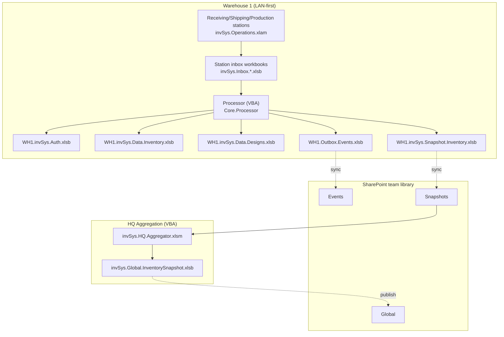
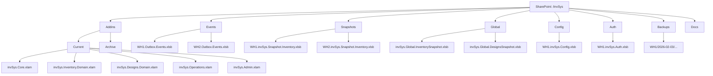
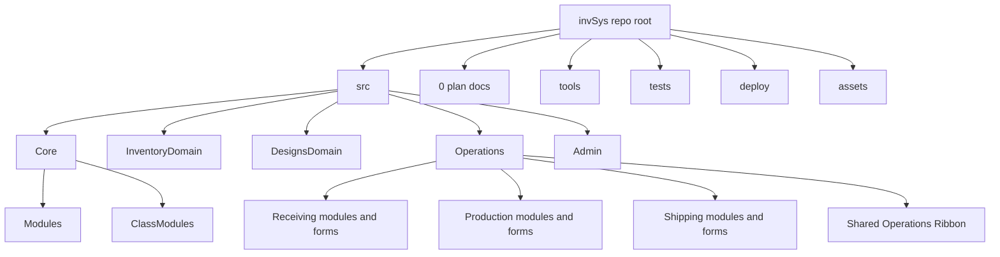
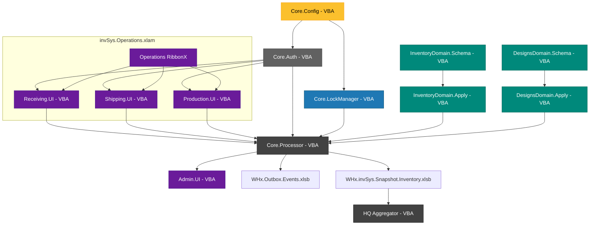
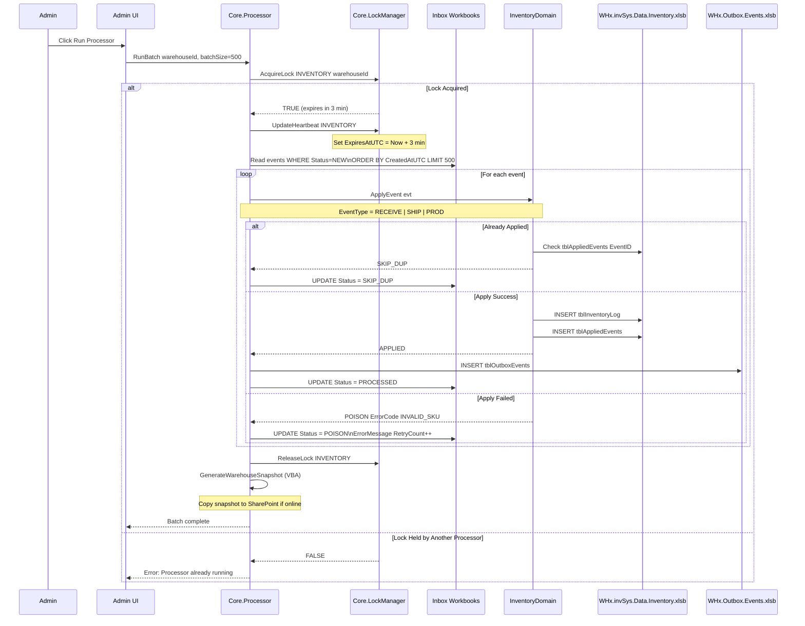

# invSys Architecture v4.11 - Release 1 Plan
**Project:** invSys Multi-Warehouse Inventory System  
**Version:** 4.11 (VBA Release 1)  
**Date:** July 26, 2026  
**Author:** Codex  
**Purpose:** Complete architectural specification for Release 1 (VBA/Excel only).

---
## Reference Links
- `https://www.perplexity.ai/search/https-github-com-soetrain-invs-IL_KZ22YSsW5kMph4kOzxA?preview=1#7`
- `https://www.perplexity.ai/search/this-is-my-retconned-plan-plan-1l63Rt2_SDSKyOklg90qdA#7`

### v4.11 Revision Summary
- Consolidates Receiving, Production, and Shipping deployment into `invSys.Operations.xlam`.
- Reduces operator-visible invSys ribbon tabs to one Operations tab, with a second Admin tab only on administrative setups.
- Keeps Core and both Domain XLAMs separate and headless.
- Preserves independent role modules, forms, capabilities, staging, inboxes, and event contracts.
- Adds legacy role-add-in retirement, coexistence prevention, selective project builds, package-manifest validation, and consolidated-package test gates.
- Adds a scoped test-first development rule for Core, Domain, service, and high-risk form-action work.
- Replaces worksheet `ROW` identity with immutable system-wide `System_Key`,
  establishes extensible-header rules with managed `Condition`, and adopts a
  greenfield Generate Warehouse/demo-seed boundary with no old-inventory import.
- Defines Production as reusable versioned Processes assembled into validated
  Recipe graphs, with multi-output completion and exact-key run allocation.

---
## Release Strategy
### Release 1: VBA-Only Foundation (AUTHORITATIVE FOR SHIPPING)
**Scope:** Complete event-sourced inventory system implemented entirely in VBA/Excel.
- Core: Auth, Config, LockManager, Processor (VBA)
- Domain: InventoryDomain, DesignsDomain (VBA)
- Role UIs: Receiving, Shipping, Production (VBA + RibbonX), packaged together in `invSys.Operations.xlam`
- Admin: Console, processor orchestration (VBA)
- HQ: Aggregation via VBA macro (Excel-based)
- Distribution: SharePoint team document library
- Published deployment set: Five XLAM add-ins (`Core`, `Inventory.Domain`, `Designs.Domain`, `Operations`, `Admin`) + workbooks

**No external dependencies:** R1 requires only Excel + SharePoint (no Python, .NET, or other runtimes).

### Operator Deployment Model (R1 Locked)
- XLAM installation is account-scoped. On a given Windows/Excel account, each installed invSys XLAM loads into every workbook opened in that Excel session.
- This is expected baseline behavior for the simplest end-user workflow and is not itself a defect.
- An operations-only account installs Core, both Domain XLAMs, and Operations. An administrative account also installs Admin.
- A normal operator sees one invSys ribbon tab, **Operations**. An administrative setup may show **Operations** and **Admin**. Core and both Domain XLAMs are headless.
- The normal operator path is a saved workbook (`.xlsm` or `.xlsb`) reopened under that shared XLAM session, not an unsaved transient `Book1`.
- `Book1` / new-blank-workbook testing remains useful as a diagnostic stress case, but Phase 6 completion cannot be claimed from that path alone.
- Phase 6 proving must explicitly cover four stages in order: one-account local use, multi-PC LAN use, LAN + WAN use, then central aggregation.

### D16 -- Immutable Five-Package Deployment, Automatic Update, and Rollback (R1 Locked)

**Decision:** GitHub remains invSys source and review authority. The approved
station-distribution feed is the configured SharePoint team-library Addins root:
`<PathSharePointRoot>\Addins`. Its release layout is:

GitHub XLAM download and repository cloning are developer-only acquisition
paths. They are not supported operator installation, update, or rollback
mechanisms; workstations consume only a verified D16 feed/cache.

**NAS station-setup entry point:** A NAS D16 feed must also publish a
user-runnable, versioned **StationSetup** entry point. A Windows user who can
reach the designated read-only deployment share may explicitly run that entry
point to retrieve the current release, validate its complete five-package
manifest and hashes, cache it side-by-side under that user's local invSys
folder, and register only the Operations/Admin startup leaves for the next
Excel startup. The entry point uses the existing D16 updater and may offer
best-effort registration of the periodic updater, but successful first use
must not depend on Task Scheduler creation, GitHub, a Git checkout, SharePoint,
or an existing invSys warehouse target. Excel-open deferral, hash mismatch,
incomplete release, and registration failure remain fail-closed and preserve
the known-good local registration. The deployment share is publisher-write /
station-read; station setup never writes warehouse runtime, inventory, designs,
configuration/auth, inbox/outbox, snapshots, or user credentials.

The feed root also exposes a double-clickable `Install-invSys-Station.cmd`
launcher for ordinary Windows users. It invokes the feed's StationSetup
bootstrap in a process-scoped PowerShell execution-policy bypass, avoiding a
local machine-policy prompt for a publisher-controlled NAS script. The wrapper
contains no credentials and does not weaken the independently enforced NAS ACL,
release/hash validation, Excel-closed rule, invSys authentication, or capability
checks.

**Explorer-compatible NAS revalidation:** When a remembered UNC root is already
reachable through the current Windows/Explorer SMB session, Core accepts that
root by direct folder validation before attempting a WNet reconnect. A WNet
error alone must not make an Explorer-proven root appear unreachable. If direct
validation fails, the existing reconnect and credential-recovery path remains
fail-closed; this rule neither broadens NAS ACLs nor changes invSys roles.
User-entered UNC roots normalize redundant leading backslashes to the canonical
two-separator UNC form before validation; a protocol prefix remains invalid.
The Core-owned **Server Sign In** connection form's **Scan Roots** action must
discover candidate warehouse shares from the current Windows user's visible SMB
server/share connections, before any root text is required. It presents the
candidate roots without opening them or selecting a runtime. The operator then
selects one root, enters Windows/NAS credentials, and uses **Connect**; only a
successful connection scans and lists that root's warehouse runtimes for final
selection. Discovery is read-only and does not reconnect, persist a credential,
create a target, or grant an invSys role. A manually entered root remains an
explicit fallback when Windows exposes no discoverable SMB server/share.

**Admin user-onboarding packet:** Creating or updating an invSys user does not
send email, provision a Windows/NAS account, or grant network access. The
Admin **Copy Account & Setup** action may place a human-deliverable packet on
the administrator's clipboard. For the configured NAS deployment it must state
the stable `Install-invSys-Station.cmd` path, require the recipient to have
authorized NAS/Tailscale access before using it, identify the selected
warehouse scope, and give the binding sequence **install -> Server Sign In ->
select target -> invSys Sign In**. It must never include a NAS password,
Windows credential, unselected warehouse, or a claim that installation grants
an invSys role. The ordinary user still receives the explicit invSys User ID
and PIN only as the administrator elects to deliver them.

After setup, the explicit Operations **Server Sign In** -> warehouse target ->
**invSys Sign In** sequence remains binding. A Windows/NAS identity is not an
invSys identity. **Create New Warehouse** remains an `ADMIN_MAINT` action for a
signed-in invSys administrator and can create only at a path that the current
Windows session is authorized to write; NAS reachability or D16 setup alone
never grants that capability.

```text
<PathSharePointRoot>\Addins\
  current-release.json
  Releases\
    <ReleaseId>\
      release-manifest.json
      invSys.Core.xlam
      invSys.Inventory.Domain.xlam
      invSys.Designs.Domain.xlam
      invSys.Operations.xlam
      invSys.Admin.xlam
```

`ReleaseId` is immutable. Its manifest names exactly the five normative XLAMs,
their SHA-256 hashes, package-set version, Git commit, build timestamp, and
minimum compatibility metadata. A publisher validates every file and hash in a
new release directory before atomically replacing `current-release.json`.
The feed retains the current release plus the two immediately preceding
verified releases. A NAS may mirror this feed for LAN delivery, but it must
preserve this layout and may never be placed inside a warehouse's
`PathDataRoot`, authority workbooks, inbox/outbox, config/auth, or operator
workbook area.

**Station update rule:** A Windows Task Scheduler station updater checks the
feed at user logon and every 15 minutes. It applies an available release only
when no Excel process is running. It verifies the complete remote manifest and
hashes, copies the complete release side-by-side into a station-local cache,
verifies the copied hashes, then repoints only the account-scoped Excel startup
registration to the cached Operations and Admin leaf XLAMs. Core and the Domain
XLAMs remain headless bridge dependencies; the updater does not register them
as visible Add-ins. The update is automatic and non-interrupting: it is applied
before the next Excel/invSys session and its release/status is shown after that
session starts. There is no in-place replacement of a loaded XLAM.

**Station tool location rule:** Git is source/review authority, not a
workstation dependency. When the update task is installed, it stages the small
PowerShell station-maintenance toolset into the user's local invSys deployment
directory and verifies the copied files before registering the task. The task
targets that local toolset, never a repository checkout. This toolset is not an
XLAM, is not an independent launcher, is not part of the five-package release,
and has no access path to warehouse authority other than the explicit Addins
feed supplied to the updater.

**Failure and rollback rule:** The updater fails closed. A missing/partial
release, hash mismatch, cache-copy failure, registration failure, or Excel-open
condition leaves the active known-good cached release and its registry startup
paths untouched, records only redacted local diagnostics, and retries later.
On an update failure after staging, it automatically restores the prior
verified known-good cached release. A deliberate manual rollback is a
station-administration operation available only to a local Windows
administrator while Excel is closed; it selects one of the retained verified
releases, re-verifies it, repoints the leaf registration, and records the
reason/time/from/to versions locally. Rollback never reverses inventory or
design events, snapshots, config/auth data, user data, or operator workbooks.

**Boundary rules:** The deployment scripts and scheduled task are Windows
deployment utilities, not invSys runtime/domain dependencies. A release never
contains inventory, designs authority workbooks, config/auth workbooks,
credentials, inbox/outbox data, snapshots, or operator workbook state. No
XLAM may be built, copied, replaced, registered, unregistered, or rolled back
while an Excel process is running. D13 must prove incomplete-release rejection,
hash-mismatch rejection, Excel-open deferral, complete five-package update,
automatic known-good restoration, manual rollback, Operations/Admin leaf
registration order, and byte-for-byte non-mutation of authority workbooks.

### D17 -- Multi-Server Advisory Aggregation Source Set (R1 Locked)

**Decision:** The existing single-target **Aggregate Global Snapshot** command
remains valid, but an `ADMIN_MAINT` user may instead open an Admin aggregation
source-set form. On open, the form discovers warehouses available through the
already connected current and remembered NAS/server roots; it does not require
the operator to re-enter credentials for an existing Windows connection. The
user may explicitly choose **Add Server** for another server connection, then
select accessible warehouses from that server too. Credentials are supplied to
the existing Windows storage connection flow only for the current session;
they are never stored in an aggregation source, configuration, export, event,
or log.

A source set is session-scoped and explicit: it contains a server endpoint
descriptor, WarehouseId, published snapshot path/freshness/hash, and selection
state. It never changes the current operational `Send To` warehouse target,
authenticates an invSys user, creates a runtime, or makes a remote warehouse
authoritative. Aggregation copies and reads only selected published snapshots,
rejects an unreadable/stale/incompatible source and duplicate WarehouseId with
different source identity, and writes its advisory result only to the
designated existing aggregation output feed. The source-set form must visibly
show selected, skipped, and rejected sources with reasons.

The result remains a read-only advisory projection. It preserves every source
WarehouseId and exact `System_Key`, never merges entities merely by SKU, and
cannot write inventory, events, designs, configuration/auth, inbox/outbox, or
operator workbooks on any source server. Two-PC/two-warehouse UAT remains a
separate proof: two selected sources must be distinct NAS-backed warehouse
runtimes and station identities. D13 must begin with public Admin-form/action
RED for current-server discovery, additional-server discovery, selection
validation, duplicate/source rejection, read-only aggregation, and source
authority non-mutation.

### D18 -- Shared Events and How-To/Diagnostic Action Paths (R1 Locked)

**Approved 2026-09-07 -- Slice 4be synthesized contract.** The user approved the
detailed shared Events contract, including comprehensive Operations/Admin
coverage, one versioned Action Path with How-To, Diagnostic and Compare both
presentations, dedicated Event Tracking Settings, and personal view selection.
This decision replaces the earlier curated-only D18 and the after-R1 deferral
of comprehensive Viewer history. Curated authoring/search/version/export/import
is retained within this contract; captured observations and diagnostic results
remain distinct from authored instructions.

The inactive replacement-only proposal is superseded. D5 Core command ownership,
D12 packaging, D13 test-first gates and D19 required-audit/retention boundaries
remain binding. Contract approval authorizes implementation in tested slices; it
does not claim runtime implementation, deployment or user acceptance.

**Semantic inheritance:** More-specific plans, controls, implementation records
and tests may clarify, implement, test and constrain these rules, including
newly discovered controls. They must name their governing rule and preserve its
meaning. A contradiction or material weakening requires an explicit approved
architecture decision here before implementation, then synchronized Plan 022
and controls updates. A plan edit, generated report or handoff cannot supply
that decision. Tightening a test or recording a discovered control within the
existing rules does not require repeat approval.

**Considered critique, 2026-09-07:** Events remain observations, owners determine
business effects, and How-To/Diagnostic do not execute recovery. The ownership,
structured-evidence and re-entrancy details below clarify these existing
boundaries. Suggested executable Navigate/Retry/Repair/Override Action Path
types are not adopted: ordinary authorized workflow commands remain separate.
RetryAllowed describes matching an observed retry, never permission to retry.

**Operator entry:** Operations > Viewer > Events retains the accepted inventory,
Events and ListBox->Table surfaces. Selecting an event opens Event Detail;
**Show Action Path** defaults off per form session and reveals related steps
using the preferred view. **Action Paths** opens the searchable guide/recording
library. Missing observations say **Recorded controls unavailable**; the user
may still read an authored guide, whose provenance remains visible.

**Shared foundation and ownership:**

- Core owns publication orchestration, authenticated projection reads, authorized
  configuration commands, and a separate non-authoritative user-activity append
  service. Inventory and Designs Domain retain canonical event/state authority.
  Operations owns Viewer and its role handlers; Admin owns its handlers and
  policy/profile editor. D12's five packages remain; Core/Domain gain no UI.
- Viewer reads published projections and the selected warehouse training library.
  Open/Refresh/filter/detail/path/diagnostic actions never open canonical
  workbooks, process inboxes, repair data, or trigger publication. The ordinary
  publisher uses existing owning read boundaries. Training saves write only the
  training library; personal preferences write only local UI state.
- Repeated launch reuses Viewer and captured role workbooks. Every action checks
  its captured warehouse, invSys session and role workbook where applicable.
  Sign-out, target change or loss of that binding invalidates loaded content and
  terminates active recording as incomplete; no ActiveWorkbook redirection.
- Preserve exact source identities and immutable System_Key, every contributing
  event line, and unknown user columns through normalized header lookup.
  ActivityId, SequenceId and ActionPathId identify only their own records.
  No canonical business-event schema change or legacy-inventory import is proposed.

**Observation semantics and structured evidence:**

- A record states an observed fact and context; its publication never authorizes,
  schedules or performs a business/configuration/deployment mutation, repair,
  retry, guard override or automatic navigation. The shared layer validates and
  records evidence; the existing workflow/Domain owner alone determines effects,
  blockers, allowed next actions and canonical outcomes.
- The coverage catalog adds logical OwnerId and stable EventCode for each
  supported observation/outcome, plus severity, data-effect mapping, sanitized
  operator explanation and advisory next step. Source handler names belong in
  the maintained developer catalog, never in ordinary Viewer payloads. OwnerId
  is a registered logical workflow identifier, not an executable target.
- Extend the required activity envelope with OwnerId, EventCode, Severity
  (Info/Notice/Warning/Blocked/Error), and DataEffect (Changed/Unchanged/Unknown).
  EventCode identifies the kind of observation; RecordId/ActivityId identify
  immutable instances. SequenceId is optional outside recording; otherwise it
  joins the actor/warehouse interaction. ActivityId always correlates an attempt,
  its result and its source-event references. Optional source references are
  empty when none exist, not fabricated IDs or null-looking string values.
- Known fixed codes supply UserMessage and NextStep from the catalog; store only
  allowlisted cause codes and source references, never raw Err.Description,
  arbitrary TechnicalDetail, entered data or hidden security material. Existing
  permitted business-detail fields retain their separate profile contract.
  Unsupported outcome detail is explicitly unavailable, not invented diagnosis.
- DataEffect is reported by the owning boundary from facts it actually knows.
  Handler entry defaults Unknown. Confirmed pre-write rejection/read-only action
  may report Unchanged; confirmed applied mutation may report Changed. A partial
  failure or mere submission acknowledgement cannot imply a clean rollback or
  completed Domain effect. Uncertain status remains Unknown with guidance to
  inspect the owning workflow. Severe findings retain code, operation, context,
  plain explanation and uncertainty; logging must not swallow existing errors.
- Use a re-entrancy guard inside the shared observation path. Logging/preview/
  rendering failures cannot recursively log themselves, reopen forms or cause
  business actions. Same record ID is idempotent; distinct repeated user actions
  retain distinct ActivityIds. Coalesce only repeated tracking-failure notices
  within the same ActivityId; never deduplicate away attempts or owner errors.
  Closing/cancelling a guide or recording never invokes or retries a workflow.
- Diagnostic R1 scope stays the approved evaluation of already permitted
  projection/training evidence. The critique's broader connectivity/lease/repair
  tools are not implicitly authorized. Any future command belongs to its owning
  workflow, with its own authorization, contract decision and D13 evidence.

**What is tracked and published:**

- Maintain a versioned coverage catalog for every reachable Operations/Admin
  launcher, form command, deliberate page/selection action and result. Each
  entry names a stable ControlId, fixed captions, role/family, public handler,
  existing capability, tracking class, completion-evidence source, and any
  deliberate exclusion/reason. Retired controls require reachability evidence;
  unimplemented controls are marked pending. Comprehensive means every reachable
  action is accounted for, not keystroke or mouse-movement surveillance.
- Operations coverage includes shared session/target actions, Viewer,
  Receiving/Return/Dump, inventory creation/adjustment/retirement, Shipping
  Add/reserve/Remove/Hold/Send, Boxing build/unbox, and active Production
  Process/Recipe lifecycle, allocation, input, output and run actions.
  Admin coverage includes Settings, Generate/Create Warehouse, Seed, user
  management, processor/lock/reissue, snapshots/publication, Aggregator and
  implemented maintenance commands. Sensitive inputs are never recorded.
- Distinguish **Business event**, **User activity**, and **Current state**.
  Business events preserve their canonical identities. New user activity gets
  immutable generated ActivityId at real handler entry and linked outcome
  records; one action may reference zero, one or several business events.
  An attempted click, validation rejection, denial, cancellation, accepted
  submission, completed command and later Domain application are distinct.
  Programmatic control changes and backend calls are not user clicks.
- Activity envelopes carry schema/package version, record/ActivityId, optional
  SequenceId, WarehouseId, station and invSys actor IDs, ControlId/fixed captions,
  sequence ordinal, verified UTC, policy version, sanitized outcome code and
  source-event references. No keystrokes, entered selector values, arbitrary
  free text, secrets, credential/security internals, workstation/network paths
  or backend procedure names. User-management activity states action/outcome
  only; it does not disclose credential or account payloads to ordinary Viewers.
- Authorized originating handlers append only their eligible records through a
  Core primitive/serialized boundary to
  `<WarehouseRuntimeRoot>\Training\Activity\<WarehouseId>`.
  This new store contains immutable per-record JSON/integrity metadata, separate
  from canonical audit/event/inventory/design/config/auth/inbox authority.
  Core validates context, registered control and record type; recording a denied
  attempt grants no operation. Required audit/security writers remain effective.
- Use generated filenames, at most 1 MiB per record, warehouse/schema/hash
  validation and atomic publication. Retries with the same record ID are
  idempotent; a conflicting duplicate is rejected. Independent stations use
  distinct IDs. No shared mutable workbook or arbitrary caller-supplied path.
  Failed optional tracking never retries, blocks or rolls back the business
  command; show **Tracking unavailable** and incomplete evidence. There is no
  silent durable local fallback for an unavailable NAS library.
- New eligible Admin actions use this shared store. Existing station-local
  tblAdminAudit has no stable event ID or complete central discovery contract:
  historical coverage is unavailable; do not fabricate IDs from row positions
  or silently import station logs. Pre-sign-in actions have no trusted warehouse
  actor and are explicitly excluded from this warehouse activity store; existing
  security handling remains. Do not later attribute them to a new target/user.
  Target-changing actions end recording in the original context. Creation with
  no existing valid runtime cannot log to a nonexistent store.
- Default **Operator actions** preserves accepted labels and hides internal
  SHIP_RESERVE mechanics. **All published events** may show **Inventory Reserved**,
  never **Shipment Held** without an actual Hold. Box Design/Held Shipment
  supplements remain labelled **Current state**, not invented durable history.
- Publish the newest 5,000 complete durable business-event/activity groups plus
  separately labelled current-state supplements. Group by warehouse/source/ID,
  retaining all detail and outcome lines, including repeated System_Key and
  unlike UOMs. Never choose one key for a multi-entity event or sum unlike units.
  Coverage shows source families, available/omitted event and detail-line counts,
  earliest/latest included times, exclusions, policy version, schema/release,
  verified publication UTC and missing sources. A group is never split by the
  publication limit: complete means all available contributing lines, not that
  an attempted command necessarily succeeded. Sort by recorded timestamp then
  source kind/ID for deterministic ties, with the zone caveat below. No
  historical action is inferred from current state.
- Viewer pages 100 matching records after applying Search, family/source/outcome
  and accepted All/Day/Week/Month/custom 1-36500-day filters across the loaded
  projection. Preserve the remembered date preference. All means all published
  dates, with visible limits and matching/available counts. Saved sequence
  evidence can be read from its training record beyond this publication window;
  missing canonical history cannot be fetched by Viewer.
- **4be.3 paging-control refinement:** Operations Events exposes **Previous**,
  **Next** and a page/matching-record count (`btnEventsPrevious`,
  `btnEventsNext`, `lblEventPage`). A record is one complete source/ID group;
  selecting it preserves every contributing detail line. Paging and Search use
  the loaded projection only, validate the captured context and never publish
  or read authority. Search starts at the first matching page; navigation is
  disabled at the corresponding boundary. Multiple contributing values are
  identified as multiple in summary columns rather than silently presenting
  one line's quantity or combining unlike units. ListBox export continues to
  export the currently displayed headings and values. These controls implement
  the existing 100-record paging contract; all-source publication/coverage and
  the 5,000-complete-group publication bound remain independently required.
- **4be.3 filter-control refinement:** Events exposes View, Event family, Source
   and Recorded outcome selectors (`cboEventsView`, `cboEventsFamily`,
   `cboEventsSource`, `cboEventsOutcome`). View defaults to Operator actions;
   All published events includes internal reservations using their existing
   Inventory Reserved label. The other selectors default to All families,
   All sources and All outcomes. Choices derive only from the loaded,
   policy-permitted projection; source captions use Inventory, Designs,
   User activity, Box designs and Held shipments. Missing metadata is Unavailable.
   Each selected criterion must match a contributing line in the complete group;
   Unavailable matches groups with no supplied value for that criterion. Combining
   criteria uses AND, without trimming the group's detail lines. A recorded
   outcome match is an observation filter, never a sequence conclusion.
   Selector changes apply to loaded content immediately and start on page one;
   they validate captured context, preserve Search/date constraints and Stale
   status. A staged date value waits for Refresh; selectors use the last
   successfully refreshed date range. They never read or publish. Explicit
   Refresh retains an available
   selection; a disappeared choice resets to its All choice. These session-only
   selectors are visible on Events and fit the supported minimum/resized form.
   The existing remembered date control and its Refresh action stay unchanged.
   Hidden Events navigation must not consume the Inventory tab's accepted list
   area; Inventory retains its list-to-bottom-control spacing when resized.
- Display yyyy-mm-dd hh:mm:ss with verified zone/offset where known. Existing
  UTC-named fields containing local Now are not proof of UTC: label them
  **Recorded time (zone unavailable)** and explain approximate cross-source
  ordering/date filters. Use verified UTC for new activity/publication/load.
  Display Published and Loaded separately. Failed Refresh retains visibly
  **Stale** content; incompatible schemas fail with guidance. Missing coverage
  reads **Unavailable**, never empty success. D19 prohibits destructive retention.

**4be.3 persisted Events publication refinement:** Core publishes
`<WarehouseRuntimeRoot>\<WarehouseId>.invSys.Snapshot.Events.json` separately
from canonical workbooks and the existing inventory-level snapshot. The ordinary
owning snapshot/publication path creates this projection; Viewer never does.
The existing inventory snapshot contract and unknown columns remain intact.
An Events artifact has SchemaVersion 1, PackageSetVersion, BuildIdentity,
WarehouseId, generated PublicationId, verified PublishedAtUTC, PolicyVersion,
Groups, CurrentState, Coverage and ContentSha256. Its ASCII-escaped UTF-8 JSON
and trailing ContentSha256 use the same exact-byte hash convention as activity
records. Validate the complete candidate before atomically replacing the prior
projection; a failed publication leaves the prior complete artifact available.

Each durable Groups entry carries owning Source, exact SourceId, SourceKind,
RecordedAt with TimeProvenance, all permitted Lines and available Outcomes.
CurrentState is separate and cannot supply invented historical identities or
completed outcomes. Coverage identifies each expected Inventory, Designs,
activity and Shipping current-state source, its availability/exclusions and
available/included/omitted group and line counts, with included time bounds.
Unavailable owner metadata stays unavailable. The 5,000 bound applies across
durable groups after deterministic ordering; the boundary group retains every
contributing line. No raw authority payload or unknown user field is serialized.

Core's authenticated read validates warehouse/schema/integrity and current
visibility policy. Missing or incompatible Events publication reports unavailable
coverage; retained content can only be shown as Stale within the same captured
context. A supported older inventory-only envelope retains its explicit legacy
coverage limitations and never authorizes canonical Shipping reads as a fallback.
This storage refinement implements D18's existing publication/read separation;
it does not accept partial source coverage or change canonical write authority.

**4be.3 Viewer projection wire refinement:** The existing Core Events read entry
returns a primitive escaped tab-separated `EVENTS1` envelope. The header contains
status, warehouse, verified publication UTC, detail-line count, wire version,
verified load UTC, publication identity, current visibility-policy version,
coverage explanation, ordered detail-field IDs, package version and build identity.
Each line retains the eighteen legacy display/identity slots followed by named
detail values in the declared field order. Empty values remain unavailable;
current state never receives an invented durable event identity. Source metadata
and all contributing lines remain distinct from the currently visible summary.
Supported legacy Inventory-only envelopes retain their explicit coverage limits;
parsing them never invokes canonical Shipping readers. This wire refines the
approved primitive cross-package read boundary without adding a new authority or
loosening current-policy checks, complete-group publication or paging rules.

**Snapshot source-read constraint:** The existing Admin Generate Inventory
Snapshot command delegates inventory source resolution to Core's snapshot
orchestrator. That read resolves the existing canonical file in the captured
warehouse/runtime, without create, schema-ensure, repair or save. A supplied or
already-open source is borrowed unchanged; Core closes without saving only a
read-only workbook opened by that scoped read. This corrects a discovered
mutating-resolver path under D3/D18, without changing authentication, capability
provisioning, canonical writer APIs or the command's existing permission gate.

**4be.3 activity grouping and coverage wire detail:** A user-activity group uses
Source `Activity`, SourceKind `User activity`, and the exact ActivityId as
SourceId. Lines preserve every permitted original record, including each exact
RecordId and its verified timestamp. Outcomes contains the available result
records, excluding REQUESTED attempts; it never synthesizes an applied business
outcome. RecordedAt is the earliest available contributing record timestamp,
with its actual TimeProvenance; each later result retains its own timestamp.
Business groups retain their exact owner EventID and contributing lines under
the same earliest-record ordering rule. Quantity display values remain strings
with each line's own Uom; grouping never adds unlike units or loses repeated keys.

Coverage.Sources identifies Inventory, Designs, Activity, ShippingBOM and
ShippingHolds separately. Each entry names Source, Availability, Scope and a
sanitized explanation. AvailableGroups/IncludedGroups/OmittedGroups and
AvailableLines/IncludedLines/OmittedLines reconcile within that source; unknown
counts are unavailable, not zero. Current-state counts remain separate from the
5,000 durable-group limit. Shipping hold visibility is limited to the originating
station's existing local store; that source cannot imply discovery of other
stations or warehouse-wide Hold history. Comprehensive shared user activity and
all-source publication remain required. This makes existing D18 provenance and
coverage obligations testable; it does not accept missing sources as complete.

**4be.3 Designs publication read:** The existing Designs query dispatcher adds
`PUBLICATION_EVENTS` with expected WarehouseId and runtime-root strings. Core's
publisher calls this owner query through the existing query bridge. It validates
the current allowed target against both arguments, reads only the existing
canonical Designs file, and never creates, ensures, repairs or saves a source.
An open clean source is borrowed unchanged; an unsaved source is unavailable.
Only a source opened by the query is closed, without saving. Missing/ambiguous
required headers or mismatched warehouse rows make the source unavailable.

The primitive result is a versioned escaped tab-separated string. Its first
line contains `EVTSRC1`, `Designs`, Availability, WarehouseId, returned-line count,
read mode (`ReadOnly`, `Borrowed` or `None`) and a fixed reason code. The next
line names exported fields; subsequent lines contain their values. Backslash,
tab, CR and LF are escaped losslessly. Export EventID, UndoOfEventId, AppliedSeq,
EventType, OccurredAtUTC, AppliedAtUTC, WarehouseId, StationId, UserId,
DefinitionType, DefinitionId, DefinitionVersion and Note only. All contributing
rows and exact identities remain; PayloadJson, unknown columns and source paths
are excluded. Recorded dates remain zone-unverified. An unavailable result has
zero returned rows, not a claim that the source contains zero events. This is an
owner read for publication, not a new Viewer read path or business write command.

**4be.3 Shipping current-state publication detail:** CurrentState entries name
Source `ShippingBOM` or `ShippingHolds`, SourceKind `Current state`, and Lines.
They do not invent SourceId/EventID, historical outcomes or observation times.
ShippingBOM lines preserve the twenty named fields of the owning Shipping BOM
schema, including exact PackageSystemKey, ComponentSystemKey, version fields and
each component's own quantity/UOM. ShippingHolds lines preserve Ref, Item, Qty,
UOM, Location, Description, Area, Carrier, ShipmentLineId, ReserveEventId and
exact System_Key from the existing local store. The obsolete positional slot
is neither imported nor exposed. Unknown columns are excluded, never removed
from their source. Existing recorded timestamps remain zone-unverified.
Coverage scope is `Warehouse` for ShippingBOM and `Station profile` for
ShippingHolds; local holds never imply other-station or historical coverage.
Actual Box Designer/Box Maker and Shipping Add/Hold handlers must prepare the
protecting publication fixture. Full contributing lines and source preservation
are asserted through the public Admin publisher, not inferred from a helper's
empty-success result. This clarifies D18's existing current-state and owner-read
rules; it adds no write authority or new operator action.

**4be.3 Shipping state presentation refinement:** Preserve the accepted
`BOX_DESIGNED` package/alternative summary and `SHIP_HELD` held-line summary while
reading only the published Events artifact. A ShippingBOM summary uses the owning
package item, package UOM/location and alternative label, with no invented package
quantity. Its contributing lines remain associated by exact PackageSystemKey and
BomVersion within the captured warehouse and source. The existing named detail
fields BomId and BomVersion carry that package reference and owning version;
System_Key, item and quantity/UOM in each detail line remain the component's own
values. This is a current-state presentation association, never an EventID,
ActivityId, canonical identity replacement or fabricated historical group.
SourceId stays unavailable. Selecting the summary or searching one component
retains every contributing component line; unrelated blank IDs remain separate.
The eighteen compatibility display slots may therefore contain package summary
values while their named detail fields contain the selected component values.
ShippingHolds retains its owning reference, item, quantity/UOM, location and exact
inventory key, remains station-profile current state and supplies no completed
shipment outcome. This mapping implements the existing accepted-summary,
complete-detail and unavailable-identity rules without changing a canonical schema,
the display-field allowlist, publication limits or Viewer read authority.

**4be.3 publication implementation boundaries:** Core calls the fixed Operations
entry `modShippingPublicationSource.ReadForPublication` with source name,
expected WarehouseId and runtime root, using only primitive strings. This is a
declared cross-XLAM owner-read boundary under D12, never a Viewer fallback or a
dynamic workflow dispatcher. Shipping validates the matching allowed target and
returns the `EVTSRC1` envelope convention used by Designs, with the named
Shipping source and its permitted headers. Missing/dirty/unreadable/malformed
sources return unavailable with a fixed reason; only transient read-only source
handles are closed. Hold reads remain limited to the current station profile.

The Inventory snapshot's existing Boolean/path result is independent of Events
publication. Core supplies a separate Events result/notice; Admin's explicit
Generate Inventory Snapshot report includes it. Failure never claims Events
success or replaces the prior complete Events file. Bootstrap without a matching
allowed target retains inventory creation and explicitly defers Events publication
until an ordinary publication runs with that context. No target is synthesized
or changed to make an owner query succeed. The Events JSON parser may read the
complete bounded-group artifact; Activity/guide parsers retain their 1 MiB limits.

**Settings -- dedicated Event Tracking tab:**

- Admin Settings gains **General** (existing controls) and **Event Tracking**
  tabs. Event Tracking contains **Tracking**, **Event Detail**, and **Action
  Paths** sections. Operations Viewer also exposes **Settings > Event Tracking**
  for signed-in users' personal preferences, without requiring Admin installed.
  This Operations-owned surface shows effective policy read-only; only Admin's
  editor exposes warehouse policy/profile writes, gated by ADMIN_MAINT at open
  and save. Existing role capabilities still govern every action.
- Tracking lists family/control, optional collection, Viewer visibility, and
  recorded-sequence eligibility. Required canonical/audit collection is labelled
  **Required** and cannot be disabled. Optional command/result activity defaults
  on; optional navigation/selection collection defaults off. **Capture recorded
  controls** (ViewerActionPathCaptureEnabled) defaults off and enables collection
  of eligible navigational controls during explicit recording only.
  AdminViewerEventLoggingEnabled remains default True and controls only eligible
  non-inventory Admin projection visibility, never required audit/business events.
- Collection affects future activity only; disabling does not erase history.
  Visibility applies on each authorized read/Refresh, including saved-path
  rendering, so a hidden source cannot leak through a guide. Show **Hidden by
  policy**, **Not tracked**, or **Unavailable** as appropriate. Display profiles
  do not confer access. Self-observation must not recurse: explicit Viewer
  commands may be eligible, but automatic rendering/refresh internals, tracking
  writes, preview and preference reads never generate control events.
- **Preferred Action Path view** offers **How-To**, **Diagnostic**, and **Compare
  both**; both presentations ship for user comparison. Admin sets a warehouse
  default, initially How-To. A signed-in user can choose **Use warehouse default**
  or save a local override scoped by Windows user, invSys user and WarehouseId,
  restored after Excel restart. Invalid preference falls back to the effective
  warehouse default. It never writes Config or changes what Admin permits
  tracking. Show unavailable diagnostic evidence when capture is off.
- **Save Tracking Policy**, **Save Detail Profile**, **Save My Preference**,
  **Reload**, and **Reset to Default** have explicit separate scopes. Reset
  stages defaults; Close discards unsaved edits. Preview uses synthetic values.
  Headless D5 Core commands persist append-only warehouse policy/profile
  versions with expected version and captured target, validating the whole
  request before one save. Reject stale versions, unknown fields/controls,
  invalid flags/order, missing required Config, capability/context mismatch,
  locked/read-only or unrelated dirty Config. Preserve unknown columns.
- Policy metadata is PolicyVersion, SchemaVersion, CatalogVersion, CreatedAtUTC,
  CreatedByUserId, DefaultView, capture flag, and per-control collection/
  visibility/sequence flags. Legacy Admin projection and capture settings are
  compatibility views of that same policy; reject conflicting writes and update
  them atomically, never maintain independent contradictory policies. Track a
  policy save by version/outcome only, without storing configuration values.
- Check effective policy/context at action boundaries. A mid-sequence collection
  change ends recording as partial before new policy applies. Missing optional
  policy uses labelled defaults; malformed/unreadable policy disables optional
  collection with a visible error, never repairs Config or suppresses required
  audit. D5's fail-closed business-write requirements remain binding.

**4be.2 Operations Settings surface refinement:** Viewer has a Settings button
that opens an Operations-owned modeless Event Tracking settings form. It shows
the current warehouse tracking policy and its control flags read-only, required
canonical/audit collection, the four personal choices, effective view/evidence
status, and personal Save/Reset/Reload. It exposes no warehouse policy or detail
profile writer. Core's signed-in serialized policy projection shares the same
validated policy reader as the Admin editor; it adds no write permission.
The personal read boundary may additionally return serialized policy, policy
version and saved catalog version from that same validated read, so policy flags
and the effective personal view cannot come from separate refreshes.

The Settings instance captures the Viewer session/warehouse context. Repeated
opens in that context reuse the instance and retain staging. A different or
expired context cannot silently retarget it; closing/reopening establishes the
new context. Closing Settings discards its staging; closing Viewer closes its
Settings instance. Opening/using Settings preserves Viewer tab, search, selection
and projection data. These discovered controls implement D18's existing role
surface and captured-context requirements; they do not add business authority.

**4be.2 Admin Close lifecycle clarification:** The existing Close-discard rule
applies to the default Settings instance opened by `modAdmin.Open_Settings`.
Close releases that form and its staged editors; the next actual launcher call
constructs the current saved state and captures the current context. Hiding the
default instance and retaining unsaved choices is not Close-discard. Tests must
exercise repeated real launcher calls and the real Close handler, not substitute
disposal of a test-owned private instance. This enforces the existing D18 rule
without changing Admin authorization, save ownership or modal presentation.

**4be.2 personal preference storage refinement:** The local preference uses the
existing current-Windows-user settings mechanism (`SaveSetting`/`GetSetting`,
HKCU), under invSys / ActionPathPreferencesV1. Its value key encodes the exact
invSys user and WarehouseId separately, without delimiter collisions. The only
stored value is one of the four fixed choices above. A missing or invalid value
selects Use warehouse default; reads never repair it. Core validates the
captured signed-in context at each personal read/save and verifies a save by
reading back the exact choice. No ADMIN_MAINT capability is added to the personal
boundary; Admin's existing form gate remains, and Operations must expose its own
signed-in surface without an Admin dependency. Invalid/unreadable warehouse
policy is shown as unavailable effective policy/evidence, never an invented
effective default or permission. It does not prevent saving a valid local choice.
Preference reads, rendering and synthetic previews create no activity. These
storage and failure-display details implement the approved local preference
scope under semantic inheritance; full restart/role/UI acceptance remains required.

**4be.1 implementation clarification:** Persisted policy metadata uses
`tblEventTrackingPolicies` and per-control rows use `tblEventTrackingControls`
in authoritative Config. Both tables absent means built-in PolicyVersion 0;
saved versions are positive integers. A partial pair, duplicate version/control,
unknown catalog entry or malformed latest version is an error, never fallback
to an older permissive policy. Header lookup is normalized and unknown columns
are preserved. Activity SchemaVersion/CatalogVersion begin at 1; RecordId and
ActivityId are generated GUIDs. Activity JSON is UTF-8 without a BOM, with
non-ASCII characters escaped losslessly; ContentSha256 is the final property
and hashes the complete JSON object before that property is appended. These
wire/table choices refine the approved contract without adding authority.
Schema, catalog, policy and ordinal fields are JSON integers, not coercible
strings. Verified activity/policy UTC uses a valid calendar/time value in
`yyyy-mm-ddTHH:mm:ss.fffZ` format. An activity outside a recording has ordinal
0; a recorded action has an ordinal from 1 through 256. The originating form
rejects a stale session before its command, independently of optional tracking
availability; re-authenticating the same user does not revive that form binding.

**4be.1 Receiving/source-reference clarification:** Each SourceEventRefs entry
has exactly string fields WarehouseId, SourceKind, EventId and SubmissionState.
WarehouseId must match the activity; SourceKind is the registered owning source
(initially Inventory for Receiving). EventId preserves the exact owner-generated
identity passed to the submission boundary. Submitted means that boundary
confirmed acceptance; Unknown retains a possibly submitted identity after an
uncertain failure. Neither state proves Domain application. Reject duplicate
references, unknown fields/source/state, cross-warehouse references and invalid
identity text; never rewrite an identity or silently drop individual references.
Identity text is bounded to 128 ASCII letters, digits, hyphens or underscores;
unsupported source identity makes optional evidence unavailable, not a business
failure. The existing 1 MiB bound applies to the whole record without truncation.
Attempts and known pre-submission denials/rejections have empty references.
Receiving command confirmation may report CONFIRMED with Unknown Domain effect;
a submitted command whose processing/refresh did not finish reports PENDING with
Unknown effect. Both retain every related source reference, and only later
owning published evidence can satisfy an all-events-applied conclusion.

Catalog version 2 adds the Receiving confirmation control while retaining the
version-1 definitions. Reads validate against the record/policy's own supported
catalog version, preserving original captions and outcomes. A valid version-1
policy continues governing its two registered controls; a newly introduced
control absent from that saved version has unavailable optional tracking until
an explicit whole-policy update includes it. Do not reinterpret that valid older
policy as a permissive policy for newly introduced controls, repair it on read,
or fall back from malformed latest policy. This refines D18's versioned coverage
and older-release rules without changing configuration or business authority.

**4be.1 Receiving staging/disposition clarification:** Catalog version 3 adds
RECEIVING_ADD_SELECTED (RECEIVING_STAGING), DISPOSITION_ADD_SELECTED and
DISPOSITION_CONFIRM (RECEIVING_DISPOSITION), preserving versions 1 and 2.
The older-policy rule above applies to every newly registered control. The
actual Add handler records REQUESTED before validation; STAGED/Info/Changed
means its owning service confirmed a change to workbook-local staging only.
It neither submits an event nor proves an inventory effect. Its source references
remain empty, including preallocated staging EventIds that have not been submitted.
Local form validation reports REJECTED/Warning/Unchanged before service entry;
an unsuccessful service call or exception reports FAILED/Error/Unknown unless
the owner provides a more specific supported result. Do not classify raw error
text, assume rollback, or invent a capability denial from a generic failure.
Add uses fixed prefixes RECEIVE_ADD_ and DISPOSITION_ADD_; its message and next
step explicitly identify local staging. Direct staging service calls do not
produce user-control activity. Captured-session rejection precedes staging
independently of optional tracking; optional append failure preserves the
authorized staging action and displays Tracking unavailable.

Confirm Dispositions uses DISPOSITION_CONFIRM_ and the same owner-reported
REQUESTED/CONFIRMED/PENDING/DENIED/REJECTED/FAILED semantics and exact Inventory
source references as Receiving confirmation. Its captions/messages name inventory
dispositions. RETURN and DUMP retain their existing exact-entity depletion
authority; tracking neither reallocates quantities nor initiates retry. These
are discovered controls and outcome refinements under approved D18, not a new
business contract or a weakening of D5/D12/D13.

**4be.1 Receiving Refresh/Clear clarification:** Under the approved coverage,
owner-outcome and captured-context rules, catalog 4 adds RECEIVING_REFRESH
(RECEIVING_WORKFLOW) and RECEIVING_CLEAR (RECEIVING_STAGING). Their fixed captions
are Refresh and Clear on the shared Receiving/Returns surface. Catalogs 1-3
retain their definitions; an older policy cannot implicitly enable either new
control. This introduces no new business permission or authority boundary.

Both actual button handlers record REQUESTED/Info/Unknown only after validating
their captured session, warehouse and still-open role workbook. Stale context
rejects before the local owner call, independently of optional tracking. Direct
service calls and internal/programmatic refreshes are not user-control activity.

RECEIVE_REFRESH_REFRESHED/Info/Changed means the existing read-model owner
confirmed a workbook-local projection refresh from a non-stale source.
RECEIVE_REFRESH_STALE/Warning/Changed means that owner retained cached inventory
or loaded a stale fallback and updated local freshness metadata. Changed refers
only to local projection/metadata work, not fresh inventory or Domain effect.
The existing Boolean refresh result remains compatible: True may include STALE.
The owner additionally returns the primitive string REFRESHED, STALE or FAILED
through the declared Core/Operations refresh bridge; callers must not infer
freshness from Boolean success or parse human-readable reports. The actual form
preserves the owner's cached/stale explanation instead of replacing it with a
fresh-success message. Unknown/missing outcome evidence cannot assert REFRESHED.
This clarification inherits the approved owner-fact and freshness rules; it
changes neither snapshot selection nor business-write authority.
RECEIVE_CLEAR_CLEARED/Info/Changed means the
owner cleared nonempty local staging/aggregation; RECEIVE_CLEAR_EMPTY/Info/
Unchanged means it was already empty. All references remain empty: these actions
neither submit business events nor establish Domain application. Fixed messages
state the local scope. Required headers and unknown user columns remain governed
by D14; explicit Clear removes staged rows, not the table's column schema.

Each control uses its RECEIVE_REFRESH_ or RECEIVE_CLEAR_ prefix for REQUESTED
and FAILED. FAILED/Error/Unknown retains uncertainty after an unsuccessful owner
call or exception. In particular, failure clearing a second table must not imply
rollback of an earlier deletion. A false refresh result must retain the owner's
visible cause rather than report completed refresh. Optional observation failure
shows Tracking unavailable while preserving the existing authorized local action;
it cannot retry the owner, redirect to ActiveWorkbook, or conceal its failure.
These discovered controls and precise outcomes refine D18 without weakening
D5, D12 or D13.

**4be.1 Receiving Open/Close clarification:** Catalog 5 reserves RECEIVING_OPEN
and RECEIVING_CLOSE, owned by RECEIVING_WORKFLOW, with fixed captions Receiving
and Close on Operations > Receiving and existing RECEIVE_POST eligibility.
Catalogs 1-4 retain their definitions; older policies cannot implicitly enable
these new controls. This is a discovered-control refinement of the approved
coverage and captured-context rules, not a new permission or business owner.

The actual Receiving Ribbon dispatch records one REQUESTED/Info/Unknown and an
owner-confirmed OPENED or REUSED outcome (RECEIVE_OPEN_ prefix). Both outcomes
are Info/Unknown: opening can provision or initialize a local workbook, and
form visibility alone proves neither a persisted data effect nor Domain success.
FAILED/Error/Unknown preserves the launcher's visible cause and uncertainty.
The existing launcher alone resolves/provisions the workbook and establishes
the form binding. Reuse requires the same still-open workbook and captured
invSys session/warehouse; a new explicit launch replaces an invalid form without
attributing the old form's internal unload as a user Close. Initialization,
direct compatibility macro calls and backend refreshes are not extra clicks.

The Close button and explicit window close each record one correlated REQUESTED
and CLOSED pair (RECEIVE_CLOSE_ prefix), with CLOSED/Info/Unchanged describing
only dismissal of the UI, never posting or clearing staged work. Termination,
internal replacement, workbook shutdown and programmatic Unload add no Close
activity. A stale session or missing captured workbook still permits dismissal
but cannot attribute that dismissal to another context. All Open/Close source
references are empty. Optional tracking failure remains visible through the
existing operator notification surface and cannot block closing, retry opening,
redirect a workbook, or replace the underlying failure. Disabled Ribbon actions
remain subject to their existing capability guard; comprehensive denial coverage
must be separately proved before claiming the whole launcher surface complete.

CLOSED requires committed UI dismissal: cancelling native close while leaving
the form open cannot satisfy that outcome, even if a nested Unload call returns.
The native handler may synchronously hide the form, finish that dismissal's
observation, and allow native window teardown. It must invalidate launcher reuse;
it cannot retain a hidden reusable form or defer the record/notice until another
launch. Termination and reference release are internal lifetime operations, not
new user actions or the completion clock. This clarifies the existing owner-fact
rule; it introduces no new close command or authority boundary.

**4be.1 Receiving launcher-denial clarification:** The existing RECEIVING_OPEN
control also accounts for an authenticated dispatch rejected by the existing
RECEIVE_POST guard before workbook resolution/provisioning or form opening.
Record REQUESTED/Info/Unknown at the action boundary, then
RECEIVE_OPEN_DENIED (DENIED/Blocked/Unchanged) from that guard's actual rejection,
with empty source references, the fixed explanation "Receiving form launch was
not authorized." and advisory "Review Receiving permissions before reopening."
Unchanged describes the rejected launch, not suppression of existing security
handling. Repeated dispatches remain separate ActivityIds. Catalog 6 gains this
outcome for its existing control; no prior outcome or control definition changes.

The typed Receiving action entry may perform the existing Core cached capability
check so an outer generated guard does not discard the attempt before it is
observed. It must execute that guard exactly once before any launch owner work;
the Ribbon's capability mapping and getEnabled behavior remain unchanged. This
clarifies D18 observation placement without weakening D12 capability gating or
moving authorization ownership out of Core. Polling/getEnabled and direct guard
calls never create user activity. Pre-sign-in dispatch remains excluded from
warehouse activity. Capture the session/warehouse before the guard: a change
during notification cannot attribute completion to a new context. Incomplete
tracking remains visible and cannot authorize, retry or perform the denied
launch. The ordinary direct compatibility call retains its existing non-click
semantics. This is semantic inheritance of approved D18, not a new permission.

**4be.1 Receiving worksheet confirmation clarification:** Catalog 7 registers
RECEIVING_WORKSHEET_CONFIRM, a Command owned by RECEIVING_WORKFLOW, caption
Confirm Writes, surface Operations > Receiving > Received Tally, and existing
RECEIVE_POST eligibility. Its EventCode prefix is RECEIVE_WORKSHEET_CONFIRM_.
Catalogs 1-6 retain their definitions; older saved policies cannot implicitly
enable this newly registered control. This accounts for the native worksheet
button proven reachable in the 115-check packaged discovery. It does not add a
business command, permission, mandatory form-opening step or authority store.

The existing `modTS_Received.ConfirmWrites` boundary distinguishes a native
`btnConfirmWrites` caller on ReceivedTally from a programmatic macro call. A
native action captures its actual worksheet/workbook and the current trusted
warehouse/session at entry, verifies that same eligible Receiving workbook,
and retains those references through the owning command and observation.
Recheck the captured session before owner entry, including after optional
tracking work; a changed context cannot submit or attribute to a new target.
Never resolve a different eligible workbook or revisit ActiveWorkbook after
capture. This action binding neither revives a stale form/recording nor changes
their existing lifetime rules. Direct compatibility/service calls retain their
existing non-click semantics and do not emit worksheet user-control activity.

Use the existing Receiving owner's REQUESTED, CONFIRMED, PENDING, DENIED,
REJECTED and FAILED facts, severities and data effects. In particular REJECTED
remains Warning/Unknown: validation may follow local staging normalization and
does not establish an untouched workbook or rollback. DENIED is Blocked/Unchanged
from the existing pre-write capability guard. Confirmation and pending submission
remain Unknown Domain effect; all exact owner-returned Inventory event references
are retained under the existing Submitted/Unknown rules. Attempts and pre-submit
denials/rejections have empty references. Fixed explanations and advisory next
steps identify the worksheet workflow; they contain no entered values or handler
names. Optional tracking failure remains visible through Receiving's existing
notification surface without preventing, repeating or rolling back the authorized
command, and without replacing its failure. Whole-policy/version, immutable
identity and unknown-column rules remain binding. These details inherit D18's
approved coverage, owner-fact and captured-action rules; they do not weaken D5,
D12 or D13 or alter the posting service's business contract.

**4be.1 Shipping mutation-context clarification:** The existing shared captured-
context rule applies before Shipping Add, Update Row, Remove, Send Hold, Return,
To Shipments and Shipments Sent enter their owning workflow. Capture the trusted
session/warehouse once for a new form; setting its workbook, refreshing or
relaunching must not renew that old form's session. A signed-out, reauthenticated,
changed-target or closed-workbook form cannot mutate staging, submit, or attribute
activity to a new context. This check is independent of optional collection.
Recheck after any intervening UI yield and before owner entry. Keep existing Core
capability checks and their authority; observation does not confer a permission.

A REQUESTED observation durably recorded in the valid captured context before a
later interruption remains valid. It must not be deleted or reattributed when the
session is lost, and no later outcome may be recorded under an invalid/new context.
Tests must distinguish evidence already present before interruption from activity
created after it; counting all records added during the entire handler as forbidden
would contradict D18's required pre-validation/pre-authorization attempt.

Use the fixed context notice **Session or warehouse changed. Reopen Shipping
before continuing.** A lost workbook instead identifies the unavailable captured
Shipping workbook. Mark the old form unusable for commands and cancel its automatic
synchronization. An explicit authorized launcher invocation replaces a stale form
with a newly captured form bound to the same eligible workbook, preserving active
and held staging, exact keys and unknown columns. It does not silently rebind or
revive the old instance. Repeated launch within the same valid context retains
the accepted form/workbook reuse; ordinary Close behavior remains unchanged.

The registered automatic-sync callback enforces the same captured-context check
before synchronization or overlay maintenance, even if no user command has yet
rejected the stale form. Rejection shows the same context notice and exits without
scheduling another callback. Healthy pending synchronization retains its existing
owner and scheduling behavior. This internal callback is not a user-control event.

**Shipping mutation permission constraint:** D18's existing role-capability rule
also applies to local staging mutations, including Send Hold and Return, which
may emit no event. Before the seven mutation handlers above enter an owning
mutation boundary, verify the current SHIP_POST permission through the existing
Core role-access check, independently of optional activity collection. A valid
captured session or a previously enabled launcher is not a fresh permission result.
Recheck permission after intervening UI yields and between separately entered
multi-row mutations, retaining the captured session/workbook check around that
authorization work. A denied or unavailable check stops the new mutation and
cancels pending automatic synchronization through the form's existing rejection
path. Show **Shipping permission could not be verified. Review Shipping access
before continuing.** This wording does not diagnose a missing permission from
an unavailable Auth/Config read or claim rollback of earlier completed work.
The fixed context/access message remains intact. D18's separately required fixed
**Tracking unavailable** notice may follow it when optional evidence also fails;
the tracking notice never replaces or changes the primary access/context message.

Core retains permission and required security-decision ownership; existing service
and event-writer checks remain. Automatic synchronization retains its existing
context/owner checks and is not reclassified as a user mutation or observation.
Ordinary Close and explicit launcher reuse/recovery remain unchanged. This
constraint inherits the approved D18 capability/owner-fact rules: it introduces
no new permission, actor, activity outcome, catalog version or authority store.

These are implementation constraints inherited from approved D18's context,
owner-fact and workbook-preservation rules, not new ControlIds, outcomes, catalog
versions, permissions or authority stores. Shipping activity/source-reference
definitions and remaining control coverage require their own protecting evidence.

**4be.1 Admin UOM command observation refinement (observation regressions verified; diagnostic-completion acceptance pending):**
Under D18's comprehensive Admin coverage, actual-entry and owner-fact rules,
catalog 10 adds the three existing General > Recipe UOM Catalog commands below.
All use OwnerId CORE_CONFIGURATION, SourceRole Admin, Class Command, existing
ADMIN_MAINT eligibility, Surface **Admin > Settings > Recipe UOM Catalog**, and
EventCode prefix ControlId followed by an underscore. Catalogs 1-9 retain their
original definitions; an older saved policy does not implicitly enable these
new controls. Registration does not claim packaged implementation or acceptance.

| ControlId | Fixed caption | Existing frmAdminSettings handler |
|---|---|---|
| ADMIN_UOM_ADD | Add | mBtnUomAdd_Click |
| ADMIN_UOM_REMOVE | Remove | mBtnUomRemove_Click |
| ADMIN_UOM_RESET | Reset | mBtnUomReset_Click |

Each actual handler validates its captured session/warehouse/station before
observation or command dispatch. Valid entry observes REQUESTED/Info/Unknown
before validation, authorization or Reset confirmation. Existing Remove
no-selection validation and existing capability requirements remain. Reset keeps
its existing Yes/No question, revalidates captured context after confirmation,
and never invokes the owner when cancelled or stale. Programmatic list loading,
rendering, UOM service calls and catalog reads create no control observations.

COMPLETED/Info/Changed requires Core's confirmed saved change.
UNCHANGED/Info/Unchanged requires the owning UOM/configuration boundary to confirm
no change, including an already-present Add; Boolean success alone cannot select
COMPLETED. REJECTED/Warning/Unchanged means confirmed pre-write validation failure;
DENIED/Blocked/Unchanged means authorization was not established before mutation.
Only Reset supports CANCELLED/Notice/Unchanged for the actual No response.
FAILED/Error/Unknown preserves uncertainty after an exception or unverified save;
it never claims rollback. These actions have empty SourceEventRefs: configuration
changes are not Inventory event submissions. Fixed explanations contain no UOM
value, selector content, credential, path or backend procedure name.

Admin retains UI/confirmation and observation ownership. Core modUomSettings
propagates explicit sanitized facts from the existing modConfigCommands writer;
Core/Domain remain headless and the existing public service argument order stays
compatible. Optional tracking failure preserves the authorized command and its
normal result, adds Tracking unavailable, and never retries the command. This
is semantic inheritance of D5/D18, not a new capability, authority store or UOM
business rule. UOM selection, text entry exclusions and other Admin controls
remain separately accounted for; these three commands are not comprehensive
Admin acceptance.

**4be.1 Settings editor observation refinement (specified; implementation pending):**
The next discovered coverage group comprises the ten deliberate Tracking editor
actions, eight Event Detail editor actions, and four personal-preference actions
on each of the Admin and Operations surfaces. Catalog 11 preserves every catalog
1-10 definition and adds exactly these 26 controls. General Settings commands,
launcher/Close/page navigation and other role controls remain separately pending;
this group does not establish comprehensive coverage.

The maintained controls catalog names each stable ControlId and actual handler.
Tracking control selection, its six flag/default-view choices, Detail family/
field/show-field selection, and each personal-view choice are Navigation.
Save, Reset, Reload and Detail Move Up/Move Down are Command. Existing D18
collection, visibility and explicit-recording defaults apply; an older saved
whole policy cannot implicitly enable a newly registered control. Selected
values, field IDs, staged requests and personal choices never enter activity.
Each record uses fixed captions, its exact originating Admin or Operations
surface and empty SourceEventRefs. Rendering a source's status is not a source
business event and must not manufacture an EventID or System_Key.

Every deliberate handler validates its captured session/warehouse before any
staging, read or save, then begins its eligible REQUESTED observation before
validation and the owning permission check. A context mismatch stops the action
and requires reopening; it never retargets a held editor. Existing Admin form
access and ADMIN_MAINT policy/profile save guards remain. Local staging and
deliberate reads confer no warehouse write permission. Core direct services,
initialization, programmatic selections, synthetic preview, post-save Reload
and Reset's internal choice changes remain unobserved. The actual private
control callback must execute once per tested user action; assigning a control
value and also invoking its callback must not fabricate two user actions.

Core's policy/profile writers and personal-preference owner expose explicit
primitive outcomes from their existing validation, authorization and persistence
branches. Callers never classify a Boolean or parse report text as Changed,
denial or rollback. Verified appended profile versions and changed personal
choices use COMPLETED/Changed; an already-matching verified personal choice uses
UNCHANGED/Unchanged without asserting a new change. Confirmed pre-write
validation and denial use REJECTED/Unchanged and
DENIED/Unchanged. An uncertain save uses FAILED/Unknown. Deliberate successful
Reload uses REFRESHED/Unchanged, display selection uses SELECTED/Unchanged, and
confirmed staged changes or Reset/Move use STAGED/Unchanged with fixed wording
that identifies unsaved staging. These latter effects describe saved settings;
they do not imply that the form's staging was unchanged. A failed read/staging
action that cannot write saved settings retains Unchanged with explicit failure
wording. Do not report COMPLETED merely because rendering or staging succeeded.
Preserve the owning status and any optional-tracking notice independently;
logging failure cannot block, repeat or silently alter an authorized action.

**Policy-save interruption is retained:** The existing successful Tracking
Policy save creates a new version and interrupts the active recording with
POLICY_CHANGED. An eligible pre-save REQUESTED record remains under its original
policy. No ordinary completion may be appended by bypassing current-version
eligibility, reusing another activity's identity or inventing a post-save click.
The form reports the actual saved policy and the interrupted/unavailable tracking
result separately. An incomplete attempt cannot establish a diagnostic conclusion.
The policy-save control therefore offers only its observable request/pre-write
rejection/denial/failure outcomes, not an unreachable normal COMPLETED terminal.
If the old policy did not collect the attempt, enabling collection cannot create
it retroactively. This preserves D18's policy-change and incomplete-evidence
rules; it does not authorize cross-version activity completion.

**Personal-preference authority is retained:** Both originating surfaces use the
already approved signed-in captured-context boundary, with no new ADMIN_MAINT or
role capability at the personal save service. The catalog explicitly identifies
these eight controls as CORE_PERSONAL_PREFERENCE with that existing authority
mode. Shared completion validation may recognize only those registered controls
under that mode after current-context validation; it must retain the existing
capability checks for every capability-bearing control and fail closed for any
unknown mode/control. Admin's form gate remains separate. This is an explicit
representation of the existing personal boundary, not a permission exception for
configuration commands or a renamed outcome that evades their guards.

The other registered owners are CORE_CONFIGURATION for policy/profile saves and
ADMIN_SETTINGS_UI for their local editor actions. Exact permissions, whole
version writes, expected-version checks, unknown-column preservation, personal
Windows/invSys-user/warehouse isolation, and read-only Operations policy display
remain unchanged. D13 requires actual-handler RED/GREEN, programmatic/direct-call
non-observation, policy-change interruption and old-policy coverage, independent
owner-effect evidence, publication/expectation compatibility, packaged builds,
compile/layout/static gates and current Release 1 regressions. This refinement
names discovered controls under approved D18 semantic inheritance; it changes
no authority store, business permission or recording-interruption rule.

**4be.1 Boxing Make/Unbox activity refinement:** D18 comprehensive control coverage
registers two existing Box Maker commands in catalog 9 (isolated implementation
verified; broader acceptance remains open):
`BOXING_MAKE` / **Make Boxes** / `mBtnBoxMakerMake_Click`, and
`BOXING_UNBOX` / **Unbox** / `mBtnBoxMakerUnmake_Click`. Both have OwnerId
BOXING_WORKFLOW, SourceRole Boxing, Surface **Operations > Shipping > Box Maker**,
Class Command, existing SHIP_POST eligibility and EventCode prefix ControlId plus
underscore. Catalogs 1-8 retain their definitions; an older saved policy does not
implicitly enable these new entries. Other Boxing controls remain separately
accounted for and require their own implementation and evidence.

The real handler validates its captured workbook/session/warehouse before any
observation or owner dispatch. A valid context observes REQUESTED/Info/Unknown
before authorization/validation; permission must then be established before the
mutation owner, independently of optional tracking. A stale form is not revived
by signing in again as the same user. Direct services, programmatic rendering and
automatic synchronization do not impersonate either control.

DENIED/Blocked/Unchanged means authorization was not established before mutation.
REJECTED/Warning/Unchanged requires explicit owner/form validation rejection
before submission or mutation. Both have empty references. PENDING/Notice/Unknown
requires accepted submission and unconfirmed completion of the processing/refresh
path. CONFIRMED/Info/Unknown additionally requires the owner's explicit successful
processing/refresh return, never report-text parsing or a generic success flag.
Neither establishes individual inventory application. FAILED/Error/Unknown
retains all accepted or possibly submitted references after an uncertain, partial
or failed action; it never implies rollback. STAGED is not a Make/Unbox outcome.

SourceEventRefs preserve every owning Inventory event ID for this action, including
each event's multiple contributing package/component lines in published evidence.
PENDING/CONFIRMED require only Submitted references; Unknown is allowed only with
FAILED. The existing four-field, warehouse, uniqueness, write-entry, size and
preallocated-but-unsubmitted exclusion rules apply. No earlier action's event is
borrowed merely because it is processed during catch-up. Completion is evaluated
from owning published evidence, not from cleared staging or the activity outcome.
This refinement implements existing D18 ownership and observation rules; it adds
no business capability, canonical schema or authority path. Box Designer saves
and ADMIN_MAINT maintenance permissions are separate.

**4be.1 Shipping activity/source-reference clarification:** Under the approved
D18 comprehensive coverage, owner-fact and exact-reference rules, catalog 8 adds
the following Command controls, all owned by SHIPPING_WORKFLOW with existing
SHIP_POST eligibility, SourceRole Shipping, and Surface Operations > Shipping.
The EventCode prefix is the ControlId followed by an underscore. Catalogs 1-7
retain their original definitions; an older saved policy cannot implicitly enable
a newly registered control. Registration does not claim handler implementation.

| ControlId | Fixed caption | Actual form handler |
|---|---|---|
| SHIPPING_ADD | Add | mBtnAdd_Click |
| SHIPPING_UPDATE | Update Row | mBtnUpdate_Click |
| SHIPPING_REMOVE | Remove | mBtnRemove_Click |
| SHIPPING_HOLD | Send Hold | mBtnHold_Click |
| SHIPPING_RETURN | Return | mBtnReturn_Click |
| SHIPPING_STAGE | To Shipments | mBtnStage_Click |
| SHIPPING_SEND | Shipments Sent | mBtnSend_Click |

Each eligible real handler observes REQUESTED/Info/Unknown before validation or
authorization, after validating its captured session/warehouse/workbook. Direct
service calls and automatic synchronization do not impersonate user controls.
The preceding independent context and permission constraints remain effective.

- REJECTED/Warning/Unchanged requires confirmed validation rejection before any
  staging write or submission. DENIED/Blocked/Unchanged describes authorization
  not established before any mutation; it does not diagnose why access was
  unavailable. Both have empty references. A later interruption after earlier
  work instead reports FAILED/Error/Unknown with all known source references.
- STAGED/Info/Changed is supported for Add, Update Row, Remove, Send Hold, Return
  and To Shipments when the owner confirms workbook-local staging changed without
  any new source submission. Its message identifies local staging only; it does
  not prove inventory application or persistence across restart. References are
  empty. Hold and Return always have empty references, including their failures.
- PENDING/Notice/Unknown is supported for Add, Update Row, Remove, To Shipments
  and Shipments Sent when the owner confirms its requested local work and every
  new source submission was accepted, but no complete inventory application is
  established. It requires at least one exact Submitted Inventory reference.
  Delta-only Update and already-reserved Stage can instead be STAGED.
- CONFIRMED/Info/Unknown is supported only for Shipments Sent when its owning
  command additionally confirms the requested processing/read-model refresh path
  finished. It requires at least one Submitted reference and still does not prove
  individual source application; only owning published evidence can establish that.
- FAILED/Error/Unknown is supported for every command when its owner reports
  failure or an uncertain/partial result. A true generic return with a known
  release, reservation-ledger or other required-step failure cannot be promoted
  to a clean STAGED/PENDING/CONFIRMED outcome. Keep fixed guidance to inspect the
  Shipping workflow before retrying; never infer rollback or parse report text.

Add, Update Row, Remove, To Shipments and Shipments Sent may reference Inventory
submissions. Retain every exact identity actually supplied by the owning submission
boundary for this ActivityId, including pending work and a possibly submitted ID
after an uncertain acknowledgment. Source references are per identity: a partial
action may have both Submitted and Unknown references in its FAILED result.
Never collapse these to one state, borrow earlier actions' IDs processed during
catch-up, include a preallocated-but-unsubmitted identity, or manufacture an ID.
Unknown references are allowed only with FAILED. REQUESTED, DENIED, REJECTED and
STAGED references remain empty; PENDING/CONFIRMED require only Submitted entries.
All existing exact four-field, matching warehouse, uniqueness, identity-text,
size, policy and non-authority constraints remain unchanged.

**Submission-entry evidence refinement:** Core's typed QueuePayloadEventServer
and QueuePayloadEventCurrent boundaries expose an optional ByRef Boolean
writeAttemptedOut. Each call initializes it False. Core sets it True only when
the Inventory inbox-row write or serialized local-row append is attempted;
identity allocation, context/permission checks, path resolution, read-only/schema
rejection, and preparation before that write do not establish a submission.
The existing Boolean acceptance result, allocated EventId, fallback identity reuse,
authorization and business writes remain unchanged. Shipping keeps the independent
server and fallback facts for the same identity, including exceptional returns.
Accepted submission supports Submitted; a failed result after either attempted
write supports Unknown. If neither route attempted a write and neither accepted,
the allocated identity remains available to its business owner but is excluded
from activity references. This implements the existing D18 exclusion of
preallocated-but-unsubmitted identities; it introduces no new stored reference
state, permission, actor, policy or business outcome. Protect it through the real
handler with both pre-write refusals, known writes and uncertain acknowledgments.

This is semantic inheritance within approved D18, not a change to Shipping's
business mutations, Core authorization or Domain application. No D8-A approval
is implied. Required tests include actual handlers, local and source-bearing
branches, partial/mixed failures, stale/denied actions, optional tracking failure,
older policies, and preserved accepted role/release behavior.

**4be.1 Receiving navigation/selection clarification:** Catalog 6 adds the
thirteen reserved page/selection controls in the maintained catalog, owned by
RECEIVING_NAVIGATION with existing RECEIVE_POST eligibility. Catalogs 1-5 retain
their definitions. These controls are Navigation class, default collection off;
an explicit current whole-policy Collect flag may enable them. The capture flag
alone does not collect outside an explicit recording. An older saved policy
cannot implicitly enable them. This refines the approved comprehensive coverage
and optional-navigation rules without adding permission or business authority.

Record one REQUESTED/Info/Unknown and SELECTED/Info/Unchanged pair for a
deliberate committed page or list/choice selection through the actual form's
mouse/keyboard interaction boundary. SELECTED describes only UI selection and
its existing local detail presentation, never staging, submission or inventory
completion. Use the stable ControlId plus underscore as the EventCode prefix,
fixed product captions and empty source references. Never include selected
values, list positions, item identities, input text or physical key/button data.
Programmatic Value/ListIndex changes, initialization, automatic sole-item choice,
refresh, dependent field fills and direct detail-loader calls are not user
selections. Focus, typing, scroll and window mechanics remain excluded.

The form validates its captured session/warehouse and live role workbook before
presenting newly selected business detail; stale forms require reopening and
cannot attribute observations to a new context. Optional tracking failure shows
Tracking unavailable while preserving an otherwise valid selection and the
owner's result. FAILED/Error/Unknown is permitted only when the existing local
selection/detail owner reports failure; the recorder does not infer success from
input delivery alone. Purchasing remains the non-operational stub. No input
surveillance, command replay or new selection-driven business write is added.

**Event Detail profile:**

- Admin > Settings > Event Tracking > Event Detail chooses an event family,
  allowlisted fields, enabled state and order, with synthetic preview and
  Save Detail Profile. Profile versions are append-only Core-owned Config
  commands; the scalar compatibility writer is not a profile writer.
- Header fields: ProfileVersion, SchemaVersion, CreatedAtUTC, CreatedByUserId.
  Rows: ProfileVersion, EventFamily, FieldId, Enabled, DisplayOrder. Versions
  are positive integers; reject unknown/duplicate fields, duplicate order
  positions, invalid types and stale-version saves before writing.
- Allowlist: source event/activity ID, EventCode, Severity, DataEffect, logical
  OwnerId, family/type, outcome, role/source kind,
  WarehouseId, invSys actor/station, occurred/applied time with provenance,
  reference/parent/undo event, SKU/item name, exact System_Key, quantity/UOM,
  location/condition, Recipe/Process identity/version, RunId, shipment/BOM
  reference/version, sanitized business reason/batch note. Source supplies values;
  unavailable fields are never fabricated. Activity collection excludes input
  values even when an existing business event exposes an allowed business field.
- Identity, action/outcome, source classification, time provenance, coverage
  and freshness always remain visible. Optional defaults: reference, item,
  quantity/UOM, location/condition, source role, actor, business reason. Exact
  keys and family correlations are available in selected-event detail, which
  retains every contributing line. Labels are fixed product wording in R1.
  Warning/Blocked/Error detail always retains its stable code, severity, owning
  operation, explanation, data-effect uncertainty and advisory next step.
- A profile affects rendering on explicit Refresh only and shows its version;
  it never rewrites payloads or changes collection/access policy. Missing profile
  uses a labelled built-in default. Malformed/unreadable profile reports failure
  and uses the same safe default without repairs. Raw payloads, arbitrary user
  columns, paths, secrets and security internals are never selectable fields.

**4be.2 profile schema/editor refinement:** The Admin editor presents Tracking,
Event Detail and Action Paths as section tabs within Settings > Event Tracking;
General remains separate. Profile metadata uses `tblEventDetailProfiles` and
field rows use `tblEventDetailFields`, with the header/row fields specified
above. A version is one complete display-profile snapshot across its registered
families. Both tables absent means labelled built-in defaults, version 0;
persisted versions start at 1. A partial pair or invalid latest version is an
error, with the safe display default and no repair or fallback to older data.
SchemaVersion 1 registers Receiving, Shipping, Boxing, Production, Inventory,
Designs, Admin, Session and Viewer as display families. Family membership is a
display classification; existing source identities and workflow ownership stay
binding. Each family has one row per registered field and a unique integer
DisplayOrder permutation from 1 through its field count. The serialized command
has SchemaVersion and Fields, with expected ProfileVersion supplied separately.

`modEventDetailCatalog` maps the allowlist above to fixed display FieldIds,
captions, required/default-enabled flags and synthetic preview examples. It
keeps source identity, exact System_Key, action/outcome, source/warehouse, time
provenance, coverage/freshness and safety explanation/context required. Severity,
data-effect uncertainty, owning operation, explanation and advisory next step
remain visible for every severity, preserving the mandatory severe-finding
minimum. Required fields cannot be disabled. Optional field values still come
only from permitted source evidence, with unavailable values labelled explicitly.
Preview uses fixed synthetic examples, and section/field selection stages no
warehouse write. These UI/schema choices implement and constrain the existing
D18 display contract under semantic inheritance; they grant no access or
collection capability and do not claim completed implementation or acceptance.

**4be.3 selected-event detail refinement:** The Operations-owned Event Detail
surface renders the selected source event and all of its contributing lines
from the same loaded projection. Matching uses the captured warehouse, owning
source and exact EventID; repeated System_Key values remain separate detail
lines. A transient list selection position is not an event or inventory identity.
The detail surface is read-only, reuses its owned instance, and closes with Viewer.
Its actions validate the captured context before rendering retained content.

**Horizontal field-value reachability:** The locked caption/value list must make
each permitted single-line field's complete text reachable at the supported minimum,
larger, maximized and restored sizes. Size the columns for their rendered text;
use the list's horizontal scrolling when they exceed the visible width. Retain
the fixed captions, profile order, original values and contributing-line selection.
Scrolling is already excluded window mechanics under D18; it creates no activity,
authority read or workflow action. This constrains existing read-only detail
rendering under semantic inheritance and introduces no new selection contract.
This addresses horizontal overflow; it does not make horizontal scrolling alone
sufficient evidence for complete multiline-field rendering.

**Proposed Event Detail scrolling decision -- approval pending:** A disposable
packaged-form comparison found that `lstEventFields.Locked=True` prevents native
horizontal scrollbar interaction; identical input with `Locked=False` reaches
the right edge without changing field values. The proposed amendment replaces
"locked caption/value list" above with "read-only caption/value list" and permits
`lstEventFields.Locked=False` solely for selection and scrolling. Its cells remain
non-editable ListBox projections: no text editor, persisted selection, authority
read/write, activity event or workflow action is introduced. Original captions,
values, ordering, context checks and full-text reachability remain required.
Packaged D13 must prove native scrolling and unchanged values/source bytes.
This is an explicit proposed change to the lock requirement, not a Plan 022
override. **Until the user approves, the current locked-list requirement remains
in force and runtime unlocking is prohibited.** Multiline rendering remains a
separate open acceptance requirement.

**Contributing-line labels:** `lblDetailLines` reads **Contributing lines - select
a line to inspect its fields**. A User activity line in `lstEventLines` displays
its original published fixed control caption and recorded outcome, separated by
` - `; an unavailable caption or outcome remains **Unavailable**. These labels
distinguish an attempt from its result without inventing an inventory key or
asserting Domain application. Other lines retain their exact System_Key labels,
including repeats and existing unavailable-identity handling. The identity/key
accessor, source grouping, selected line, published order and profile-permitted
fields remain unchanged. Labels are cached presentation only; they do not read
authority, reload policy, log actions or dispatch a workflow. This implements
D18's approved activity/business distinction under semantic inheritance and
requires actual published-activity selection RED/GREEN before implementation.

The existing Core string read envelope may carry a `DETAIL1` marker after its
four compatibility header fields, followed by verified load UTC. Its ten visible
fields retain their declared order; permitted Inventory line fields appended
to that same response are exact EventID, exact System_Key, source EventType,
item code, station, recorded occurred time, recorded applied time and the
owning source `Inventory`. UOM comes only from an explicit published UOM field
or the published line's existing UOM token. No current inventory lookup supplies
historical values. Raw Note and unknown columns are not ordinary detail fields.
This is a read-envelope refinement, not a canonical or snapshot-table schema
change. It does not create business events or infer completed outcomes.

An older supported envelope or current-state supplement without these source
fields has unavailable identities/detail metadata; do not group unrelated blank
IDs or invent identities. Unsupported markers fail with guidance. Legacy
publication time/coverage and unavailable owner outcome fields remain labelled
Unavailable; source UTC-named timestamps remain zone unavailable. The complete
publisher/coverage and source-outcome requirements above remain binding.

Core exposes the same validated detail-profile reader to a captured signed-in
Viewer without ADMIN_MAINT. Read access grants no profile write capability.
Viewer captures that profile on successful explicit Refresh, retaining the prior
profile and data on failed Refresh. Selection renders the cached version only.
Profile failure uses the already specified labelled safe default; invalid context
returns no retained content. The detail field list follows the profile's enabled
fields/order and fixed catalog captions; its line selector preserves every exact
key and never combines quantities. These details constrain existing D18 under
semantic inheritance and do not accept incomplete coverage or Action Paths.

**One Action Path, two useful presentations:**

- **How-To** selects tracked events/actions in intended order, adds a name,
  tags and human instructions, and may begin with a draft populated from a
  recorded sequence's actual fixed control captions. The author reviews and
  saves it; labels distinguish **Authored instruction**, **Observed control**
  and **Business outcome**. Reordering/omitting steps changes the guide only,
  never the original sequence. A guide cannot assert that an authored step ran.
  No hand-maintained event-type template is invented as observed evidence.
- **Diagnostic** shows the immutable observed sequence, repetitions, attempts,
  failures/cancellations, submissions and correlated outcomes in actual order.
  A guide may define an expected ordered set of registered actions/outcomes
  plus a terminal result; evaluation compares that expectation with one selected
  observed run. It has no arbitrary predicates, VBA, SQL, macro or control replay.
  A click or saved instruction cannot establish business completion.
- An expectation contains ordered StepId/ControlId/required outcome and
  RetryAllowed (default True), plus a terminal StepId with either command
  completion or application of all source events emitted by that matched step.
  Bind expected steps to actual ActivityIds in the selected run, in order;
  repeated required steps require distinct occurrences. A permitted retry may
  match a later successful occurrence; extra actions remain visible. No match
  by SKU alone, inferred actor, wall-clock proximity or another run is allowed.
  Current-state supplements cannot satisfy historical completion. These fixed
  comparison rules are the R1 diagnostic contract, not a general rules engine.
- **Compare both** uses the same selected ActionPath/version and observed run,
  showing How-To instructions beside Diagnostic evidence with matched, missing,
  extra, failed and unavailable steps. Users can switch presentations without
  losing selection. Persisted comparison results identify their exact guide
  version, sequence, source identities and publication/evaluation timestamp.
- **Start Recording** begins an explicit sequence under the current actor and
  warehouse. The user then uses ordinary Operations/Admin controls for which
  they already have capability; the session sequence spans those forms and
  multiple submissions without merging their mutable role/workbook state.
  Submissions reference their exact resulting event IDs, including multi-event
  operations. Other actors' control streams are not silently joined; a later
  processor result may correlate through those business IDs with its own actor.
- **Stop Recording** freezes a record, with an optional expected conclusion
  chosen from supported outcomes: a registered command completed, or a specified
  set of related source events applied. The guide editor may save an expectation
  for future runs; captured success is still evaluated only from observed
  evidence. **Cancel Recording** closes it as cancelled; it does not undo work.
  A failed validation remains a recorded attempt. Recording never runs a task.
- Limit sequences to 256 actions across submissions, with a visible counter and
  1 MiB saved-record maximum. At the action bound, finish as **Partial: action
  limit reached**; continue ordinary work. Oversize records fail save explicitly
  without silent truncation. Form/workbook binding loss, sign-out, target change,
  policy change, Excel interruption and tracking failure cause incomplete
  evidence. Restart does not resume or reconstruct an unfinished recording.
  Persist accepted action records incrementally; an absent closing record is
  **Interrupted**, never a completed sequence.
- Evaluation statuses are **Conclusion observed**, **Awaiting published result**,
  **Failed**, **Cancelled**, and **Incomplete evidence**. Conclusion observed
  requires the required ordered steps plus every selected terminal result from
  its owning source, with no known relevant tracking gaps. Stop alone cannot
  satisfy it. A submitted-but-unapplied event awaits publication; missing,
  disabled, stale, clipped or corrupt required evidence is incomplete. Failed
  attempts followed by a successful retry remain visible and may satisfy an
  expectation that allows that retry; they are never erased.
- **Evaluate** reads the selected run and latest explicitly loaded permitted
  evidence. An unfinished run with no closing record is never silently resumed.
  Evaluation results are derived and identify their evidence versions/time;
  re-evaluation appends a new result rather than rewriting earlier conclusions.
  A signed-in user may evaluate permitted records; guide editing/publication
  still requires ACTION_PATH_MAINT. Saving their own recording/derived result
  cannot modify another actor's observations or publish an edited guide.
- Do not declare a domain effect from a command acknowledgement when application
  is asynchronous. A command-only conclusion explicitly says **Command completed;
  Domain application not asserted**. This is diagnostic evidence of a specific
  observed run, not a compliance audit or guarantee of future success.
  Imported examples remain **Origin evidence** and never count as local runs.

**4be.4 recording surface refinement:** The Operations-owned Viewer exposes the
approved Start Recording, Stop Recording and Cancel Recording controls with a
`lblRecordingStatus` status/counter. The status distinguishes capture disabled,
active recording, stopped, cancelled and incomplete evidence. A stopped label
describes capture lifecycle only; it never asserts a diagnostic conclusion.
Opening or repainting the surface creates no observed action. The controls use
the captured Viewer context and primitive/serialized headless Core boundaries;
ordinary role/Admin forms retain their own bindings and owning handlers. This
names the UI implementation of the existing D18 lifecycle under semantic
inheritance; all persistence, limits, interruption, policy and evaluation
requirements above remain binding.

**Library, permissions and integrity:**

**4be.4 recorded-run journal refinement:** A locally recorded run is an
append-only series at the approved ActionPaths warehouse root. Filenames are
generated `ActionPathId.Version.json` values; versions start at 1 and increment
without overwrite. The Start, Observation and Close entries share an immutable
ActionPathId and a distinct immutable SequenceId. Each entry has its own
RecordId, previous RecordId/hash (empty only at Start), and SHA-256 over its
exact ASCII-escaped UTF-8 JSON body, with final ContentSha256 as in Activity.
Every entry is at most 1 MiB and is atomically published from a same-directory
temporary file. Readers validate schema, warehouse, identity and the hash chain.

SchemaVersion 1 uses RecordKind `Recording`, RecordType Start/Observation/Close,
Version, Lifecycle Recording/Stopped/Cancelled/Incomplete, ReasonCode,
ActionCount, CreatedByUserId, CreatedAtUTC, WarehouseId, OriginWarehouseId,
PolicyVersion, CatalogVersion, PackageSetVersion and BuildIdentity. Name is
`Recorded sequence`; Tags and Instructions begin empty, Method is Diagnostic,
and Observations contain only validated original activity bodies (not input
values or newly inferred outcomes). Start has no observations; each Observation
entry adds one accepted attempt/result. Close retains all those observations,
in original journal order, for training. A size failure rejects the save with
an explicit incomplete notice; it never clips observations or rewrites entries.
Guide authoring and derived evaluations remain separate immutable records.

Start reports active only after its entry is durable. An absent Close means
Interrupted on a later read, regardless of the last Observation entry. Reading
never reconstructs a live recorder. Stop/Cancel/known interruption append Close;
if storage failure prevents Close, the prior journal remains interrupted.
Stopped is capture lifecycle only, not Conclusion observed. The journal reader
must retain current policy restrictions and identify missing/corrupt entries as
incomplete evidence. This is a storage refinement under D18 semantic inheritance;
it does not relax the full coverage, limits, evaluation or acceptance contract.

**4be.4 saved-run read surface refinement:** The Events-only `btnActionPaths`
opens one reusable Operations-owned `frmActionPaths`, bound to the launching
Viewer context. Its window title is **Action Paths**, including packages that
construct the form at runtime. Its `txtPathSearch`, `lstActionPaths`, `btnPathRefresh`,
`txtPathEvidence` and `lblPathStatus` provide Search, selection, explicit Refresh,
read-only evidence and availability feedback. Selection validates the entire
selected journal, including contiguous versions, distinct record identities,
previous links, stable run/actor/warehouse/policy identity, ordered action
occurrences and exact closing observations. An unclosed journal is Interrupted;
a broken journal is Incomplete evidence. Neither is reconstructed or repaired.
Stopped remains capture lifecycle, not a diagnostic conclusion.
Its notice is **Stopped. Capture frozen.** before and after evaluation. It must
not claim whether evaluation has occurred; the separate saved-result surface
reports evaluation status and provenance. This clarifies the existing lifecycle
separation without changing any recording or result record.

Core returns only primitive/serialized permitted training projections. Every
library action checks the captured context and current policy; restricted
observations are omitted with explicit incomplete-evidence feedback. Previously
loaded content cannot bypass a later restriction. Open, Search, selection and
Refresh do not publish Events, open canonical inventory/designs workbooks, write
training files or resume recording. Reopening reuses the library for the same
Viewer; Viewer closure or binding loss clears/closes it. These discovered read
controls implement the approved library and integrity rules. Guide authoring,
expectations, evaluation, both presentations and import/export remain required
extensions of that library, not alternative records or a reduced R1 scope.

**4be.5 guide draft entry refinement:** The recorded-run library exposes
`btnCreateGuide`, **Create guide**, for the selected permitted run. It is enabled
only with ACTION_PATH_MAINT and a validated selection. The command opens one
Operations-owned modeless `frmActionPathGuide`, caption **Action Path guide**,
bound to the launching Viewer, captured session/warehouse and exact selected
ActionPathId, SequenceId, journal version, RecordId and hash. Repeated entry for
that same binding reuses the draft. A changed run/version or invalid context
invalidates the prior draft; it must not be saved or retargeted to another run.

`txtGuideName`, `txtGuideTags` and `txtGuideInstructions` stage authored guide
content. `lstGuideSteps` contains one draft step for each distinct observed action,
in original action order, retaining the original fixed control caption. Each step
has a separate stable StepId and exact source ActivityId; source ordinals are not
new identities. `txtGuideStepInstruction` stages the selected authored instruction;
`btnGuideStepUp`, `btnGuideStepDown` and `btnRemoveGuideStep` alter only draft steps.
`txtGuideEvidence` is locked and distinguishes **Observed control** and original
outcomes from **Authored instruction**. It presents the source sequence's permitted
observations in recorded order, independently of authored step order or omissions.
All original attempt/result observations
remain in the source recording even when an author reorders or omits guide steps.
`lblGuideSource` identifies the exact source run/version and its lifecycle;
`lblGuideStatus` explains staging or unavailable evidence without claiming completion.
`btnCancelGuide`, **Cancel**, discards the draft and closes the editor.
The guide editor defaults to 900 by 650 points, with a 760 by 600 minimum;
controls remain inside the form without overlap through larger and restored sizes.
The step list's selected value is its stable StepId; displayed ordering never
becomes the identity. Context invalidation clears retained source evidence.

Core validates the captured source, current visibility, maintenance capability
and draft binding through primitive/serialized boundaries; Operations owns the
form. Draft entry, editing, reordering and Cancel do not publish a guide, append
an evaluation, record user activity, change preference/policy or rewrite source
files. Authored text cannot become observed evidence. These discovered controls
implement the already approved How-To authoring contract under semantic inheritance;
they do not relax immutable save/version/publication, search, both presentations,
comparison, export/import, current-policy or incomplete-evidence requirements.
The initial draft-entry D13 gate does not accept those remaining behaviors.

**4be.5 immutable guide-save refinement:** `frmActionPathGuide` adds
`btnSaveGuide`, **Save guide**. Visible wording explains that Save publishes a
version for permitted Viewers in this warehouse. It does not publish business
Events or evaluate a run. The existing editor sizes remain binding; Save and
Cancel fit together without overlapping the status or other controls. Cancel
discards unsaved changes and never removes an already saved version.

Core revalidates the captured source selection, session/target, current policy
and ACTION_PATH_MAINT at every save. A trimmed nonempty guide name and at least
one authored step are required. Instructions retain their authored text; comma-
separated tags become an ordered collection of trimmed nonempty strings.
The first successful save generates a new guide ActionPathId, distinct from its
source recording/sequence and authored step identities, and writes version 1.
Saving again from that editor appends the next immutable version of that guide,
with a new RecordId and exact previous RecordId/hash. Stable surviving StepIds
and original observations are preserved. No save overwrites a version or silently
rebases a stale editor onto another writer's version. A validation/storage failure
while the binding remains valid preserves unsaved edits and reports a reason.
Source/context/permission/policy binding loss still invalidates the draft and
clears retained evidence under the preceding rule. Success identifies the saved
guide ID/version.

This first Save gate starts from the captured recording draft above. D18's
separate selection of tracked events/actions remains required; it is not replaced
by a requirement to record every guide source first.

Guide records use the fixed `Guides` child of the approved ActionPaths warehouse
root: `Training\ActionPaths\<WarehouseId>\Guides\<ActionPathId>.<Version>.json`.
Readers never create the folder. Generated identifiers, allowed target checks,
reparse-point rejection, same-directory atomic publication, exact warehouse/
schema/hash validation and the existing 1 MiB whole-record bound apply. No content
is silently truncated. Guide versions are positive integers; the recording
journal's 514-entry limit does not apply to guide revisions. Version exhaustion
or a concurrent filename/version conflict fails explicitly without overwrite.

The initial guide schema is 1, RecordKind **Guide**, Lifecycle **Published**.
Its fields are `SchemaVersion`, `RecordKind`, `ActionPathId`, `Version`, `RecordId`,
`PreviousRecordId`, `PreviousSha256`, `WarehouseId`, `OriginWarehouseId`,
`CreatedByUserId`, `CreatedAtUTC`, `Lifecycle`, `Name`, `Tags`, `Instructions`,
`CatalogVersion`, `PackageSetVersion`, `BuildIdentity`, `PolicyVersion`, `Steps`,
`Observations`, `SourceRun`, `ExpectedConclusion`, then final `ContentSha256`.
The existing ASCII-escaped UTF-8 and final-hash convention applies. Unknown fields,
duplicate record or Step identities, unsupported values and invalid types are
rejected. Preserve the existing activity writer's REQUESTED relationship: that
attempt's RecordId is also its ActivityId. This shared source value is not a
duplicate observation or permission to reuse a guide/Step identity; guide and
Step identities remain distinct from source identities. Identity validation must
respect these existing namespaces rather than relabeling original observations.
Each authored step contains `StepId`, `Method` (**How-To**), `ControlId`, original
`Caption`, `Instruction`, and exact `SourceActivityId`. Observations retain the
existing allowlisted activity-record schema, in original order, independently
of authored step ordering or omissions; currently restricted observations are
excluded with an explicit restricted count, never fabricated or relabelled.

`SourceRun` preserves `ActionPathId`, `SequenceId`, `JournalVersion`, `RecordId`,
`ContentSha256`, `RecordedByUserId`, `EntryCreatedAtUTC`, `Lifecycle`, `ReasonCode`,
`ActionCount`, `CapturePolicyVersion`, `CatalogVersion`, `PackageSetVersion`,
`BuildIdentity`, and `RestrictedObservationCount`. These refer to the validated
selected source entry; they are not the new guide's identity or proof that its
authored instructions ran. `SourceRun` is empty when no recording applies; this
recorded-draft route requires the complete exact source object. An absent recording
must never be fabricated from selected events. `ExpectedConclusion` uses the existing D18 definition;
it is None until explicitly authored for the guide. Captured success is never
automatically promoted to an authored expectation or diagnostic conclusion.

This names the storage and control details of D18's already approved immutable
save/publication contract under semantic inheritance. It does not accept the
remaining guide discovery/editing, expectation authoring, presentation switching,
comparison, transfer, current-policy or full Release 1 acceptance gates.

**4be.5 direct tracked-action curation refinement:** Action Paths adds
`btnChooseGuideActions`, **Choose tracked actions**, independent of a selected
recording. With ACTION_PATH_MAINT and a current loaded Events publication it opens
one reusable Operations-owned `frmGuideActionPicker`, **Choose tracked actions**.
This is a source picker for authored How-To steps, not a recorder. Its
`lblGuideActionSource` identifies the exact publication ID/hash and loaded time;
`txtGuideActionSearch` filters the permitted loaded actions by caption/control ID;
`lstGuideActions` selects one or more exact ActivityIds. Each row shows the original
fixed caption, original occurrence time and available outcome labels. Search
preserves selected identities, including selections outside the current filter;
`lblGuideActionStatus` gives the selected count and explains unavailable/restricted
sources. `btnCreateSelectedGuide`, **Create guide**, opens the existing guide editor
from that reviewed selection; `btnCancelGuideActions`, **Cancel**, closes the picker
and any draft it owns without deleting published versions. The picker defaults to
900 by 650 points with a 760 by 600 minimum, with readable nonoverlapping controls
through larger and restored sizes. The existing library sizes remain unchanged.

Core resolves selected ActivityIds only from its acknowledged loaded publication,
validates each original activity body against the current warehouse/activity
schema and requires exactly one REQUESTED body per selected action. Published
activity lines carry the existing storage envelope's final ContentSha256: validate
that digest against its unchanged body before selection. Guide Observations retain
the existing 26-field body, not the envelope's digest field; removing the verified
wrapper from a detached copy changes neither source bytes nor observation values.
An invalid/missing digest or unexpected body field makes the action unavailable.
It retains
all published attempt/result bodies for those actions, their original identity,
ordinal, actor, time and source references. Missing or malformed selected evidence
fails explicitly; it is never read back from operational owner workbooks or
silently supplemented from another publication. Current-state supplements and
business-event rows cannot impersonate an observed control. They remain available
as separate Viewer evidence and through exact source references; inventing a
control caption from a business-event type is prohibited.

The initial authored order follows selected groups in loaded publication order;
the existing editor can reorder/remove steps and author instructions. Observation
bodies retain their publication group/line order independently of authored order.
Different groups do not constitute a single original execution sequence: both
picker and editor explicitly label them selected published actions, with **No
recorded sequence; authored order is not execution evidence**. New stable StepIds
refer to the exact original ActivityIds. Guide schema 1 is unchanged: `SourceRun`
is empty on this route, even when an individual selected activity originally had
a SequenceId. Its original body is preserved. No recording identity, lifecycle,
expectation or conclusion is inferred. ExpectedConclusion remains None until
explicitly authored, and use/evaluation still requires a separately selected run.

Entry and every selection/draft/save action check captured context, current policy,
ACTION_PATH_MAINT and the exact loaded publication binding. Previously hidden
actions cannot be selected by identity injection. Restriction of any selected
action invalidates the selection/draft with a reason, without silently deleting
steps. A changed or stale loaded publication, changed selection, parent closure,
sign-out or target change invalidates owned editor/expectation staging. Repeated
entry with the same source and selected identities reuses the staged draft.
Selecting a recording does not retarget this direct-source draft. Opening a
different authoring source closes the prior editor under the existing single-editor
rule. Current permission/policy changes cannot be bypassed by cached source bodies.

Open, search, selection, editing and Cancel do not write source/training/config,
publish Events, append evaluation, start recording or create observed activity.
Only explicit Save publishes the existing immutable guide version with all its
normal identity, size, conflict and validation rules. Selected original bodies
remain unchanged even if their authored steps are omitted. This names the
approved direct event/action curation route under D18 semantic inheritance; it
does not change guide schema, identity/authority, execution or outcome rules and
does not approve the pending Event Detail or D8-A proposals. Transfer and full
human acceptance remain required.

**4be.5 published-guide reader refinement:** The recorded-run library adds
`btnPublishedGuides`, **Published guides**, opening one reusable Operations-owned
`frmActionPathLibrary`, caption **Published guides**, under its captured Viewer
context. This read surface is available to signed-in readers without
ACTION_PATH_MAINT. Closing the originating library/Viewer closes the reader;
context loss clears retained guide content rather than retargeting it.

`txtGuideSearch`, `lstPublishedGuides`, `btnRefreshGuides`, `txtPublishedInstructions`,
`txtPublishedObservations`, `lblPublishedGuideSource`, `lblPublishedGuideStatus`
and `btnCloseGuides` provide search, exact-version selection, explicit Refresh,
locked authored/observed text, provenance, availability and Close. Search matches
guide name, tags or exact ID, case-insensitively. Each immutable version is a
separate selectable entry; its hidden value binds ID, version and hash, never a
list position or an implicit latest version. Refresh retains that exact selection
only while it remains available and valid. Versions are ordered by guide ID and
numeric version, independently of filesystem enumeration order.

Core validates the selected guide and its complete predecessor chain, including
exact prior RecordId/hash and distinct revision identities. Invalid, missing or
cross-warehouse records show unavailable with a reason; reads never repair,
rewrite, create folders or silently choose an older/newer version. Changed bytes
under an already selected version invalidate that selection. Current visibility
is checked on every reader action; hidden step instructions and observations are
withheld with **Hidden by policy** and incomplete-evidence feedback. Author name,
tags and general instructions remain authored metadata, never observed proof.

The reader labels **Authored instruction** and **Observed control** separately,
retains authored step order and original observation order independently, and
identifies exact guide ID/version/hash and source run provenance. It does not
assert **Business outcome** without owning-source evidence; an embedded attempt
or acknowledgement alone remains application not asserted. Original captions
and existing release-provenance labels remain binding. Both text panes are
read-only. Default/minimum/larger/restored geometry follows the guide editor's
900 by 650 default and 760 by 600 minimum, without overlap or clipping.

These discovered read controls implement D18's approved searchable versioned
library under semantic inheritance. They neither change the guide schema nor
replace required guide editing, direct event/action curation, explicit observed-
run selection, How-To/Diagnostic/Compare, expectations, import/export, preferences
or full acceptance. Reading a saved guide's source observations is not evaluation
of another run. No reader action records activity, publishes Events or evaluates.

**4be.5 guide-expectation authoring refinement:** `frmActionPathGuide` adds
`btnGuideExpectedConclusion`, **Expected conclusion**, and
`lblGuideExpectationSummary`. The summary distinguishes **Guide expectation:
None** from the number of explicitly authored expected steps. The existing
900 by 650 default and 760 by 600 minimum remain binding. Source provenance
shares the top area with these controls and stays readable without overlap.

The command reuses Operations' `frmActionPathExpectation` in an explicit
guide-draft scope. Its action is **Use for this guide**, and its help identifies
guide intent. The recording, selected-run evaluation and guide scopes must not
be inferred from each other or share staged definitions accidentally. The
originating guide draft ID, source/selection binding, captured session/warehouse,
current policy and ACTION_PATH_MAINT remain valid for every expectation action.
Opening again for the same valid guide draft reuses the editor; cancelling or
invalidating that guide closes/clears its expectation editor. A changed scope
cannot retain another recording, evaluation or guide's pending steps.

A new guide begins with the existing None definition even if the recorded run
succeeded or contains a captured expectation. The shared registered control/
outcome pickers, 256-step bound, RetryAllowed default True, stable expected StepIds
and terminal-kind rules apply unchanged. Expected-step identities belong to the
expectation definition; they do not replace authored instruction StepIds or
original ActivityIds, and list positions are not identities.

**Use for this guide** validates and stages the definition in the originating
guide draft. Cancel in the expectation editor discards only its pending edits;
it retains the previously staged guide definition. Neither action publishes,
evaluates, logs activity, changes a recording/evaluation expectation or executes
a workflow. Save guide atomically includes the last explicitly staged definition
in that immutable guide version using the existing ExpectedConclusion schema.
Later saves retain exact prior-version links and preserve earlier definitions,
authored instructions and original observations. Cancelling the guide discards
unsaved expectation changes while preserving all published versions. A fresh
guide draft never inherits another draft's definition.

This implements the already approved guide-expectation rule under D18 semantic
inheritance. It changes no schema or comparison semantics. Closed-guide editing,
explicit observed-run selection, guide-bound evaluation, both presentations and
Compare, direct event curation, transfer and full acceptance remain required.

**4be.5 explicit guide-to-run expectation binding:** An operator first selects a
permitted saved recording in Action Paths, then opens Published guides and selects
an exact immutable guide version. `lblGuideObservedRun` identifies the recording
ID and journal version captured by that explicit opening action;
`btnUseGuideForRun`, **Use for selected run**, stages that guide's explicit
ExpectedConclusion for that recording. The existing recording list is the observed-
run selector. The guide's source recording and embedded observations never select
or substitute for the observed run. No selected run means the action is disabled.

The command validates the displayed captured context, journal binding, exact guide
ID/version/hash and current visibility before staging. A changed recording or
journal version invalidates the pending reader action; reopen Published guides
from the intended recording to bind it explicitly. Reusing that explicit entry
updates the displayed binding; passive activation does not silently retarget it.
Browsing or refreshing guide versions does not replace previously staged intent.
Only **Use for selected run** applies another guide. The existing 900 by 650 default
and 760 by 600 minimum retain readable run provenance, status and action controls.

Applying a guide requires ordinary permitted read access, not ACTION_PATH_MAINT.
It closes any pending selected-run expectation edit, clears the displayed previous
evaluation selection, and stages **Guide expectation** with its exact version/hash.
It does not append an evaluation, publish, record activity, execute a task, change
the guide or alter captured observations. **Evaluate** remains a separate explicit
action. A None guide expectation remains None and cannot imply success. Explicit
analysis edits become **This evaluation** and clear the staged guide reference;
changing run/context clears both. Closing the guide browser alone does not discard
the explicitly staged definition.

Core keeps the validated definition and exact guide reference with the existing
selected-run continuity token. It revalidates guide integrity/current permitted
expectation before evaluation commit and saved-result display. Saved guide-bound
results retain the existing schema's Guide reference and match only original
ActivityIds from the explicitly selected journal. Missing, changed, corrupt or
restricted guide evidence cannot be silently replaced by captured intent, a newer
guide or the guide's successful source run. These discovered controls implement
the approved exact-guide/observed-run separation under semantic inheritance; they
do not redefine evaluation semantics or complete How-To/Diagnostic/Compare.

**4be.5 published-guide editing refinement:** The Published guides reader adds
`btnEditPublishedGuide`, **Edit guide**, for the exact selected guide ID/version/hash.
This implements the already approved capability-gated guide editing and immutable
revision contract. It does not require a selected diagnostic recording and never
substitutes that recording, its expectation or its observations for guide content.
Ordinary readers keep their existing read and Use for selected run access; only
ACTION_PATH_MAINT permits opening or saving an authored edit. Core rechecks the
captured session/warehouse, capability, current policy and exact predecessor chain
at entry and each draft action/save. Operations continues to own the modeless UI.

The existing **Action Path guide** editor restores the selected version's name,
ordered tags, general instructions, authored step order/text and stable StepIds,
and explicit ExpectedConclusion with its existing expected-step identities.
Original observation bodies/order, source action identities and SourceRun provenance
remain unchanged. Authored steps and expected steps remain different collections;
reordering or removing authored instructions never rewrites either observations or
an expectation automatically. The source label identifies the exact guide version
being edited and its original provenance. Opening does not generate a new guide
identity, reinterpret source success as a conclusion, evaluate, or publish.

The draft binds to that exact selection in the launching Published guides reader.
Repeated entry for that binding reuses staged edits. Selecting a different guide,
losing the selection's exact integrity, closing its reader/Viewer, or losing the
captured context invalidates/closes that draft and any child expectation editor.
It never retargets pending edits. Current visibility is enforced before exposing
editable content: if any retained authored control, observation or expected step
is restricted, editing is unavailable with a reason. Do not silently remove hidden
content to produce a different revision. A changed policy/capability invalidates
the draft and clears retained content under the existing draft rules.

**Save guide** appends the next immutable version of the same ActionPathId, with
a fresh RecordId and exact predecessor RecordId/hash, preserving surviving authored
and expected StepIds and source provenance. Subsequent saves from this editor append
from its own last successful version. It does not change the reader's selected
version or a separately selected observed run. Opening an older valid version is
allowed; attempting to save where the next version already exists reports a
version conflict and preserves unsaved edits. No overwrite, branch, silent latest
selection or rebase is introduced. Existing size/validation/storage failures also
preserve drafts while their binding remains valid. Cancel discards unsaved edits
and cannot remove a published version.

Existing editor and reader default/minimum sizes, current-policy reads, no activity
recursion, advisory-only behavior and D13 packaged handler gates remain required.
This discovered entry refines D18 under semantic inheritance; it does not authorize
direct-event source fabrication, transfer/import changes, or the pending D8-A and
Event Detail proposals. Direct curation, transfer and broader acceptance remain.

**4be.5 paired How-To/Diagnostic presentation refinement:** The Action Paths
recording library adds `btnViewActionPath`, **View guide and run**. After an
operator explicitly uses a published guide for the selected recording, this
opens one reusable Operations-owned `frmActionPathView`, caption **Action Path
view**. It captures that exact guide ID/version/hash, recording journal binding
and originating library context. No guide is inferred from a successful source
recording or chosen by filename/order. Without a staged guide/run pair the entry
is disabled. A guide with None expectation may still supply authored instructions;
it never supplies an inferred diagnostic conclusion.

`cboActionPathView` offers **How-To**, **Diagnostic**, and **Compare both**.
`txtActionPathHowTo` shows locked authored instructions; `txtActionPathDiagnostic`
shows the separately selected run's original observations and, when explicitly
available for that same pair, its validated saved diagnostic result. How-To shows
the authored pane, Diagnostic the observed/result pane, and Compare both places
them beside each other. Provenance labels distinguish the exact guide from the
observed recording and the guide's source. Authored order and expected comparison
steps are distinct: do not align them by list position or imply that an authored
instruction ran. Matched, missing, extra, failed and unavailable comparison states
retain the existing evaluator's meaning and original observed action identities.

The new view leaves the existing recording library and its observation/result
controls available. It has `lblActionPathPair`, `lblActionPathViewStatus`,
`btnRefreshActionPathView` and `btnCloseActionPathView`. Opening, switching, resizing,
refreshing and closing never evaluate, append records, publish, save preference,
replay a control or change selected intent. Evaluate remains the existing separate
explicit library action. A displayed saved result must identify the exact paired
guide and journal; an unrelated or absent result is not silently selected. Refresh
may display the library's explicitly selected result only after that validation.

At a fresh opening, use the effective personal/warehouse view from the existing
Core preference reader. Switching is local to this view instance; persistence
still requires **Save My Preference** in Settings. Refresh retains the chosen
method and pair while revalidating current policy and evidence. Reopening after
Close reads the saved effective preference again. Unavailable policy never invents
an effective choice or permission. Capture-off diagnostics show the existing
unavailable-evidence notice; historical observations retain their original identity
and current visibility, and disabling future collection never deletes them.

Changed context, recording/journal binding or explicitly staged guide invalidates
the pending view rather than retargeting it. Explicitly reopening establishes the
new pair. Current visibility and exact integrity apply on every view action and
activation; invalid content clears with a reason. Closing the originating library
or Viewer closes the view. Default 960 by 680 and minimum 840 by 600 points retain
readable pair/status/method controls and scrollable text at both sizes, larger,
maximized and restored. These advisory controls are excluded from activity capture
under the existing training-control rule. This names a compatible implementation
of the approved two presentations; it changes no evaluator, storage, authority or
preference-write contract and does not waive remaining curation/transfer/UAT gates.

**4be.4 expectation and evaluation refinement (2026-09-14):** This implements
the approved ordered-step and terminal-result rules above. It adds no workflow
execution, recovery, permission grant, source-identity inference or substitute
for How-To/Diagnostic/Compare. Guide expectations and run/evaluation expectations
use the same definition; their provenance and authoring permissions stay distinct.

An expectation definition has SchemaVersion 1, Steps, TerminalStepId and
TerminalKind. Each step has a nonempty, unique, stable StepId, a registered
ControlId, a registered RequiredOutcome and Boolean RetryAllowed. Steps are
ordered and bounded to 256. Reordering preserves StepId; repeating a ControlId
creates another StepId. A selected terminal references one of those steps and
uses CommandCompleted or SourceEventsApplied. TerminalKind None requires an empty step list
and empty TerminalStepId. It is the default, never an implicit expectation built
from whatever happened to succeed. Reject unknown/duplicate fields, invalid
types, unsupported controls/outcomes, missing terminal steps and oversize input;
there are no user expressions, predicates or executable names.

Operations provides one modeless `frmActionPathExpectation`, caption **Expected
steps and conclusion**. Its `lstExpectedSteps`, `cboExpectedControl`,
`cboExpectedOutcome`, `chkExpectedRetry`, `btnAddExpectedStep`,
`btnRemoveExpectedStep`, `btnExpectedStepUp`, `btnExpectedStepDown`,
`cboTerminalStep`, `cboTerminalKind`, `btnUseExpectation` and `btnCancelExpectation`
edit only that definition. Pickers show fixed registered role/control/outcome
captions; hidden IDs retain the exact definitions. No entered business values,
credentials, backend procedure names or arbitrary text enter the expectation.
The editor captures its originating Viewer/session/warehouse and recording or
selected run; Cancel discards its draft and never invokes a workflow.

Viewer's Events-only `btnRecordingExpectation`, **Expected conclusion**, opens
that editor for the active recording. **Use for this recording** stages a
validated definition in Core under that exact active context/SequenceId; it does
not append an observation, change policy or authorize an action. Stop retains its
immediate freeze behavior, including when no expectation was chosen. New recording
journals use SchemaVersion 2, which adds ExpectedConclusion to the existing
recording envelope. Start/Observation entries contain the None definition; Close
contains the last explicitly staged definition. No schema-1 entry is rewritten.
Readers support both complete schema-1 and schema-2 journals, reject mixed schemas
within one journal, and treat schema 1 as having no captured expectation. All
existing hash-chain, origin, actor, catalog, policy, size and completeness rules
remain binding. An expectation is authored intent, not proof that a step ran.

The selected-run library adds `btnExpectedConclusion`, **Expected conclusion**,
`lblExpectationSummary`, `btnEvaluatePath`, **Evaluate**, and a read-only
`txtPathEvaluation`/`lblEvaluationStatus` result surface. Observations remain
visible and unmodified. A captured expectation is identified as **Captured
expectation**. Editing for analysis stages **This evaluation**; it never changes
the captured definition or an authored guide. A guide supplies its exact immutable
ActionPathId/version/hash, identified as **Guide expectation**. Guide selection,
authoring and both presentations remain required in 4be.5. A signed-in user may
stage an evaluation expectation for any permitted selected run; this creates no
guide and grants no ACTION_PATH_MAINT or underlying workflow capability. Changing
run/context clears staged expectations and previous result selection. Editor and
library controls must fit the supported minimum/resized layouts. These training
authoring/evaluation controls are explicitly catalogued as excluded from user-
activity capture to avoid self-referential workflow evidence; their saved training
records provide their own provenance.

**Evaluation selection continuity:** Before an evaluation is appended, its captured
context, ActionPathId, journal RecordId/version/hash and staged expectation must
still match the library selection that authorized it. A selection or version change
invalidates that pending calculation; do not retarget it or append it under stale
intent. If selection changes after the immutable result was committed, preserve that
file but do not attach its result ID or text to the new selection. Refresh of the
same exact journal binding retains the selected saved result; discovering a newer
version clears that result selection and staged analysis intent. These constraints
implement the existing captured-selection and immutable-evidence rules, without
preventing ordinary activation of another workbook from retaining a valid captured
Viewer context. Saved reads must retain every source reference of a matched terminal
action even when the result is Incomplete. Evaluation and publication-load display
times use the verified UTC value rendered as `yyyy-mm-dd hh:mm:ss UTC`; the original
millisecond UTC wire values and hashes remain unchanged.

Evaluation consumes the selected validated journal and the last successfully,
explicitly loaded Events projection. Core retains that already validated model,
bound to captured context, PublicationId and verified LoadedAtUTC; callers supply
only that descriptor, never a purported authoritative payload. The existing
EVENTS1 identity/load-time fields supply the descriptor without changing their
meaning. A failed explicit Refresh marks retained evidence stale for evaluation;
a successful Refresh replaces it. Sign-out/context loss clears it. An unavailable
descriptor, legacy envelope without compatible evidence, stale load, integrity or
schema failure gives Incomplete evidence. Evaluate never reads a newer publication
behind the user's loaded view, publishes, processes an inbox, or opens canonical
inventory/design workbooks. Publication after a load changes no prior evaluation;
explicit Refresh and another Evaluate are required to observe the newer result.
Current visibility and required capture-policy evidence are checked through their
existing owning policy read boundary, without policy repair or mutation.

Match required steps from left to right against original action ordinals. Use the
earliest eligible occurrence after the preceding match. Different controls are
extra actions, retained visibly. With RetryAllowed=False, the first occurrence of
that ControlId must have the required outcome; a later success cannot erase it.
With RetryAllowed=True, later occurrences may match the required outcome while
earlier failed/mismatching occurrences remain visible. Repeated required steps
need distinct ActivityIds. A confirmed mismatch or missing required action in
complete, eligible capture is Failed; an absent action whose required capture or
visibility cannot be established is Incomplete evidence. Do not infer historical
collection eligibility from a changed current policy. A malformed/unreadable run
is incomplete; a valid cancelled run is Cancelled; interrupted or incomplete
capture cannot satisfy a conclusion. Missing/corrupt/restricted required evidence
takes precedence over a success claim. Matching an expected failure does not by
itself establish a completed terminal command.

CommandCompleted additionally requires the registered owner's positive command-
completion semantics for the matched outcome. Severity, nonempty result text,
DataEffect, handler return or mere submission is not a completion classifier.
Its successful display remains **Command completed; Domain application not
asserted**.

**Discovered UOM/Boxing terminal-map refinement (specified; verification pending):**
The existing ADMIN_UOM_ADD, ADMIN_UOM_REMOVE and ADMIN_UOM_RESET owner outcomes
COMPLETED and UNCHANGED are positive command-completion facts for those exact
controls. BOXING_MAKE and BOXING_UNBOX use CONFIRMED only, meaning their owning
processing/refresh command finished; PENDING does not establish that completion.
These mappings must be explicit in the evaluator, alongside existing registered
controls. REQUESTED, DENIED, REJECTED, FAILED and Reset CANCELLED never become
positive completions. The original observations, catalog identity and complete
stopped-run requirements remain binding. Do not classify by severity, data effect,
Boolean return or a source's mere presence. CommandCompleted never asserts that
all Domain sources applied; SourceEventsApplied continues to require the full
exact-reference evidence below. A source review found these five controls absent
from the current explicit evaluator map; D13 must establish actual-handler and
actual-editor/Evaluate RED before any correction. This discovered map entry
inherits the owner-completion rule above and changes no owning workflow outcome.

SourceEventsApplied checks every exact source reference of the matched
terminal action, including repeated references across other actions. The set must
be nonempty and its owning source must supply supported applied evidence for
every ID. Preserve original Submitted/Unknown observations after later application;
do not rewrite them as applied. A complete, available loaded owner projection
with no relevant exclusions/omissions may show Awaiting published result for
submitted IDs whose application is not yet published, including partial application.
If missing IDs could instead reflect unavailable, restricted or clipped required
coverage, the result is Incomplete evidence. Present complete groups can establish
their own applied evidence despite omission of unrelated groups. Current-state
supplements, another warehouse/sequence, SKU matches, timestamps alone and imported
origin observations never substitute for owning application. Source-specific failure
requires an explicit supported owner result; absence alone is not failure.

Each Evaluate appends a new immutable SchemaVersion-1 RecordKind Evaluation under
the fixed `<ActionPaths warehouse root>\Evaluations` child directory. Core generates
EvaluationId and writes `<EvaluationId>.1.json` atomically with Version 1, the
existing ASCII-escaped UTF-8/final ContentSha256 convention and 1 MiB maximum. There
is no caller-supplied path, overwrite, silent truncation or durable local fallback.
The original journal remains at its existing root. Recording discovery does not
reinterpret evaluation files as journal versions. Failure to save is explicit;
an unsaved calculation must not be presented as a saved diagnostic result.

The result binds ActionPathId, exact closing/selected journal version, RecordId
and hash, SequenceId, recorded actor, evaluating actor/UTC, warehouse/origin,
catalog/package/build, capture and evaluation policy versions, expectation source
and complete definition/hash, and any exact guide ID/version/hash. It retains the
five-state result, fixed reason codes, StepId-to-ActivityId/ordinal matches,
missing/failed/unavailable steps, extra ActivityIds and every terminal source
reference with its supported owner status. Publication provenance includes its
identity/hash/schema/build, publication/load times and relevant coverage. Applied
group evidence retains source/ID, complete-line count/hash and exact contributing
System_Key values without inventing line identities or aggregating unlike units.
Do not serialize raw authority payloads, unknown columns, credentials, paths or
arbitrary exceptions. Re-evaluation uses a new EvaluationId, optionally naming the
previous selected result, and never rewrites its conclusion or evidence. A result
is derived evidence of that observation/version, not a guarantee about current or
future physical state. A read of saved results still applies current visibility;
it cannot disclose observations that a current read would restrict.

**Evaluation wire field names (D18 implementation refinement):** The schema-1
Evaluation object uses `SchemaVersion`, `RecordKind`, `EvaluationId`, `Version`,
`ActionPathId`, `SequenceId`, `JournalVersion`, `JournalRecordId`, `JournalSha256`,
`RecordedByUserId`, `EvaluatedByUserId`, `EvaluatedAtUTC`, `WarehouseId`,
`OriginWarehouseId`, `CatalogVersion`, `PackageSetVersion`, `BuildIdentity`,
`CapturePolicyVersion`, `EvaluationPolicyVersion`, `ExpectationSource`,
`ExpectedConclusion`, `ExpectationSha256`, `Guide`, `PreviousEvaluationId`,
`ResultState`, `ReasonCodes`, `Matches`, `MissingSteps`, `FailedSteps`,
`UnavailableSteps`, `ExtraActivityIds`, `TerminalSources`, and `Publication`,
followed by the final `ContentSha256`. These name the already required evidence;
they add no new authority or success criterion. ExpectationSource is
`No expectation`, `Captured expectation`, `This evaluation`, or `Guide expectation`.
Guide is empty when absent; otherwise it contains exact `ActionPathId`, `Version`
and `ContentSha256`. PreviousEvaluationId is empty when absent. ResultState is
`Concluded`, `Awaiting`, `Failed`, `Cancelled`, or `Incomplete`; the existing
five-state operator wording remains binding.

Matches contain `StepId`, `ActivityId`, `Ordinal`, `ControlId`, and `OutcomeCode`;
missing/failed/unavailable collections contain StepIds, and extras contain original
ActivityIds. Each TerminalSources entry preserves `WarehouseId`, `SourceKind`,
`EventId`, `SubmissionState`, `OwnerStatus`, `LineCount`, `LinesSha256`, and
`SystemKeys`. Supported owner status is `Applied`, `Awaiting`, or `Unavailable`;
unsupported owner-failure evidence remains unavailable, never inferred. Applied
evidence hashes the ASCII-escaped object `{"Lines": [...]}` containing every
original contributing line in its published order. SystemKeys preserves that same
line order, including repeated exact keys. Unavailable/pending sources use zero
lines, an empty hash and no keys; they never borrow another group's evidence.

Publication contains `Availability`, `WarehouseId`, `PublicationId`,
`ContentSha256`, `SchemaVersion`, `PackageSetVersion`, `BuildIdentity`,
`PublishedAtUTC`, `LoadedAtUTC`, `PolicyVersion`, and `Coverage`. Availability is
`Loaded`, `Stale`, or `Unavailable`. Unknown provenance uses empty strings/zero
versions and empty Coverage; it cannot satisfy a conclusion. Retained stale
provenance remains labelled Stale. Coverage is the validated loaded source-coverage
object, never a replacement authority payload. All objects reject unknown or
duplicate fields, invalid types and unsupported values under the existing 1 MiB
bound. Current policy still governs every read. Historical sequence eligibility
uses the saved capture policy: eligible navigation may be recorded during explicit
capture even with ordinary Collect off, exactly as the existing recorder allows.

**Release-provenance read constraint:** BuildIdentity is opaque and
PackageSetVersion identifies package compatibility; inequality alone does not
establish chronological age. A lower supported catalog version can identify an
Older release. Otherwise differing package/build identity is labelled
**Different release/build; relative age unavailable**, retaining the original
observations. This applies D18's truthful provenance/unavailable-evidence rule;
it does not infer that a GUID or package count orders releases.
The journal BuildIdentity belongs to Core's recorder; an observation's
BuildIdentity belongs to its producing Admin or Operations package. Preserve
both owning identities. An attempt and its result must agree on their owning
package/build/catalog; observations share the journal's catalog and package-set
compatibility version, but their build IDs need not equal Core's. This follows
the existing original-observation/owner-provenance rule, not a new build scheme.

- Store versioned records only at
  `<WarehouseRuntimeRoot>\Training\ActionPaths\<WarehouseId>`.
  Record immutable ActionPathId, warehouse/origin, name, version, lifecycle,
  author/time/tags/instructions, method-labelled steps, selected source refs,
  optional SequenceId/expectation/evaluation provenance, schema/package version
  and SHA-256. Use generated IDs, atomic writes, warehouse/schema/hash validation,
  and a 1 MiB per-record bound. No SharePoint dependency or authority rewrite.
- Any signed-in Viewer user may read/search permitted published paths and
  record their own allowed actions when policy enables recording. Core checks
  originating context when appending observations. ACTION_PATH_MAINT is required
  to publish/edit a guide version and export/import a training package; ordinary
  recording does not grant that maintenance capability.
- Save creates an immutable version; guide edits cannot overwrite evidence.
  Export is self-contained versioned JSON with allowlisted training content and
  integrity metadata, excluding secrets, paths and raw authority payloads.
  Import validates schema, hash, bounds and provenance, assigns a new local
  ActionPathId and treats embedded observations solely as origin evidence.
  It never imports inventory or claims the task occurred locally.
- Missing/corrupt/cross-warehouse evidence shows unavailable with a reason.
  Older release records retain original captions and show **Older release**;
  imported or stale instructions never claim controls still match. Saved paths
  retain enough sanitized observed controls/outcomes for training, but evaluation
  cannot invent missing application evidence or conceal current policy limits.
  D19 permits archive-first non-authoritative handling, with no deletion tools.

**D13 execution and acceptance:**

Before implementation, establish the current packaged GREEN baseline and create focused
tests through modInventoryViewer.OpenInventoryViewer, actual Viewer Refresh/
selection/Settings/guide/record/compare handlers, frmAdminSettings policy/profile
handlers, and the real Operations/Admin action handlers being tracked. Missing
behavior must fail before implementation; broken fixtures, absent test seams and
compile failures are not behavioral RED. Use generated disposable warehouses.

Require RED/GREEN for coverage by family/control, optional versus required
tracking, policy/capability/context gates, actual versus programmatic actions,
Admin stable identities, sequence/event/outcome correlation, both presentations
and comparison, personal preference restart/isolation, guide save/search/version/
export/import, source non-mutation, tracking-off/failure/overflow/interruption,
stale/corrupt/imported evidence and incomplete diagnostic conclusions. Include
multi-event submissions, repeated exact-key lines, unlike UOMs, local timestamps
under UTC-named columns, asynchronous application, retries, and policy changes.

Completion requires five-package build/explicit compile/initialization, layout
and header checks at default/minimum/maximize/restore, static maintenance with
no unexplained bloat/dynamic-call growth, all current GREEN role/Viewer/export/
launcher/inventory-management/reusable Production regressions, packaged live-role
and full Release 1 chain, saved-workbook restart/binding proof, and visible
operator comparison of How-To and Diagnostic for the same Operations task and
an Admin task, including an incomplete run. Record human acceptance separately.
Commit/push each completed subslice; approve any further contract change before
its implementation. No operational workbook modification or NAS rollout is
authorized merely by approving this specification.

### D19 -- Admin Event Projection Control and Archive-First Retention (R1 Locked)

**Decision:** `AdminViewerEventLoggingEnabled` is a warehouse-scoped Config
setting, default `True`, controlling only whether eligible non-inventory Admin
tool activity is included in the Viewer Events projection. It never suppresses
canonical processor events, security/audit entries, inventory/design changes,
authorization failures, or required operational evidence. The Admin Settings
surface must state that this is a Viewer-noise control, not an audit switch.

Release 1 retention is archive-first and disabled by default. An
`ADMIN_MAINT` Data Lifecycle tool may inspect counts/size/age and create a
hashed, manifest-backed archive package for selected derived Viewer snapshots,
Action Path versions, and other explicitly non-authoritative collected data.
No automatic or manual R1 tool may delete, compact, rewrite, or silently
truncate canonical inventory/event/design/config/auth authority. A future
canonical retention policy requires its own approved duration, legal hold,
restore, verification, and destructive-action contract. Archive operations are
audited and must preserve unknown user columns where applicable.

### D20 -- Save Feedback and Notification Ownership (R1 Locked)

**Decision:** invSys will not modify Windows notification policy, registry-wide
toast settings, NAS-client notification settings, or global Office settings as
a product behavior. Before changing feedback, D13 diagnosis must distinguish
an invSys `MsgBox`/form/status message from an operating-system or sync-client
notification. invSys-owned routine save-success feedback may be replaced by a
bounded form/status surface; errors, confirmations, and required warnings stay
explicit. External notifications are documented with their detected owner and
left under the workstation administrator's control.

---
## Progress Tracking (v4.11)
**Legend:** `[ ]` not started, `[x]` complete

### Release 1 Milestones
- [x] Phase 1 complete: Foundation
- [x] Phase 2 complete: Event Processing
- [x] Phase 3 complete: Role UI
- [x] Phase 4 complete: Admin Tooling
- [ ] Phase 5 complete: Multi-Warehouse Sync
- [ ] Phase 6 complete: User Systems and XLAM Hardening
- [ ] Phase 7 complete: Polish and Release

### Key Architecture Deliverables
- [x] Core.ItemSearch module implemented (shared normalization/query/filter logic)
- [x] Shared Core item-search form implemented with role-aware columns and filters
- [x] Processor idempotency verified with duplicate-event test
- [x] Schema self-heal validation verified across required workbooks

---
## Executive Summary
### Purpose
This document provides a single, coherent, Codex AI-ready specification for the invSys retcon project. It converts a legacy VBA inventory management application into a modern, event-sourced, multi-warehouse system. Release 1 is the only shippable specification.

### Key Architectural Principles
1. **Event Sourcing:** All domain state changes happen via inbox/outbox event streams.
2. **Offline-First:** Each warehouse operates autonomously on LAN; SharePoint is a convenience layer.
3. **Clear Boundaries:** Core (orchestration) / Domain (writes) / Role (UI) separation.
4. **Idempotent Processing:** Crash-safe, restart-safe event application.
5. **VBA-First:** R1 runtime is 100% VBA; external runtimes are out of scope.
6. **Stable Entity Identity:** Durable inventory entities use immutable
   system-wide `System_Key`; worksheet position and business labels are not
   identity.

### System Capabilities
- Multi-warehouse inventory tracking (receiving, shipping, production).
- Offline-capable operations with eventual consistency.
- Role-based access control with capability enforcement.
- Event-driven architecture with processor-based batch application.
- Greenfield managed schemas with extensible headers and rebuildable
  projections; no old-business-inventory import.

**Advisory-only global visibility:** The central aggregator's global snapshot is advisory only. Each warehouse's `WHx.invSys.Data.Inventory.xlsb` remains the only authoritative inventory store for that warehouse.

### Technology Stack (Release 1)
**Core System:**
- **Platform:** Microsoft Excel 2016+ (Windows)
- **Language:** VBA (Visual Basic for Applications)
- **Persistence:** Excel workbooks (.xlsb, .xlsm, .xlam)
- **Distribution:** SharePoint Online document library (team library)
- **Scheduling:** Windows Task Scheduler (opens Excel, runs VBA macros)
- **Version Control:** Git (via VBA source export scripts)

**No runtime dependencies:** R1 requires only Excel + SharePoint.

---
## Architecture Decisions
### D1 -- One Write Model Everywhere: Inbox/Outbox + Processor
**Decision:** All domain state changes happen by **appending events** into an **inbox** (and/or publishing **outbox** events). A **processor** is the only component that applies events to authoritative data stores.

**Rationale:**
- Enforces single-writer pattern (processor only)
- Enables offline operation (append-only inboxes do not block)
- Provides audit trail and idempotency
- Crash-safe: unapplied events remain in inbox

**VBA Implementation Details:**
```text
RULE: Each station writes to its OWN inbox file (e.g., invSys.Inbox.Receiving.S1.xlsb).
Processor reads ALL station inboxes sequentially in a single warehouse run.
This avoids VBA file-locking conflicts when multiple stations append simultaneously.
```

**SharePoint Sync Strategy:**
```text
RULE: Outbox files are written atomically to local disk, then copied to SharePoint
team library when online. HQ Aggregator copies outbox files to a local temp
folder before reading to avoid corruption from incomplete syncs.
```

---
### D2 -- Multi-Warehouse, LAN-First, SharePoint as Convenience Layer
**Decision:** Each warehouse has **local authoritative Excel workbooks** (inventory and optionally designs) and can operate when internet is down. Warehouses **publish outbox workbooks** (and periodic snapshot workbooks) to a **SharePoint team document library** when online. HQ aggregates events and produces a **global snapshot workbook** for cross-warehouse visibility.

**Visibility rule:** Global totals are advisory only. Cross-warehouse views must never be treated as more authoritative than the local warehouse store that produced them.

**Conflict Resolution:**
```text
RULE: Global snapshot aggregation is last-write-wins by AppliedAtUTC. Conflicts
are logged but not blocked. Each warehouse's authoritative store remains
independent; global snapshot is advisory only for cross-warehouse visibility.

Example: If WH1 and WH2 both receive SKU-123 at 10:05 AM, HQ snapshot shows both
transactions with their respective AppliedAtUTC timestamps. No merge/
reconciliation is performed.
```

**Consistency Model:**
- **Warehouse-local:** Strongly consistent (single processor per warehouse)
- **Cross-warehouse:** Eventually consistent (via periodic sync)
- **Global snapshot:** Point-in-time consistent (rebuilt from warehouse snapshots)

**Operational guarantees by deployment scope:**

| Scope | Consistency guarantee | Processor ownership | Snapshot freshness expectation |
|---|---|---|---|
| One-account local | Strong, single writer in one Excel/account context | Same account/session | Immediate or operator-triggered |
| LAN warehouse | Strong within warehouse, processor serialized by lock | Designated warehouse PC/session | Minutes |
| LAN + WAN | Strong local, eventually consistent cross-warehouse | One processor lane per warehouse | Hours / shift depending on connectivity |
| Central aggregation | Advisory only; global totals are not authoritative | HQ aggregator / scheduled Excel session | Per publish/sync cycle |

**LAN + WAN warehouse hub note (v4.8):** For Release 1, the preferred LAN + WAN model is a **single authoritative warehouse hub on a NAS**, with WAN stations acting as **relay-first event sources** rather than live editors of canonical warehouse workbooks over the internet.

**Operational interpretation:**
- WAN is **eventually consistent by design**. Remote stations may feel "live" only in advanced deployments such as VPN-to-LAN, and that is not the primary Phase 6 proving path.
- A Synology `DS920+` or equivalent NAS is the **authoritative file host** for its warehouse. It stores the canonical warehouse runtime, including `WHx.invSys.Data.Inventory.xlsb`, `WHx.invSys.Auth.xlsb`, `WHx.invSys.Config.xlsb`, `WHx.invSys.Snapshot.Inventory.xlsb`, and the warehouse inbox/outbox workbooks.
- The NAS is **not** the processor host. One designated Windows/Excel PC on that warehouse LAN remains the single processor lane and reads/writes the warehouse runtime over SMB.
- **SharePoint remains the WAN relay for R1.** Remote WAN stations publish event bundles and sync artifacts through the existing SharePoint path rather than becoming direct internet-connected editors of the canonical warehouse `.xlsb` files.
- LAN stations may work directly against the warehouse hub; WAN stations publish into the same warehouse processor lane on next sync. Totals reconcile because the processor is still the sole writer to the authoritative warehouse store.
- Internet connectivity is optional for warehouse availability. The non-negotiable availability guarantee is that a warehouse continues operating on **LAN + NAS + one processor PC** even when WAN/internet is unavailable.

---
### D-NAS -- Three-Layer Warehouse Connection Model
**Decision:** Runtime warehouse access is a three-layer connection model owned by Core and shared by the role modules inside `invSys.Operations.xlam` and by `invSys.Admin.xlam`:
1. **NAS / Windows credential layer:** establishes the current Windows/Excel session's SMB access to a warehouse root such as `\\100.84.136.19\invSysWH1`.
2. **Warehouse target layer:** selects the active warehouse runtime root, config workbook, auth workbook, inbox roots, processor identity, and HQ publication context.
3. **invSys user layer:** signs in the operator against the selected warehouse's auth workbook and enforces role/capability access.

**Rationale:**
- Receiving, Shipping, and Production operators may not have `invSys.Admin.xlam` loaded, so Admin cannot be the only place where NAS access is established. The Operations ribbon must expose the normal operator connection and sign-in path.
- A valid NAS login does not identify the invSys operator; it only proves the Excel session can reach the files.
- A valid invSys user login is scoped to a selected warehouse target and must be validated against that target's auth workbook.
- A local fallback such as `C:\invSys\WH1` must not silently override a deliberately selected NAS/server warehouse.

**Resolver priority rule:**
```text
RULE: Runtime resolution must prefer explicit and remembered operator intent over local defaults.

Priority:
1. Current in-session warehouse target override
2. Remembered warehouse target from the current Office/Windows profile
3. Remembered warehouse scan roots / NAS roots that still contain valid config/auth workbooks
4. Open workbook-local or active runtime config, when explicitly selected or unambiguous
5. Default local development root such as C:\invSys\WH1

If a higher-priority NAS/server target is unreachable, Operations/Admin must surface
a clear connect/reconnect prompt. They must not silently fall back to a local
warehouse with the same or similar WarehouseId.
```

**Operational rule:** Core owns the shared NAS connection UI/API, remembered warehouse target, current user state, and runtime resolver. Admin may expose richer management forms, but the shared Operations ribbon must expose enough UI for Receiving/Shipping/Production operators to connect to a NAS/server root, select a warehouse target, and sign in as an invSys user. The Admin ribbon mirrors the same Core-owned live warehouse selector and selection callback; selecting a target from either ribbon invalidates and refreshes both displays.

**Operator sign-in workflow:** `invSys.Operations.xlam` must allow a normal operator to work without loading `invSys.Admin.xlam`:
1. **Server Sign In** on the Operations ribbon revalidates the remembered/current warehouse storage target and refreshes visible server status. It does not open the warehouse storage credential/selection form in normal Receiving, Shipping, or Production workflows unless Windows has no usable credential for the saved server root, or this Windows profile has no remembered NAS root at all.
2. Storage credential/selection UI normally belongs in Admin/setup or Runtime Context troubleshooting. The first-use exception is an explicit Operations **Server Sign In** click with no remembered NAS root: it opens the same Core-owned connection form so a non-Admin operator can **Scan Roots**, select a discovered authorized UNC root, provide Windows/NAS credentials, connect, then select one validated warehouse runtime. A manually entered root is fallback only when Windows has no discoverable server/share. The form persists only the successful current-profile root/target through the existing Core API; it does not grant an invSys role, create or repair a warehouse, change another target, or treat a Windows/NAS identity as an invSys user. **Send To** remains available for an intentional later target change, and **invSys Sign In** remains separate. This is storage authority only.
3. **invSys Sign In** authenticates the operator as an invSys user against the selected warehouse auth workbook. If no live server session and usable target are selected, invSys Sign In tells the operator to use Server Sign In and select storage first; it must not revive a remembered target or show NAS credentials as an invSys login.
4. Ribbon labels show both server state (`Server: Connected ...` / `Server: Not connected`) and user state (`invSys Sign In` / `invSys Sign Out`). Windows, Office, and NAS account names must not be displayed as the invSys user.
5. **invSys Sign Out** clears only the invSys user session/capability cache. It retains the current NAS/server session so another invSys user can authenticate without reconnecting Windows storage.
6. **Server Sign Out** first clears the invSys user session, then clears the current warehouse target and disconnects the Windows SMB session established for that server root. Server and invSys controls return to their signed-out labels, server status changes immediately to `Server: Not connected`, and all capability-gated operator controls remain disabled until Server Sign In, warehouse selection, and invSys Sign In succeed again.
7. Operations write/send buttons require an allowed warehouse target, a signed-in invSys user, and the required capability. Admin remains the authority for creating invSys users and assigning capabilities, but Operations sign-in must not require Admin to be loaded.
8. A generated warehouse created before computer-name station identity may retain
   `S1` as a legacy placeholder. After, and only after, the submitted invSys
   secret validates for the exact user, Core may idempotently transition that
   same user's effective active `S1` capability rows to the selected station
   when the selected station exactly equals the current Windows computer name
   and `S1` remains configured in that warehouse. The transition preserves
   capability, warehouse scope, and validity dates; it does not overwrite any
   existing current-station row, does not override a current-station deny, and
   does not invent a capability absent from the user's effective `S1` scope.
   Authorization continues against exact current-station rows; `S1` is not a
   runtime wildcard or permanent alias.

**Procedure contract:** The binding VBA API, resolver behavior, ribbon callback rules, credential handling rules, and Phase 6 D-NAS tests are maintained in `D-NAS_Procedure_Contract.md`. This architecture section defines the model; the procedure contract defines the implementation surface.

---
### D3 -- Clear Ownership Boundaries
**Decision:**
- **Core:** Authorization gate, orchestration, config, lock manager, processor runner, shared utilities, NAS connection/session handling, warehouse target selection, current-user state, and runtime resolver
- **Domain XLAMs:** All writes to authoritative data stores + domain invariants
- **Operations XLAM:** Receiving, Production, and Shipping UI + event creation only; the three roles remain separate internal modules/forms
- **Admin XLAM:** Orchestration console only (invokes Core + domain routines; does not write domain tables directly)

**D-NAS implementation boundary:** Core-owned NAS connection, warehouse target, current-user, and capability-gate procedures must follow `D-NAS_Procedure_Contract.md`. Operations role modules and Admin consume that Core API; they must not implement independent NAS credential prompts, warehouse target resolvers, current-user caches, or direct capability checks.

**Packaging clarification:** Receiving, Production, and Shipping are packaged together in `invSys.Operations.xlam` per D12. Packaging them together does not permit one role module to mutate another role's local workflow state or bypass its event-creation contract.

**Boundary clarification:**
```text
RULE: `invSys.Inventory.Domain.xlam` is a domain engine. It contains code,
invariants, schema definitions, validators, and projection builders. It is NOT
an authoritative data store. All live inventory state is persisted in
`WHx.invSys.Data.Inventory.xlsb`, never inside the XLAM itself.

RULE: Operator workbooks own their local workflow/staging tables
(`ReceivedTally`, shipping staging, production staging, local workflow logs).
These are ephemeral work surfaces. They are not synced or aggregated as domain
truth. The domain only sees what the operator explicitly submits as an inbox
event.
```

**Clarification on Domain Reads:**
```text
RULE: Domain XLAMs expose READ-ONLY query functions (e.g., GetOnHandQty, GetBOM,
ListDesigns). Admin XLAM and Operations role modules may call these for UI display. WRITE
operations go through Core.Orchestrate only.

Example:
- OK: Admin calls InventoryDomain.GetOnHandQty(SKU) to display current inventory
- NO: Admin directly writes to tblInventoryLog (forbidden)
- OK: Admin calls Core.Orchestrate("ADJUST_INVENTORY", payload) (creates event in inbox)
```

---
### D4 -- Forms Strategy (Shared Search Form + Role Profiles)
**Decision:** Item search uses one runtime-built Core form, `frmItemSearch`, with role-aware profiles for Receiving, Shipping, Production, and Admin. The caller supplies the role profile; Core owns the shared form, normalization, query, filtering, and dynamic event wiring. Role packages must not carry empty role-named search forms or unused dynamic-form templates.

**Rationale:** Receiving, Shipping, Production, and Admin need different search priorities and defaults (vendor/PO focus vs available-to-pick focus vs BOM/WIP focus vs full diagnostics), but the Release 1 layouts are produced from one shared runtime builder. Role-aware profiles provide the required behavioral differences without retaining empty copied form shells or synchronizing duplicate designers.

**UI layout note (v4.8):** For complex VBA userforms, prefer the combined method of **Windows API resize plus Andy Pope's anchor-based layout**. The form receives native corner/edge drag resize behavior via Windows API, while controls resize or reposition declaratively through anchors (`Left`, `Top`, `Right`, `Bottom`) rather than per-form coordinate math. This is the preferred future pattern for Admin and other complex forms, and should be reused instead of introducing new one-off resize logic.

**Implementation Rules:**
```text
RULE: Core.ItemSearch contains:
  - Search normalization (trim, case normalization, synonym mapping)
  - Index query logic for tblItemSearchIndex (Scripting.Dictionary lookups)
  - Role-aware filtering (for example: RECEIVING includes expected receipts,
    SHIPPING defaults to available inventory, PRODUCTION includes BOM links/WIP)
  - The single runtime-built frmItemSearch and its dynamic event wiring

RULE: Each role module contains:
  - A role-profile selection for the shared item-search form
  - Role-specific entry-point behavior; business search rules and shared form
    event wiring stay in Core.ItemSearch

RULE: Empty role-named search forms and unused dynamic-form-template shells are
not Release 1 components and must not be packaged.

RULE: Packaging multiple role modules in invSys.Operations.xlam does not merge
their forms, staging state, event payloads, or capability requirements.
```

**Form Ownership Matrix:**
| Component | Receiving | Shipping | Production | Admin |
|---|---|---|---|---|
| `Core.ItemSearch` (module) | Shared | Shared | Shared | Shared |
| `frmItemSearch` (runtime-built Core form) | Shared profile | Shared profile | Shared profile | Shared profile |

---
### D5 -- Core.Config Contract (R1 Locked)
**Decision:** `WHx.invSys.Config.xlsb` is the single authoritative config source in R1 (no workbook-local overrides).

**Rules:**
- Precedence is fixed: `tblStationConfig` -> `tblWarehouseConfig` -> hardcoded defaults.
- Config is strongly typed and schema-validated at load; required missing keys fail validation.
- The `Core.Config` read API is read-only in R1 with explicit `Load`/`Reload`
  support. It must not create, repair, format, dirty, or save configuration while
  reading. Missing optional fields resolve to defaults in memory; missing required
  fields/identity fail validation. Explicit Generate Warehouse/station provisioning
  remains the separate authorized setup path.
- Missing optional keys use defaults and log warnings.
- Missing required keys or missing workbook fails closed for write operations.

**Public API Contract:**
- `Load(Optional whId, Optional stId) As Boolean`
- `Get(key) As Variant`
- `GetRequired(key) As Variant`
- `TryGet(key, ByRef outVal) As Boolean`
- `Reload() As Boolean`
- `Validate() As String`
- `GetWarehouseId() As String`, `GetStationId() As String`

**Approved 2026-09-06 -- configuration command service (Slice 4be D5 prerequisite):**
The user approved separating read access from a headless, authorized Core
configuration-write service, with Admin remaining UI/orchestration. This replaces
the proposed Admin-owned profile writer; it does not approve the separate D18
Action Path replacement proposal.

- `Core.modConfigCommands` owns ordinary configuration mutation. Its scalar
  `UpdateConfigValue` command requires an active invSys sign-in, current allowed
  warehouse target, and `ADMIN_MAINT`, checked at the command boundary even when
  an Admin form has already checked. An explicit expected warehouse/station must
  match that session target; a stale form must not redirect its save. The writer
  uses the target's exact ConfigPath, never ActiveWorkbook or an arbitrary cached
  workbook. It rejects identity-key changes, unknown keys, invalid values,
  missing/ambiguous target rows, locked/read-only or unrelated dirty workbooks,
  before writing. Managed headers are resolved by normalized name; unknown
  columns and other rows are preserved. Successful persistence refreshes the
  read cache; a failed save never reports success.
- Existing `modConfig.UpdateConfigValue` may remain as a compatibility entry
  forwarding directly to that command, with no independent mutation or bypass.
  New Admin Settings calls use the command service directly. These are typed
  calls through existing declared project references, not new Application.Run
  dispatch. Cross-package arguments/results remain primitives.
- The accepted Production UOM worksheet publication remains available to
  `PROD_POST` (or `ADMIN_MAINT`) through a separate validated UOM command. That
  command may change only the three declared UOM catalog/version settings after
  complete catalog validation, in one save. It cannot authorize a Production
  user to change arbitrary configuration. Admin UOM add/remove/reset retains its
  `ADMIN_MAINT` boundary. Existing UOM validation and version behavior remain.
- Profile persistence for a later approved Event Detail implementation uses
  this Core command ownership; no profile schema or Action Path model is newly
  approved by this D5 correction.
- D13 begins with packaged RED for direct unauthorized mutation, stale captured
  Settings context, and read-side schema mutation; GREEN must exercise the real
  Settings save handler, authorized/denied scalar and UOM routes, exact target
  binding, typed validation, read-only/reopen behavior, unknown-column preservation,
  and byte-for-byte read non-mutation. Generation, current Settings/UOM, packaged
  compile, layout, maintenance, live-role and full-chain regressions remain gates.

---
### D6 -- Locking Runtime Rules (R1 Locked)
**Decision:** Processor lock behavior is standardized across warehouses.

**Rules:**
- Lock order is always `INVENTORY` then `DESIGNS` (only when required).
- Heartbeat updates every 30 seconds while lock is held.
- `ExpiresAtUTC` is `Now + 3 minutes`, extended on heartbeat.
- If batch lock hold exceeds 2 minutes, log warning and tune batch size.
- Break-lock requires `ADMIN_MAINT` and an audit reason.

---
### D7 -- Poison Handling and Reissue (R1 Locked)
**Decision:** Poison rows are immutable audit history.

**Rules:**
- Failed rows are marked `POISON` with `ErrorCode`, `ErrorMessage`, `RetryCount`, `FailedAtUTC`.
- Admin reissue creates a new event row with a new `EventID`.
- Reissue links with `ParentEventId = <original EventID>`.
- Original poison row is never edited back to `NEW`.

---
### D8 -- Capability Enforcement and Audit (R1 Locked)
**Decision:** Core is the sole authorization authority for posting and processor actions.

**Rules:**
- Role UI gating is advisory; Core gate is authoritative.
- Gate decisions log: request/event id, user, capability, warehouse, station, result, timestamp, source.
- Capability cache uses TTL; if cache expires and cannot refresh, write operations fail closed.
- If TTL expires mid-processor-run, finish current run with current cache and refresh before next run.

**Proposed D8-A -- Auth read/provisioning separation (pending user approval):**
This proposal is not an operative runtime contract. The Shipping access-interruption
test found that an ordinary permission check recreates a missing Auth workbook
through `modAuth.LoadAuth` -> `ResolveAuthWorkbook` ->
`modRuntimeWorkbooks.OpenOrCreateAuthWorkbookRuntime`. Shipping rejects the new
mutation, but the permission read also creates authority. D5's explicit read-only
rule governs Config, not Auth; the Phase 6 checked acceptance entry for Config/Auth
auto-bootstrap does not distinguish ordinary reads from explicit provisioning.
Removing ordinary Auth bootstrap therefore requires this explicit decision rather
than a Plan-only inference or treating the new test expectation as authority.

If approved, ordinary Auth Load/Reload, sign-in reads and capability refreshes will
open and validate only the existing Auth workbook belonging to the selected trusted
warehouse. They will not create directories/workbooks, seed users or capabilities,
repair schema, format, dirty or save Auth authority. A missing, unreadable or invalid
Auth source will fail the attempted read/refresh closed; it will not fall back to
another warehouse or an arbitrary open lookalike. Existing D8 cache/processor-run
rules remain unchanged. Explicit Admin Generate Warehouse/Create Warehouse and
authorized station provisioning retain their separate creation/setup paths.
The Phase 6 auto-bootstrap entry will then be narrowed to those explicit setup
paths; this proposal does not authorize recovery of lost credentials or inventory.

D13 must first prove the ordinary packaged caller's creation/repair failure,
then protect missing/invalid/unreadable Auth, exact target selection, unchanged
healthy bytes and unknown columns, denied mutation, explicit provisioning and
existing sign-in/capability/processor behavior. Shipping's stopped-owner probes
alone cannot establish that broader Core acceptance. No implementation of D8-A
is authorized until this pending proposal is approved and recorded as effective.

---
### D9 -- Operator Read Models and Refresh Contract (R1 Locked)
**Decision:** Operator-facing inventory tables are read models refreshed from published or local warehouse snapshots. They are not authoritative write targets.

**Rules:**
```text
RULE: Operator read model tables (for example, the visible `invSys` table in an
operator workbook) are refreshed by snapshot copy/import only.

RULE: Refresh must not modify local workflow/staging tables such as
`ReceivedTally`, shipping staging, production staging, or workbook-local logs.

RULE: R1 default refresh trigger is manual. Optional on-open refresh is allowed
only when explicitly enabled (for example via `FF_AutoSnapshot = true`).

RULE: Missing or stale snapshots do NOT block inbox event posting. The operator
may continue working against cached/local state, but the workbook must expose
that staleness visibly.
```

**Required metadata exposed on operator read models:**
- `LastRefreshUTC`
- `SnapshotId`
- `SourceType` (`LOCAL`, `SHAREPOINT`, `CACHED`)
- `IsStale`

---
### D10 -- Inventory Command/Read Split (R1 Locked)
**Decision:** Inventory uses one write path and many rebuildable read models.

**Rules:**
```text
RULE: All inventory writes flow through inbox events + processor application to
`tblInventoryLog` / `tblAppliedEvents` in `WHx.invSys.Data.Inventory.xlsb`.

RULE: Detailed `tblInventoryEntities` plus aggregate `tblSkuBalance` and
`tblLocationBalance` projections are derived views only. They may be dropped
and rebuilt at any time from the event log and applied-event ledger without
data loss. Detailed entity rows preserve `System_Key`; aggregate rows group by
their declared SKU/Location dimensions.

RULE: If a projection conflicts with the event log, the event log wins.
Operator-facing inventory views must be regenerated from authoritative log state.
```

---
### D11 -- Shipping System Inventory Boundary and A+B Event Loop (R1 Locked)
**Decision:** Shipping system inventory display has one hard boundary: `NAS Inv` is the server/read-model value produced by the transaction loop. Local actions queue or stage transaction events, the processor applies those events to the server inventory log/read model, and users fetch that updated read model back into the role UI. `NAS Inv` must not be overwritten, reduced, inflated, or repaired by local Shipments math, Box Maker math, `Projected Inv` overlays, sent overlays, or `Locked` reservation display.

**Projected Inv rule:**
```text
Projected Inv = NAS Inv - active Shipments list quantity for the same package System_Key and BOM version
```

`Projected Inv` is a local display calculator only. It does not write to `invSys`, does not repair `NAS Inv`, and does not use sent overlays, backend fallback inventory, local `invSys.TOTAL INV`, or reservation totals as its base.

**Locked rule:** `Locked` is a reservation/floor guard. It can prevent over-ordering and show inventory reserved by active shipment rows, but it never changes `NAS Inv`.

**A+B event loop model:**
```text
A = immediate local/UI staging, validation feedback, reservation rows, and SHIPMENTS lock quantity.
B = queued backend/server event processing and read-model catch-up.
```

A may predict local availability and reserve inventory for the operator experience. A must also queue/log the transaction for server processing. B applies those queued events to the server inventory log/read model, and role UIs fetch the resulting values back from that read model. B is the only authority for NAS inventory, but the UI may show explicit pending/local state while the A-to-B-to-fetch loop is incomplete. The Shipping system must display backend/read-model inventory as `NAS Inv` until B publishes new values.

**Shipping system display rules:**
- `NAS Inv` comes from the loaded shippables/read-model value only.
- `Projected Inv` subtracts the current active Shipments list quantity from `NAS Inv`.
- Pending/sent projected overlays must not drive Shipments form display.
- Local `invSys.TOTAL INV` must not be mutated by shipment Add, To Shipments, Remove, or Shipments Sent reservation handling.
- Local `SHIPMENTS` may track the lock/staging quantity used by validation and release.
- If an inventory floor/minimum column is present, shipment locking must leave available inventory above that floor.

**Shipment flow:**
- Add queues or records a reservation/lock immediately and leaves `NAS Inv` unchanged.
- Add validation uses available quantity after current locks: `TOTAL INV - SHIPMENTS`, then applies any item floor as an orderable lower bound.
- Displayed availability is allowed only as an explicit override for stale local read-model cases; it still cannot change `NAS Inv`.
- Remove releases the row's local lock contribution and leaves `NAS Inv` unchanged.
- To Shipments moves the row to the dock/shipping area; it does not locally change `NAS Inv`.
- Shipments Sent queues the final shipment event, clears completed rows/locks, and waits for backend/read-model catch-up to change `NAS Inv`.

---
### D12 -- Operations Packaging Consolidation (R1 Locked)
**Decision:** Receiving, Production, and Shipping ship in one deployed add-in, `invSys.Operations.xlam`. It exposes one Excel ribbon tab named **Operations**, with independently capability-gated Receiving, Production, and Shipping groups. `invSys.Admin.xlam` remains a separately installed add-in with a separate **Admin** ribbon tab for administrative setups. `invSys.Core.xlam`, `invSys.Inventory.Domain.xlam`, and `invSys.Designs.Domain.xlam` remain separate headless add-ins with no ribbon tabs.

**Package set:**
```text
invSys.Core.xlam
invSys.Inventory.Domain.xlam
invSys.Designs.Domain.xlam
invSys.Operations.xlam
invSys.Admin.xlam
```

**Boundary rule:** This is a packaging and operator-navigation change, not a domain or role-responsibility merge. D3 remains binding. Receiving, Production, and Shipping retain separate internal modules, forms, local workflow state, capability checks, event builders, and tests inside the Operations VBA project. Combining the binary must not produce a shared mutable role-state module or a single monolithic role form.

**Ribbon rules:**
- The Operations tab owns shared server connection, invSys sign-in/sign-out, current-user, warehouse, and runtime-status controls.
- Receiving, Production, and Shipping appear as distinct groups or launch surfaces on that tab.
- Each group and each write action remains gated by its existing capability (`RECEIVE_POST`, `PROD_POST`, `SHIP_POST`, and any more specific capability).
- A user lacking a role capability must not gain that role merely because its code is present in the same XLAM.
- Operations-only installations do not require `invSys.Admin.xlam`. Administrative installations may load Admin beside Operations, producing at most two invSys ribbon tabs.
- Core and Domain packages remain headless and must not create tabs, groups, or operator buttons.

**Source and build rules:**
- Source responsibilities remain separated by role even if the build project imports them into one XLAM.
- `build-xlam.ps1` must support selecting the complete Operations project as a build target, plus any changed Core/Domain dependency. VBA modules are not independently deployable build products; selecting one changed Operations module still rebuilds the complete `invSys.Operations.xlam`.
- Integration checkpoints build and validate the complete five-XLAM package.
- Published packages require a manifest or equivalent validation proving that exactly the five expected XLAM filenames are present and version-coherent.
- Temporary staging, candidate, hotfix, and validation packages are disposable build outputs and must not be committed as deployed products.

**Upgrade and coexistence rules:**
- Installation or upgrade to v4.11 must unregister and remove `invSys.Receiving.xlam`, `invSys.Production.xlam`, and `invSys.Shipping.xlam` from the account-scoped Excel add-in load list.
- The three legacy role XLAMs must not load in the same Excel session as `invSys.Operations.xlam`; simultaneous loading risks duplicate ribbon tabs, callback collisions, duplicate startup mutation, and ambiguous macro routing.
- Setup and diagnostics must detect stale standalone role add-ins and provide a clear remediation path.
- Role inbox workbook names, operator workbook names, event types, and capability names do not change solely because of this package consolidation.

**Failure-isolation rule:** Because a compile or startup failure in the combined Operations package can affect all three operator roles, packaged validation must compile and initialize every role module and open every role form before publication. A failure in one role blocks publication of that Operations build; runtime error handling must still isolate a role-form failure so an already loaded Operations tab can report the failing role clearly.

**Rationale:**
- Reduces operator-visible invSys ribbon tabs from four to one for normal operations, or two when Admin is also installed.
- Removes duplicate role bootstrap, connection, sign-in, status, and RibbonX wiring.
- Shortens normal development packaging from three role binaries to one Operations binary.
- Preserves the Core/Domain/Role boundaries and distinct operator workflows.

---
### D13 -- Test-First Development for Core, Domain, Service, and Form-Action Contracts (R1 Locked)
**Decision:** New behavior and defect corrections must be driven by a failing automated test before implementation wherever VBA can exercise the contract deterministically. The required sequence is **RED -> GREEN -> REFACTOR**. Manual observation may discover a defect or clarify expected behavior, but it is not completion evidence.

**Core, Domain, processor, and service-layer rule:**
```text
Before changing Core, Inventory Domain, Designs Domain, processor application,
typed run-session logic, completion services, event builders, projection
builders, or other non-visual contract code:

1. Write or select the automated test that expresses the intended contract.
2. Run it and record RED: it fails for the expected missing/incorrect behavior.
3. Implement the smallest contract-compliant change.
4. Run it and record GREEN.
5. Refactor only while the focused test and relevant regression set remain green.
```

The RED result must be meaningful. A failure caused only by an unrelated compile error, missing fixture, unavailable workbook, or broken test harness does not prove the target behavior.

**Form, RibbonX, and worksheet-event rule:** Strict unit-level TDD is not required for purely visual layout, native window behavior, or Excel event wiring that cannot be isolated reasonably. High-risk form actions are still test-first at the integration boundary:
- The packaged reusable-Process and two-batch Operations/Production form-action
  tests must be written and observed failing before the Production
  designer/run-session/completion UI refactor begins.
- Those tests must enter through `mProduction.BtnOpenProductionForm` and
  exercise the same Process save/release/obsolete, Recipe graph
  select/connect/order/save/release/obsolete, ingredient assignment, run
  selection, Apply, Check In, Complete Run, refresh, and Next Batch handlers
  used by an operator; calling a Designs query or completion service directly
  is supplemental evidence, not a substitute.
- Ribbon callbacks and worksheet-bound actions require a failing packaged callback/action test before their behavior is changed.
- Visual-only work requires acceptance geometry or screenshot criteria defined before implementation, followed by automated bounds/overlap checks where practical and visible inspection.

**Completion prohibition:** A Production/Operations, Core, Domain, processor, or service-layer change is not complete when its first relevant automated test was written only after the implementation had already been observed working manually. A retrospective regression test is valuable, but it does not satisfy D13 for that change. The slice must return to a reproducible RED condition—against the pre-fix code or an equivalent isolated seam—before GREEN completion is claimed.

**Session and drift-prevention rule:** At the start of a development session or slice:
1. Name the contract being changed and the test that currently protects it.
2. If no such test exists, create the failing test before editing implementation code.
3. Record the focused RED/GREEN commands or harness entry points in the slice result or generated implementation/baton artifact.
4. Treat absence of a pre-implementation failing test as a spec-process violation to resolve, not as an optional documentation concern.

**Evidence rule:** Test result artifacts must distinguish pre-implementation RED evidence from post-implementation GREEN/regression evidence. A generated report may maintain this evidence, but generated documentation does not replace the normative behavior and ordering requirements in this decision.

**Rationale:** VBA's manual harness works well for pure logic, payloads, schemas, event application, projections, and service contracts, but Excel UI automation is less deterministic. This scoped rule puts strict test-first discipline on the layers where it is reliable and requires test-first integration targets for the UI paths that have historically failed after manual-only development.

---
### D14 -- System-Wide Entity Identity and Extensible Headers (R1 Locked)
**Decision:** Every durable inventory entity uses the exact managed header
`System_Key` as its immutable, system-wide unique identifier. `System_Key`
replaces the legacy worksheet `ROW` concept. `ITEM_CODE`/SKU identifies what an
item is; it does not identify one entity. Location, quantity, `Condition`, and
custom fields are attributes and may change without changing `System_Key`.

**Identity rules:**
```text
RULE: System_Key is generated once at the owning creation/service boundary.
RULE: System_Key is globally unique across warehouses, stations, workbooks,
      events, and role surfaces.
RULE: System_Key is opaque and must not be derived from ROW, worksheet
      position, ITEM_CODE/SKU, item name, Location, or a mutable attribute.
RULE: Sorting, filtering, refresh, save/reopen, movement, condition changes,
      event application, snapshot publication, and projection rebuild preserve
      the same System_Key for the same durable entity.
RULE: New received inventory and each new Production output entity receive new
      System_Key values before their creation event is queued.
RULE: Shipping, Production consumption, reservations, custom attributes, and
      other entity relationships reference the exact System_Key.
RULE: ROW is not a managed runtime header, migration key, display key, or
      compatibility field in the new system.
```

`EventID`, `RunId`, `DesignId`/`DesignVersion`, shipment IDs, and other
specialized identifiers remain when they identify a different record or
workflow concept. They do not replace the affected inventory entity's
`System_Key`.

**Aggregate projection rule:** SKU and SKU/Location balance tables are
rebuildable summaries and may group several entities. They do not impersonate
one contributing entity. Detailed inventory projections and operator inventory
rows carry `System_Key`; aggregate views use their declared grouping columns.
An operator stock-choice row may aggregate exact entities by managed SKU, UOM,
Location, and Condition when the row is explicitly a stock bucket rather than
an entity. Such a row exposes no invented `System_Key`; mutating execution must
expand the chosen bucket deterministically into its contributing exact keys
before events are queued.

**Header-extension rules:**
- Each managed table defines a required managed-header subset, not an exact
  closed list of columns.
- Code resolves managed fields by normalized header name and never by fixed
  ordinal column position.
- Unknown/end-user-added columns must not make validation fail.
- Refresh, table resize, snapshot hydration, and projection rebuild must not
  delete, clear, reorder, or overwrite unknown local columns.
- Local display/helper columns remain workbook-local.
- Shared custom fields persist by `System_Key` through a declared custom-field
  definition/value or event payload contract; a projection rebuild must be able
  to rematerialize them.
- Managed names and aliases are reserved so custom headers cannot silently
  replace a system field.
- Sensitive custom fields follow the same runtime-report redaction rules as
  managed sensitive data.

**Condition rule:** `Condition` is a managed inventory header, not an
uncontrolled custom field. Seeded demo inventory defaults to `GOOD`. Condition
may change only through the declared event/service path, and partial condition
changes split the affected quantity into a separately keyed entity when needed.
Condition describes physical quality; operational availability/hold state
remains a separate field or projection rule.

**Receiving condition and inventory-disposition rule:** Receiving establishes
`Condition` for each new receipt line before the event is queued; the Inventory
Viewer remains read-only. A PO/BOL may contain lines with different conditions,
and those lines create distinct durable `System_Key` entities even when SKU,
location, and lot match. `Lot` is an independent provenance/traceability
grouping and must not be used as entity identity or as a substitute for
condition.

The Receiving **Returns** page is an outbound inventory-disposition workflow,
not an inbound receipt workflow. It requires a **Disposition** choice of
`RETURN` (goods leave the warehouse for a vendor or other external party) or
`DUMP` (goods are discarded). Both choices reduce on-hand quantity and require
a reference/reason. They do not create a new inventory entity. Each queued
event identifies an existing exact `System_Key`, preserves that entity's SKU,
location, lot, and Condition, and applies a negative quantity delta without
changing identity. The operator enters a positive action quantity; the domain
records the corresponding negative inventory delta. A disposition may not
exceed available quantity or cross item/location/Condition boundaries. When a
visible choice aggregates several entities, staging deterministically allocates
the requested quantity across those exact keys and queues one separately
auditable event per allocation. `RETURN` and `DUMP` remain distinct event/audit
types and use `RECEIVE_POST` because the workflow is owned by Receiving; they
do not impersonate Shipping or Admin adjustment actions.

**Receiving aggregate rule:** `ReceivedTally` retains the separately keyed
staged receipt lines and remains the submission-identity authority.
`AggregateReceived` is a read-only, complete, rebuildable summary. It groups
matching lines by receipt type, item code, UOM, location, lot, and condition;
different conditions never share an aggregate row. Quantity is summed and
distinct PO/BOL/return references are concatenated in first-seen order rather
than forming separate rows. Return reasons are likewise concatenated for the
display summary. Confirm queues and logs every separately keyed
`ReceivedTally` line, never the aggregate row, so display aggregation cannot
collapse `System_Key` or `EventId` identity. Rebuild/refresh must include every
staged line; it may not retain a stale or partial projection.

**Receiving interaction and persistence rule:** The Receiving item-result
projection includes `Condition`, including on the Returns page. When Returns is
selected, its three projections are titled **Return Entries History**,
**Return Tally**, and **Aggregate Returns**, and its action selector displays
`RETURN` or `DUMP`. Multi-line Confirm Writes/Confirm Dispositions batches inbox,
canonical inventory, outbox, and inbox-status persistence at safe artifact
boundaries rather than saving once per row. A healthy sign-in may read and
validate Config/Auth schemas but must not format, dirty, or save unchanged
Config/Auth workbooks.

Release 1 may show an inert **Capacity (coming later)** column in Receive Item
Results. It is a future location-capacity placeholder only: it is blank, does
not validate receipt quantity, and does not write inventory, location, or
configuration data until a later approved contract defines capacity units,
scope, and enforcement.

**Greenfield boundary:** R1 does not import, translate, reconcile, repair, or
map old business inventory into this identity model. No legacy `ROW`-to-
`System_Key` migration is built. Supported test and demonstration state begins
with Admin Generate Warehouse/Create Warehouse and optional bootstrap or Admin
`Seed Demo Inventory`. Old unmanaged inventory is left behind.

**Generate/demo-inventory lifecycle acceptance contract:**
- Fresh Inventory Domain, snapshot, and operator tables contain the required
  managed headers, including `System_Key` and `Condition`, and contain no `ROW`
  header.
- Every seeded durable inventory entity has a nonblank unique `System_Key`.
- The Admin demo-inventory form requires the operator to select either the
  built-in Release 1 workflow kit or an uploaded CSV data set. A validated
  upload is copied into the selected warehouse's managed data-set library and
  remains selectable on later launches. Uploading or selecting a definition
  does not mutate inventory; **Seed Demo Inventory** applies the selected set.
- Repeating a seed is idempotent for active demo groups identified by item
  code, location, and condition. Existing active groups are skipped rather
  than assigned additional durable keys; missing or fully depleted groups are
  created with new unique keys.
- **Delete Demo Inventory** confirms the destructive intent and depletes every
  active `DEMO-` entity through exact-`System_Key` adjustment events. It does
  not physically delete canonical entity or event history.
- The single-item **Add/Edit Inventory Items** form exposes **Delete Item** only
  in Edit mode after an exact catalog SKU is selected. The action requires a
  second confirmation and a nonblank reason, retires every currently active
  managed `System_Key` entity owned by that SKU through one audited
  `ADMIN_INVENTORY_ADJUST` payload, and never physically deletes catalog,
  entity, or event history. Each counted entity is reduced to zero by its own
  exact-key line; Utility, Service, and other non-counted zero-quantity
  entities receive an exact-key zero-delta retirement line. The durable entity
  projection records `InventoryState=RETIRED`, so retired entities are omitted
  from the managed inventory list, Inventory Viewer inventory levels, and
  Production managed-item pickers after processor publication and Refresh.
  Retirement is final for an existing key: later inventory of the same SKU is
  created under a new `System_Key`. The retained catalog record is marked
  retired and omitted from the form's ordinary Edit search while remaining
  available to canonical history and event labels.
- **Delete Data Set** is a separate confirmed action. It deletes only the
  selected uploaded CSV definition from the selected warehouse library and
  does not change inventory already seeded from it. The built-in Release 1
  workflow kit is immutable and cannot be deleted.
- Uploaded CSV data sets require `ITEM_CODE`, `ITEM`, `QTY`, `UOM`, and
  `LOCATION`; may supply `CONDITION`, `DESCRIPTION`, `CATEGORY`, and `VENDOR`;
  require positive quantities and `DEMO-` item codes; and are completely
  validated before any event is queued.
- Processor application, snapshot publication, operator refresh, and reopen
  preserve the key.
- Current Inventory Viewer and Receiving choice projections aggregate active
  entities by item code/UOM/location/condition and retain a zero-total group
  while its catalog/entity state remains active. Zero is visible managed state,
  not allocatable stock; negative totals and retired groups remain omitted.
- Added custom headers survive their declared local/shared persistence boundary.
- The supported greenfield generation/seed path does not call legacy inventory
  import or migration behavior.

**Admin inventory worksheet workbench:**
- The Admin ribbon launcher is named **Add/Edit Inventory Items**. Its existing
  single-item Add/Edit form remains available and additionally exposes two
  independent actions: **Create Inventory Table** and **Upload Selected
  Inventory Table**.
- Create writes a uniquely named structured table to an **invSys Inventory
  Editor** sheet in the captured saved Admin/operator workbook, then returns
  control to the worksheet. Multiple invSys inventory tables may coexist so an
  operator can paste, reshape, and review exported CSV data before upload.
  `ActiveWorkbook` is not an authority fallback after the workbook is captured.
- The table is local staging only. It is never canonical inventory, never edits
  an `invSys` read-model table, and never supplies or preserves a physical
  inventory `System_Key`. Upload enters the same Admin catalog/event/processor
  authorities used by the single-item form. Each created counted inventory
  entity receives its new `System_Key` only at the owning creation boundary.
- Each business row declares **Action** (`ADD` or `EDIT`), **Item Code**, **Item
  Name**, **UOM**, **Qty Mode**, **Quantity**, **Default Location**, Category,
  Description, Vendor(s), Vendor Code, External Code, Picture Path/URL, and Edit
  Reason. `ADD` Item Code is blank on entry and is generated by invSys during
  upload, then written back as text. `EDIT` requires the exact existing catalog
  Item Code and a nonblank Edit Reason. Item Code identifies the catalog item,
  not one physical inventory entity.
- **UOM** uses the current warehouse UOM catalog. **Qty Mode** uses `COUNTED`,
  `UTILITY`, `SERVICE`, or `NOT COUNTED`. Counted ADD requires a positive
  starting quantity; counted EDIT may supply a nonnegative target quantity.
  Non-counted modes require no numeric quantity and emit the same `TRACK_QTY`
  and `ITEM_KIND` metadata as the form.
- Additional operator-created columns are tolerated and uploaded as custom
  catalog fields unless their normalized names collide with an invSys-managed
  or result column. Managed columns are resolved by normalized header name,
  never ordinal position. `ROW` and `System_Key` are prohibited headers.
- Upload resolves the table containing the current selection in the captured
  workbook, ignores completely blank and already-successful rows, and validates
  every remaining row before the first catalog/event write. Validation failure
  makes no authoritative change. Applied rows retain their generated Item Code
  and receive explicit Upload Status/Result text; a runtime failure stops later
  rows and leaves them available for correction/retry without treating the
  worksheet as authority.
- The single-item **Add Item** action and worksheet `ADD` action create each
  managed inventory item through `INVENTORY_CREATE`, generating one new
  immutable `System_Key` at the Admin creation boundary before queueing. A
  counted Starting Qty is required to be numeric and may be zero or greater;
  negative creation quantity is prohibited. Zero means the managed definition
  exists before stock arrives or is produced; it is not deletion or retirement.
  A successful processor run and snapshot publication keep that active zero-
  quantity entity visible in managed inventory, Inventory Viewer, Receiving
  choices, and the Production managed-item picker after Refresh. Later receipts
  or Production completion create their own new immutable physical entity keys.
  `MIGRATION_SEED`, blank-key ledger rows, and catalog-only quantity are
  prohibited for this operator path.
- A catalog item created by the superseded blank-key Add path may be completed
  only by an explicit Admin Edit/Save with a positive target quantity when no
  managed entity exists. That action creates the item's first new managed
  entity; it does not translate `ROW`, import old business inventory, or infer a
  quantity the operator did not submit.
- The single-item **Default location** and **Category** controls are editable
  dropdowns. They list distinct current catalog values; Default location also
  includes the configured warehouse default. Operators may enter a new value,
  which becomes available in later launches after it is saved.
- The single-item Edit surface includes **Delete Item**. Its real click handler
  binds the selected catalog SKU, confirms that all of that SKU's active exact
  entities will leave managed inventory, captures the required reason, and
  submits through the Admin event/processor authority. A successful action
  marks those exact entity projections `RETIRED`, marks the retained catalog
  definition `RETIRED`, reloads the form without the deleted item in ordinary
  Edit search, and instructs open role workbooks to Refresh. Worksheet tables
  do not gain a bulk delete verb in Release 1.

**D13 gate:** Before changing identity generation, schemas, Admin generation,
seeding, Inventory Domain application, snapshots, or role hydration, write and
observe meaningful RED for the applicable contract. At minimum, packaged tests
must cover Generate Warehouse, `Seed Demo Inventory`, uniqueness, absence of
`ROW`, `Condition=GOOD`, custom-header preservation, processor application, and
snapshot/operator round trip. The Admin inventory worksheet actions additionally
require test-first packaged proof through their real form-action handlers for
captured-workbook binding, table creation, dropdown/managed-header shape,
whole-table preflight, generated ADD Item Code, exact EDIT identity, Utility
metadata, and visible row status.

---
### D15 -- Reusable Production Processes and Recipe Graphs (R1 Locked)
**Decision:** Production design authority is split into reusable, versioned
**Processes** and versioned **Recipes**. A Process defines one executable unit
of work. A Recipe selects released Process versions and connects their outputs
to compatible downstream input requirements. The former single **Recipe
Builder** page is retired and replaced by two operator-visible top-level pages:
**Process Designer** and **Recipe Designer**. **Ingredients Assignment** and
**Production Run - List** remain separate pages. **Production Run - Tree**
remains experimental and outside Release 1 acceptance.

**Authority and lifecycle:**
- Processes and Recipes are Designs Domain definitions stored in
  `WHx.invSys.Data.Designs.xlsb` when `DesignsEnabled=True`. Operations owns
  editing and event creation; the headless Designs Domain owns validation,
  lifecycle invariants, application, projections, and read APIs.
- Logical identities are `ProcessId` + `ProcessVersion` and `RecipeId` +
  `RecipeVersion`. Saved versions are immutable event-sourced definitions.
  Editing and saving creates a new DRAFT version; it never rewrites an existing
  version. Release and Obsolete are explicit audited lifecycle events.
- Operator-visible Process, Recipe, Requirement, and Output IDs are generated by
  invSys, not typed by the operator. Each ID is exactly three uppercase Base-36
  characters (`001` through `ZZZ`; `000` is reserved). Process and Recipe IDs
  are collision-checked in their separate Designs Domain namespaces;
  Requirement and Output IDs share one collision-checked namespace within their
  Process draft. Process worksheet INPUT, OUTPUT, and INSTRUCTION rows likewise
  share one table-wide row-ID namespace; changing Record Type or entry order
  must never create or retain a duplicate row ID.
  ID controls are locked projections. Process version remains a locked,
  automatically proposed projection. Recipe Designer automatically supplies
  the next Recipe ID and version `1` for a new blank draft when the form opens,
  when **New Recipe** or **Clear** is used, and defensively before **Save Draft**
  or **Release** validation if either generated value is blank. The Recipe ID
  control is a locked projection; the Recipe version control is an editable
  operator field initialized by invSys. An operator may replace the proposed
  Recipe version with another positive whole-number version before saving or
  releasing. Saving never rewrites an existing immutable version. A concurrent
  lifecycle write or operator-entered version that makes a proposed
  identity/version unavailable is rejected and must be retried with an
  available version.
- A Recipe pins exact Process versions. The same released Process version may
  be reused by many Recipe versions. A Process version referenced by a released
  Recipe may not be obsoleted until dependent released Recipe versions are
  obsoleted or replaced. Obsolete definitions remain in history but cannot be
  selected for a new release or run.
- With `DesignsEnabled=True`, Production reads only released Designs Domain
  Process/Recipe projections. It must not silently fall back to legacy recipe
  tables. Explicit design-definition import may convert a legacy recipe into
  new Process and Recipe versions, but old business inventory is never imported
  or mapped.

**Process definition contract:**
```text
Each Process version declares:
  ProcessId, ProcessVersion, ProcessName, Description, Status
  one or more input requirements
  one or more output definitions
  ordered instructions

Each input requirement declares:
  RequirementId, RequirementName, Qty or Percent/BatchBasisQty, UOM
  zero or more acceptable managed ITEM_CODE/SKU alternatives

Each output definition declares:
  OutputId, OutputName, managed ITEM_CODE/SKU,
  generated DesignId/DesignVersion,
  Qty or Percent/YieldBasisQty, UOM,
  optional actual-output regulation: Enabled, FloorQty, CeilingQty
```
- Every Process has at least one output. Requirement IDs and output IDs are
  mutually unique within a Process version; quantities/yields are positive and
  UOMs are present in the warehouse catalog.
- Actual-output regulation is optional, is defined **per output** (never as a
  cross-UOM Process total), and defaults disabled. When enabled, FloorQty and
  CeilingQty use that output's UOM and are positive, FloorQty is not greater
  than CeilingQty, and normalized `EA` bounds are whole quantities. A Recipe
  version may retain the exact Process-output default or declare its own
  output-level override for one selected Process node. The override is pinned
  to its exact ProcessId/ProcessVersion/OutputId and is immutable after Recipe
  release. There is no mutable warehouse-global switch that can reinterpret a
  released Process, Recipe, or active run.
- **EA** is a discrete unit of measure. After UOM normalization, `EA` (including
  operator-entered `ea`) permits only whole quantities. No role, worksheet,
  event creator, imported definition, or Inventory Domain apply path may round,
  truncate, or silently convert a fractional EA quantity; it must reject it
  before queuing or applying the event. This applies to Process definitions,
  Recipe connection commitments, production actuals and allocations, Receiving,
  Shipping, Boxing, Admin inventory creation/adjustment, and every inventory
  event payload. Other catalog UOMs remain fractional unless their own later
  approved rule says otherwise.
- An output definition is design metadata, not a permanent inventory row and
  does not own a permanent `System_Key`. Each execution of that output creates
  a managed inventory entity with a new system-wide unique `System_Key`.
- Every Process output names a managed inventory item/SKU. The operator selects
  that managed item through the existing Core item-search interaction; the
  worksheet displays its item name and retains its `ITEM_CODE`/SKU in a hidden,
  invSys-managed **Output SKU** column. The operator does not type or maintain
  an output Item Code. This output catalog identity is distinct from the
  generated Design identity and never imports or allocates an existing physical
  inventory entity. Each execution still creates the output under its own new
  `System_Key`.
- Acceptable managed SKU alternatives belong to Ingredient Assignment records
  for input requirements. An output's one required managed SKU is output
  identity, not an acceptable-input alternative.
- Ingredients Assignment edits the acceptable SKU alternatives for each
  Process requirement. Those alternatives are versioned with the Process and
  are reused wherever that exact Process version is selected.
- Operator wording must not expose an unexplained field named only **Basis**.
  **Batch basis quantity** is the reference quantity for a percentage input;
  at 100% batch scale, `required quantity = Percent / 100 * BatchBasisQty`.
  **Yield basis quantity** is the corresponding reference for a percentage
  output. The run batch scale is applied after that base quantity is resolved.
- Process Designer presents the visible Output editor as one compact row in
  this order: **ID / Output / Design / Ver / Output Qty / Yield % / Yield
  basis / UOM**. Hidden output SKU state must not reserve a visible gap. Output
  UOM is selected from a dropdown backed by the current warehouse **Recipe UOM
  Catalog**; the form does not accept a new free-text Output UOM.

#### Slice 4ba -- variable Process quantities (approved)

This approved contract adds a versioned
`OutputQtyMode` field to every Process output, with the two values `FIXED` and
`ACTUAL`. Process Designer presents an **Output Qty mode** dropdown with
**Enter a number** (`FIXED`) and **Variable -- determined by Actual Output**
(`ACTUAL`), alongside the existing Output Qty entry.

- `FIXED` preserves the current contract: a positive Output Qty or
  Percent/Yield basis is required; quantity-defined outputs normalize to 100%
  and their Output Qty; and planned yield is batch-scaled.
- `ACTUAL` means the Process deliberately has no declared output yield. Qty,
  Yield %, and Yield basis are blank and read-only. The existing per-output
  **Actual Output** entered at completion remains required, is the sole
  quantity created under the new `System_Key`, and must be positive and whole
  for normalized `EA`.
- A variable output may have one or more fixed-quantity routed Recipe
  connections. A percentage connection is prohibited because a variable output
  has no yield basis. Recipe release does not compare its fixed routed total to
  a non-existent planned yield; completion instead retains the exact-key
  sufficiency rule: Actual Output must be at least the batch-scaled total
  routed commitment before a downstream Process can consume that key.
- Optional output regulation remains compatible with `ACTUAL`: its batch-scaled
  floor/ceiling applies to Actual Output and its ceiling must still cover any
  routed commitment. This remains a measured-output comparison, never a mass
  balance.
- Process-to-Sheet adds a **Qty Mode** dropdown carrying `FIXED` or `ACTUAL`.
  A FIXED row retains its numeric Qty/yield fields; an ACTUAL row shows the
  business text **Variable -- determined by Actual Output**, leaves numeric
  yield cells blank, and round-trips the explicit mode. Retrieval rejects an
  unrecognized mode or a variable row that carries Qty, Percent, or Yield
  basis.
- Legacy serialized outputs lacking `OutputQtyMode` are interpreted as
  `FIXED`; no released version is rewritten. New versions persist the explicit
  field.
- This proposal also adds versioned `RequirementQtyMode` to each input
  requirement, using the same `FIXED` and `ACTUAL` values and the same
  **Enter a number** / **Variable -- determined at Check In** choice in the
  Input Qty editor. `FIXED` preserves the current Qty or Percent/Batch basis
  requirement. `ACTUAL` leaves those three planning fields blank and requires
  the operator, at Check In, to select compatible external stock and commit a
  positive measured quantity across its expanded exact `System_Key` entities.
  `EA` remains whole-unit only. The committed amount is the input measurement
  recorded in the consumption event; it is not inferred from input/output
  totals or reverse-calculated from Actual Output.
- To preserve the existing directed-edge and read-only routed-input contracts,
  an `ACTUAL` requirement is external-only in Release 1: Recipe release rejects
  an incoming connection to it. A variable upstream output may still feed a
  fixed downstream requirement under the route-safe actual-output rule above.
  A future variable routed-input feature would require its own explicit
  exact-key quantity-commitment contract; it is not silently implied here.
- Process-to-Sheet's **Qty Mode** applies to both INPUT and OUTPUT rows. An
  ACTUAL INPUT row displays **Variable -- determined at Check In**, leaves Qty,
  Percent, and Batch basis blank, and round-trips its explicit mode. Retrieval
  rejects an unrecognized mode or an actual input that carries those fields.
  Legacy serialized requirements without `RequirementQtyMode` are `FIXED` and
  remain immutable.

#### Slice 4bb -- external-stock UOM conversion (approved)

This approved amendment permits a controlled equivalence conversion only when
allocating **external stock** to a Production requirement. It does not convert a
physical inventory entity, change a released Process or Recipe definition, or
relax routed Recipe-edge compatibility.

- The warehouse-owned **UOM Catalog** is a versioned configuration projection.
  Its captured-workbook workbench table has the managed columns `UOM`,
  `Dimension`, `Base UOM`, `Units Per Base UOM`, `Convertible`, `Enabled`, and
  `Notes`. The operator opens it with **Edit UOM Catalog on Sheet**, adds or
  edits rows, selects the table in the same captured workbook, then uses
  **Retrieve UOM Catalog**. The worksheet is staging only; retrieval validates
  the complete table and publishes a new catalog version rather than mutating
  historical definitions or events. No additional form is introduced.
- A convertible UOM declares a positive quantity of itself per one Base UOM in
  its declared Dimension. The current catalog is initialized as `MASS`:
  `LB=1`, `LBS=1`, `OZ=16`, `KG=2.2046226218`, `G=453.59237` per `LB`; and
  `VOLUME`: `GAL=1`, `QT=4`, `PT=8`, `L=3.785411784`, `ML=3785.411784` per
  `GAL`. Additional units become convertible only after a valid same-dimension
  row is published. The runtime factor is derived as
  `ToUnitsPerBase / FromUnitsPerBase`; no free-text factor is entered during
  Production allocation.
- `EA` remains discrete and nonconvertible; all `EA` quantities remain whole.
  `CS` is initially nonconvertible packaging stock, because a case-to-each
  factor varies by item/package and cannot safely be warehouse-global. No
  conversion rounds, truncates, or silently changes a quantity. A separate,
  approved SKU/package-conversion contract would be required for `CS <-> EA`.
- A released requirement and output retain their declared UOM. At Production
  allocation, compatible external stock in a different UOM is eligible only
  through enabled catalog rows sharing one Dimension. The palette visibly shows
  **Stock / Requirement UOM** and **Native / Requirement Available**, in that
  same native-first order. The operator enters Requirement UOM; invSys
  calculates native stock quantity without rounding before exact-key allocation.
- Each allocation/consumption event preserves the source entity's immutable
  `System_Key`, native consumed quantity/UOM, requested requirement
  quantity/UOM, and exact UOM Catalog version/derived Factor used. Remaining
  balance stays in native UOM. Historical events never recalculate from a later
  catalog change.
- Incoming and outgoing routed Recipe connections remain UOM-equal and retain
  the existing exact-produced-key rule. A routed intermediate needing a UOM
  transformation still requires an explicit conversion Process. This contract
  applies only to external stock in **Acceptable Inventory For Run**.
- A missing, disabled, cross-dimension, or non-exact conversion makes stock
  nonselectable with an explanatory status; compatible same-UOM stock is
  unchanged. Retrieval rejects duplicate UOM codes, blank Dimension/Base UOM,
  nonpositive Units Per Base UOM, a missing/disabled base row, dimensional base
  mismatches, or a convertible `EA`/`CS` row.

Before implementation, D13 must record a public Production handler RED/GREEN
that proves a fixed `OZ` requirement allocates an exact `LB` key only through
published `LB/OZ` catalog relationship, records both quantities/UOMs and the
catalog-version/factor evidence, preserves native-key balance through
Refresh/reopen, exercises the sheet Send/Retrieve public handlers for a new
same-dimension unit, and rejects missing/cross-dimension/EA/CS conversions.
This contract supersedes the former explicit-conversion-Process-only rule only
for the constrained external-stock allocation described here.

**Process worksheet workbench:**
- Process Designer exposes two independent actions: **Create Process Table**
  and **Retrieve Selected Process**. Create writes the current or new draft to
  a uniquely named structured table in the captured saved
  `Production.Operator.xlsm`. Any number of invSys Process tables may coexist;
  each owns its adjacent Process metadata and is independently retrievable.
  Retrieve resolves the table containing the selected cell in that exact
  captured workbook. The current selection may identify a table but
  `ActiveWorkbook` is never an authority fallback.
- The worksheet is an operator editing/staging surface only. It is never
  Designs Domain authority, never receives a permanent inventory `System_Key`,
  and cannot save, release, obsolete, or execute a Process by itself.
- Each table supports pasted/reformatted CSV rows. **Record Type** cells use
  list validation for `INPUT`, `OUTPUT`, `INSTRUCTION`, and `ALTERNATIVE`.
  Process metadata identity, row identity, Requirement ID, Output ID, and
  generated Design identity are retained as text so Excel never removes the
  leading zeroes required by the locked three-character Base-36 contract.
  Every INPUT, OUTPUT, and INSTRUCTION row receives its generated ID
  automatically from one table-wide row-ID namespace. Existing valid unique
  IDs remain stable as other row types are entered; duplicates are corrected
  immediately through the worksheet change handler. Every INPUT row's
  Requirement ID mirrors its generated row ID; the operator does not type or
  maintain either value.
  Percent and basis columns are invSys-owned calculated columns. INPUT rows are
  partitioned by normalized UOM; each row calculates from the subtotal of its
  own UOM group, and formulas are restored before retrieval rather than accepted
  as operator-authored percentages. For
  example, 100 lb + 200 lb +
  11.2 lb + 300 lb has a 611.2 lb batch basis and displays approximately
  16.4%, 32.7%, 1.8%, and 49.1%, totaling 100.0% for the LB group. A Process may
  also contain other groups such as two EA packaging requirements; those rows
  use an EA basis of 2 and display 50.0% each. Every populated UOM group must
  total 100.0% independently. Retrieval must not add unlike UOM quantities,
  invent a mass/count conversion, or reject a valid mixed-UOM assembly Process.
  Recipe connections remain UOM-compatible and routed UOM transformation still
  requires an explicit conversion Process. The approved Slice 4bb external-stock
  allocation conversion is the narrow exception; it does not alter this
  worksheet calculation or Recipe-edge rule.
- OUTPUT rows expose a locked/generated Design ID and version derived from the
  owning Process/Output identities. **Name** remains the output definition's
  descriptive name. **Acceptable Managed Item 1** is the OUTPUT row's visible
  managed-item selector; for OUTPUT it represents the one produced managed
  item, not an input alternative. Production Item Search opens only from an
  **Acceptable Managed Item n** cell. For OUTPUT that means **Acceptable Managed
  Item 1**; entering it by mouse, Tab, or Enter invokes the same Core
  item-search interaction as INPUT and fills the visible managed item plus the
  hidden, system-managed **Output SKU** cell. Name, Qty, UOM, and every other
  Process cell never opens item search. A selected managed SKU is required on
  retrieval. The worksheet has no operator-authored Item Code column and does
  not retain a source inventory `System_Key`.
- INPUT rows expose Ingredient Assignment in the same Process table as numbered
  pairs: **Acceptable Managed Item 1** plus its hidden managed SKU, followed by
  **Acceptable Managed Item 2**, **3**, **4**, and further pairs added on
  demand. Existing assignments are exported horizontally against their owning
  generated Requirement ID. Entering any acceptable-item cell by mouse, Tab,
  or Enter invokes the existing Core item-search interaction and fills that
  exact numbered managed item/SKU pair without allocating a physical
  `System_Key`. Historical vertical `ALTERNATIVE` rows remain import-compatible
  but are not the primary operator layout.
- UOM cells use an in-cell dropdown sourced from the current warehouse **Recipe
  UOM Catalog** maintained in Settings. Retrieval rejects a UOM absent from
  that catalog, in addition to the compatible-common-basis checks.
- Retrieve accepts one selected table or the distinct invSys Process tables
  intersected by a Ctrl+click multi-area selection in the captured workbook.
  It validates every selected table, imports each successful definition through
  the same public Process DRAFT-save authority used by the form, and removes
  only a table whose DRAFT save is confirmed. Failed and unselected tables
  remain for correction. Selection area order is not authority; imports run in
  deterministic worksheet/table order. A saved/released Process sent for
  editing becomes a new generated DRAFT version; no immutable version is
  rewritten. Release and obsolete remain explicit operator actions.

**Recipe graph contract:**
```text
Each Recipe version declares:
  RecipeId, RecipeVersion, RecipeName, Description, Status
  selected exact ProcessId/ProcessVersion nodes
  directed edges from Process OutputId to downstream RequirementId
  an explicit execution order consistent with the graph
```
- A requirement is resolved either by one compatible upstream output edge or,
  for an external inventory input, by at least one acceptable managed SKU
  alternative. It cannot consume both paths implicitly.
- One Process may expose multiple outputs. Any output may feed one or more later
  requirements. Unconnected output quantity remains finished/co-product
  inventory. The sum of quantities routed from one output may not exceed that
  output's scaled yield.
- Recipe Designer presents each connection output by its Process output name,
  which is the operator's business-facing identity. The generated `OutputId`
  remains hidden control/domain identity and is the exact value persisted on
  the Recipe edge; changing the display must never replace or regenerate that
  ID.
- Recipe Designer likewise presents selected Process nodes and downstream
  requirements by their operator-facing names. Generated Process, node,
  Output, and Requirement IDs remain hidden selection/persistence keys; they
  are not primary list or dropdown labels.
- The Released Processes and Recipe Process Nodes lists appear above one
  full-width Connections list. Each list has aligned column headers. The
  connection editor is labelled **Upstream Process / Output / Downstream
  Process / Input Requirement / Qty / % / UOM**, and the Connections
  projection displays those same names/values without exposing the generated
  edge keys. The upstream and downstream Process must be different Recipe
  nodes; a same-node connection is an invalid circular self-reference.
- A final or co-product output requires no terminal connection. Leaving it
  unconnected is the explicit instruction to create its unconsumed produced
  quantity as managed finished/co-product inventory; Recipe Designer must say
  this directly rather than imply that a final downstream requirement is
  missing.
- Recipe Designer is output-first. The operator selects a producing Process
  and one of its outputs; **Feeds Process** then offers only selected Recipe
  nodes having exactly one compatible unresolved requirement for that output.
  Compatibility requires matching UOM and an Ingredients Assignment
  alternative whose managed item/SKU identity matches the output item
  identity. invSys binds the matching `RequirementId` internally; Recipe
  Designer does not make the operator browse an arbitrary downstream
  ingredient list or default to the next Process node.
- The primary Recipe graph projection is **Output Flow**, not a raw edge table.
  It displays **Stage / Produced by / Output / Feeds Process / Output Qty /
  Yield % / UOM** and includes unconnected outputs as **Finished inventory**
  rows. Output Qty, Yield %, and UOM always come from the producing Process
  output definition; they never display the quantity or percentage consumed by
  the downstream requirement. The connection editor separately labels those
  edge values **Required Qty / Required % / UOM** and retains them as hidden
  output-to-requirement binding data. Two or more
  independent outputs may appear in the same stage and converge on different
  requirements of one later Process; that later Process output may then feed
  another stage. Multiple outgoing connections from one output remain valid.
- **Auto Order** derives deterministic topological execution order and visible
  stages from the output graph. Independent Processes may share one visible
  stage even though their persisted `ExecutionOrdinal` values remain unique
  for deterministic execution. Cycles, same-node edges, ambiguous compatible
  requirements, and backward dependencies remain invalid.
- Connection UOM is selected from the current warehouse **Recipe UOM Catalog**
  maintained in Settings. Recipe Designer does not accept a free-text UOM for
  a new or updated connection.
- A quantity-defined Process output with no explicit percentage is normalized
  as **Yield % = 100** and **Yield basis quantity = Output Qty**. Process
  Designer shows those defaults, preserves an explicitly entered percentage
  and positive yield basis through Update/save/reload, and never clears valid
  output-yield fields as a side effect of Update.
- Output/requirement connections validate item/design compatibility, UOM,
  quantity/yield basis, and execution order. Recipe release fails for an
  unresolved requirement, missing/obsolete/unreleased Process version,
  incompatible connection, nonpositive quantity, over-allocation, or circular
  dependency. The validated execution order is a deterministic topological
  order; a user order that contradicts the graph is rejected.

**Production Run - List contract:**
- A run selects one released Recipe version and a batch scale from `0.001%`
  through `1000%`, inclusive. Scaling applies consistently to every external
  input requirement, Process output yield, connection quantity, and
  finished/co-product balance.
- The primary run-plan projection shows the complete released multi-Process
  Recipe in validated execution order, with operator-facing Process and
  requirement/output names, line type, scaled quantity, percentage, UOM, and
  an explicit execution status. Status uses operator-visible wording such as
  **READY**, **NEEDS ALLOCATION**, **WAITING UPSTREAM**, **! INSUFFICIENT**, and
  **COMPLETE**; an insufficient line must remain conspicuous in the complete
  plan even when another Process is selected and runnable.
  Allocation controls may filter one Process, but the default plan view must
  not imply that a multi-Process Recipe is a single-Process run. External
  inventory choices identify their owning Process by name while retaining
  hidden node and requirement identities.
- Production Run executes one selected Process at a time. Check In validates
  only that Process's external exact-key allocations, run location, and routed
  upstream requirements. An unresolved or insufficient input belonging only
  to another Process remains visible in the complete run plan but does not
  block the selected Process. A Process with an incoming Recipe connection is
  runnable only after the producing upstream Process has completed and its
  exact output key retains enough quantity for the routed commitment.
- The selected Process's ordered instructions are visible on Production Run -
  List during allocation, Check In, and completion. The acceptable-inventory
  list shows at least eight ordinary rows at the default form size.
- Release 1 may expose a disabled **Scale from target output Qty (coming
  later)** option. It is an explicit future-work stub only: it must not alter
  the released Recipe, batch scale, allocations, or run quantities until a
  later approved contract and D13 implementation slice defines that solver.
- Before Check In or completion, the run resolves every external requirement's
  acceptable alternatives against the current inventory read model and
  presents one stock-choice row per compatible managed SKU/UOM/Location/
  Condition bucket, not one row per receipt entity. The stock row displays the
  bucket's summed available quantity and keeps contributing exact keys hidden.
  Applying a quantity deterministically expands that stock choice across the
  exact available `System_Key` entities in the bucket. Allocation may span
  several compatible entities but may not overdraw, cross Location/Condition,
  cross an undeclared SKU alternative, or queue an aggregate identity as an
  event key. Inventory Check and completion retain the expanded exact keys.
- The run plan also allocates one new `System_Key` for every Process output
  instance before its create event is queued. A routed intermediate output is
  first created under that key and later consumed from the same exact key by
  downstream Process execution. Any unconsumed balance remains managed
  finished/co-product inventory.
- **Acceptable Inventory For Run** remains an external-stock allocation surface:
  an incoming Recipe connection is never a selectable stock row. After Check
  In, **Inventory Check** also shows one read-only routed-input row for every
  incoming connection of the selected Process. That row identifies the
  downstream requirement, producing Process/output, exact produced
  `System_Key`, committed quantity, UOM, and current remaining balance. It is
  audit information, not an editable allocation; it survives Process selection,
  Refresh, and normal navigation while the same loaded Recipe version, RunId,
  and batch remain active.
- The released definition and batch scale calculate each output's planned
  quantity. Before completion, the operator-entered actual quantity must be positive
  for every output row through **Actual Output**. That operator-entered actual
  quantity, not the planned definition quantity, is the quantity created as managed
  inventory under the output's new `System_Key`. A routed output's actual
  quantity may not be smaller than its committed downstream quantity. After
  completion, Production Output retains a separate row for that Process output
  and batch instead of overwriting the prior batch. **Last Actual** displays the
  row's exact completed quantity, **Used Goods** displays the scaled input goods
  consumed by that Process for the batch as a deterministic, normalized-UOM
  grouped summary (for example, `5 LB; 12 EA`). It must never add unlike UOMs
  into a unitless numeric total; every output row of the same Process/batch
  displays the same grouped summary. **Process Total** displays cumulative actual output for the same Process/output/UOM
  across the retained rows. The active unfinished batch remains a separate
  selectable row for Actual Output staging; advancing clears only the new
  batch's staged quantities. Each retained row preserves its own recall and new
  output `System_Key`.
- **Actual Output is authoritative; Planned is comparative.** Release 1 does
  not derive, enforce, or reconcile an input-to-output mass balance: evaporation,
  dust/obliteration, measurement variation, water added during processing, and
  other physical factors are represented only by the operator's measured actual
  output. When effective output regulation is enabled, its FloorQty and
  CeilingQty scale with the batch. Completion requires the actual to be within
  that scaled interval and to satisfy every routed downstream commitment. The
  effective lower bound is `max(scaled FloorQty, total routed commitment)`;
  the effective upper bound is scaled CeilingQty. Recipe release rejects an
  enabled range whose ceiling is smaller than the output's total routed
  commitment, because no compliant actual could satisfy that route. A floor
  lower than a routed commitment is valid and merely becomes non-operative for
  that run; it never authorizes an implicit shortfall. With regulation disabled,
  the existing positive-actual and exact routed-commitment rules continue.
- Production inventory projections honor catalog quantity mode. When the exact
  managed item/SKU is marked `TRACK_QTY=FALSE` or `ITEM_KIND=UTILITY`, the Run
  palette **Inv** column and Inventory Check display **Utility**, never a stale
  or historical numeric balance. The required quantity continues to record
  measured usage, and the Inventory Domain applies the existing non-counted
  event rule rather than decrementing a finite on-hand balance.
- Execution follows the validated Recipe dependency order while allowing
  independent READY Processes in the same stage to be completed in either
  order. Completing the selected Process consumes only its allocated external
  inputs and completed upstream output commitments, then creates all outputs
  declared by that Process. The batch becomes complete only after every Recipe
  Process completes. Selected-Process completion is rejected when its own
  inventory is insufficient, an allocation is stale, an upstream output is
  missing/insufficient, an output key is missing/duplicated, or its actual
  quantities violate the released definition. Deficiencies belonging only to
  unselected Processes do not reject the selected Process.
- Correlated Production events preserve `RunId`, Recipe identity, Process
  identity/execution ordinal, exact input allocations, every output key,
  planned/scaled and operator-entered actual quantities, UOM, location,
  condition, persistence summary, and processor visibility. The processor
  remains the only canonical inventory writer.
- Each active Recipe version/RunId/batch has one optional **Batch Note**. The
  operator may set it before that batch's first Check In; the first Check In
  freezes the exact text for that batch. Every production input-consume and
  output-create event for the batch carries that frozen note as correlated
  audit detail. Refresh and Process navigation retain it; Next Batch and Clear
  Run begin a distinct blank note. The note neither changes quantities nor
  relaxes output-regulation, UOM, route, or exact-key rules.
- Published operator Events label the resulting inventory actions as
  **Production Input Consumed** and **Production Output Created**, with
  Recipe/Process/run references. Design save/release/obsolete history remains
  Designs Domain audit data and does not impersonate an inventory action.

**D13 gate:** Before changing Production forms, schemas, Designs Domain,
run-session/completion services, event builders, processor routing, or Inventory
Domain apply behavior, write and observe meaningful RED through the same public
launcher and form handlers used by operators. At minimum the focused range must
cover Process save/release/obsolete/reuse, mandatory multi-output validation,
Recipe graph connections and cycle/unresolved/quantity/order rejection,
ingredient alternatives, `0.001%`/`100%`/`1000%` scaling, exact-key sufficiency
and allocation, one fresh key per output, routed intermediate consumption,
finished/co-product balances, two consecutive batches, persistence summaries,
and published Production event visibility. Changes to generated design IDs or
the Process worksheet workbench additionally require RED/GREEN through
`mProduction.BtnOpenProductionForm` and the actual Process Designer
create/retrieve handlers, including multiple simultaneous tables, selected-
table binding, Record Type validation, calculated percentages, generated output
identity, text-safe generated Requirement IDs, catalog-backed UOM validation,
actual item-search form opening, numbered alternative projection, mixed-UOM
group calculation and retrieval, save/reopen discovery, Ctrl+click multi-table
DRAFT import, selected-table deletion, and failed-retrieve preservation.

---
## System Topology (Release 1: VBA-Only)

**Note:** Warehouses 2..N follow the same pattern as Warehouse 1.

---
## HQ Aggregation (Release 1)
**Purpose:** Provide cross-warehouse visibility by consolidating published warehouse snapshots into a global snapshot workbook.
**Implementation:** Excel workbook `invSys.HQ.Aggregator.xlsm` with VBA modules.
**Inputs:** `WHx.invSys.Snapshot.Inventory.xlsb` (and designs snapshot if enabled) from the SharePoint team document library.
**Output:** `invSys.Global.InventorySnapshot.xlsb` (read-only, for reporting).
**Execution:** Admin XLAM command or Windows Task Scheduler / `Application.OnTime` runs `RunHQAggregation` inside Excel.
**Safety:** Copy each snapshot to a local temp folder before opening to avoid partial-sync reads.
**Limitations:** Single-threaded VBA; runtime scales with number of warehouses and rows.

**VBA Outline:**
```vba
Sub RunHQAggregation()
    Dim whIds() As String
    whIds = LoadWarehouseIds()
    ClearGlobalSnapshot
    Dim whId As Variant
    For Each whId In whIds
        AppendWarehouseSnapshot CStr(whId)
    Next
    SaveGlobalSnapshot
End Sub
```

---
## Backup and Restore (Release 1)
**Goal:** Simple, reliable copies of critical workbooks using VBA and SharePoint storage.
**Backed up workbooks:** `WHx.invSys.Auth.xlsb`, `WHx.invSys.Config.xlsb`, `WHx.invSys.Data.Inventory.xlsb`, `WHx.invSys.Data.Designs.xlsb` (if enabled), `WHx.invSys.Snapshot.*.xlsb`.
**Method:** `Workbook.SaveCopyAs` to a timestamped folder in the SharePoint team document library (e.g., `/Backups/WH1/2026-02-03/`).
**Cadence:** Daily (or per shift) via Admin XLAM or Task Scheduler.

**Restore playbook:**
1. Close Excel and remove the damaged workbook.
2. Copy the latest backup into the warehouse root.
3. Open the workbook; on-open schema self-heal recreates missing tables/columns.
4. Run processor in validate-only mode; then resume normal processing.

**R1 requirement:** Workbooks must auto-regenerate required tables/columns on open so users can recover after accidental deletions.

---
## Schema Validation (Release 1)
**Goal:** Ensure required tables/columns exist and self-heal on open.
**Mechanism:** VBA schema manifest per workbook (stored in Config or embedded in domain XLAM) describing required tables, columns, types, and defaults.
**When:** On workbook open and before processor apply.

**Rules:**
- Missing tables/columns are recreated with defaults.
- Extra columns are preserved but not relied upon by the system.
- Required headers are color-coded and locked to prevent edits.

---
## Item Search (Release 1)
**Goal:** Fast, local search without external services.
**Strategy:** Build a cached index table (e.g., `tblItemSearchIndex`) from Inventory and Designs data at open and after processor apply. Load into a `Scripting.Dictionary` for instant lookup. Put normalization, index query, and role filtering in `Core.ItemSearch`.
**UI:** Core owns one runtime-built `frmItemSearch`. Receiving, Shipping, Production, and Admin select role-aware columns/default filters when opening it. Empty role-named form copies are prohibited. Search keys remain normalized (SKU, name, alt codes).
**Performance:** Target sub-second results for thousands of rows on standard warehouse PCs.

### Viewer (Release 1)
**Goal:** Give a signed-in operator an at-a-glance, read-only view of current local inventory levels without opening Receiving, Production, or Shipping.
**Authority:** The Operations Viewer is a projection only. It reads the current published warehouse inventory snapshot on explicit refresh, reports its freshness, and never writes, repairs, processes, or refreshes an authority workbook.
**UI:** The Operations ribbon exposes **Viewer** to every signed-in user. Its resizable modeless form supports local search and displays item code, item name, UOM, quantity, location, and condition. Repeated launch reuses the same form instance for the selected warehouse. Its Events headers use the same calculated column geometry as its list, so each heading is readable and exactly aligned with its displayed values.
**Current Events scope:** The R1 Viewer may expose a bounded, read-only Events page sourced from the published snapshot projection. Explicit Refresh must replace its visible rows with the newest published projection without processing or mutating authority data. The page reports meaningful operator control actions, not backend mechanics that merely occur while carrying out an action. Operator-facing **Shipment Held** rows represent actual Hold actions/currently held shipments only. The internal `SHIP_RESERVE` event written by an ordinary Shipping Add is staging/reservation machinery, not evidence that the operator used Hold, and must not be rendered as **Shipment Held**. Shipping **Remove** remains visible because it records an operator-requested release of locked inventory even though its inventory delta is zero.
Production inventory actions are visible as **Production Input Consumed** and
**Production Output Created**. Their details identify the correlated Recipe,
Process, run, and exact entity key without exposing design lifecycle events as
inventory mutations.
Audited `ADMIN_INVENTORY_ADJUST` retirement actions are visible as **Inventory
Adjustment**. Their reference/details retain the selected SKU, reason, and exact
entity evidence while the retired entities remain absent from active Inventory
levels and managed-item pickers.
**Current Events filters:** On first use, the R1 Events page defaults to **All** published dates. On explicit Refresh, an operator may apply a rolling **Day** (1-day), **Week** (7-day), **Month** (30-day), or typed positive whole-number-of-days window; the date window combines with the existing local text search and never applies to the Inventory page. Custom values are bounded to 1-36500 days. Each valid applied range is remembered per Windows user and restored when the Viewer is opened again, including after an Excel restart; an invalid persisted value falls back to **All**. The preference is local UI state and is never written to warehouse authority data. These convenience filters operate on the loaded read-only projection and do not add processing or write authority.
**Viewer list export:** The Viewer includes a **ListBox->Table** tab. The
operator enters the name of a currently open, declared list box and clicks
**Export ListBox to Table**. Viewer resolves that named visible list surface and
writes its currently loaded displayed rows, visible column headings, and values
to a new worksheet table. It never refreshes a projection, reads or writes
warehouse authority, includes hidden identity/internal columns, or implies that
an exported sheet is managed inventory. The entry may name a declared Viewer,
Receiving, Production, or Shipping/Boxing list surface, so it is not tied to
one operation. A declared Admin list surface resolves only for an authenticated
Administrator. The export is a user-requested copy of the existing operator
projection, not an Admin action or a history/archive facility.
**Comprehensive Events and Action Paths (R1 approved 2026-09-07):** D18
replaces the former after-R1 deferral with a bounded comprehensive Operations/
Admin projection, How-To/Diagnostic Action Paths and dedicated Event Tracking
Settings. The current accepted Viewer behaviors above remain protecting
regressions while that approved extension is implemented under D13. Contract
approval is distinct from implementation and visible acceptance.

---
## Monitoring and Alerts (Release 1)
**Goal:** Provide operational visibility using Excel-native tools.
**Dashboard:** Admin XLAM shows processor status, inbox backlog counts, last run timestamps, last error, lock status, and outbox sync health.
**Logging:** Append to log tables in the admin console workbook or a dedicated log sheet in warehouse data workbooks.
**Alerts:** Optional VBA email via Outlook (if available) for failures/threshold breaches; otherwise log-only.

---
## SharePoint Folder Structure

**Note:** Inbox workbooks live on local station PCs and are not stored in SharePoint.

---
## Repository Structure

**Tools (R1):** `export-vba.ps1`, `build-xlam.ps1`.

**Build granularity:** `build-xlam.ps1` must support a project-selection mode. During role development it may build the complete `invSys.Operations.xlam` project plus any explicitly changed Core/Domain dependency. It must not claim to deploy an individual VBA module. Full integration and release validation always builds the five-package set defined by D12.

---
## Component Dependency Graph


---
## Workflows and Sequences
### Workflow 1: Warehouse Processor Batch Application (VBA - Release 1)


---
## Development Roadmap (Release 1: VBA-Only)
### Phase 1: Foundation
**Goal:** Core infrastructure + basic domain schemas

**Tasks:**
- [x] Set up repository structure
- [x] Build Core.Config module
- [x] Build Core.Auth module (workbook-based, PIN deferred to Phase 2)
- [x] Build InventoryDomain.Schema with self-repair
- [x] Create sample `WH1.invSys.Auth.xlsb` and `WH1.invSys.Config.xlsb` workbooks

**Tests:**
- [x] Test: Core.Config precedence resolves `Station -> Warehouse -> Default` and required keys fail closed
- [x] Test: Core.Auth capability check returns ALLOW/DENY for scoped warehouse/station cases
- [x] Test: Inventory schema self-heal recreates missing required table/column definitions

**Deliverables:**
- [x] Core and InventoryDomain XLAMs load config and validate schemas

**Execution Evidence:** `tests/unit/phase1_test_results.md` (14 passed, 0 failed on 2026-03-08)

---
### Phase 2: Event Processing
**Goal:** Processor + domain event application for Receiving, Shipping, and Production

**Spec correction (3/8/26):** Phase 2 scope includes processor/domain handling for `RECEIVE`, `SHIP`, and `PROD`. This corrected scope is now implemented and validated in the phase 2.1 follow-through pass.

**Tasks:**
- [x] Build Core.LockManager module
- [x] Build Core.Processor batch loop
- [x] Build InventoryDomain.Apply (Receive events)
- [x] Build InventoryDomain.Apply (Shipping events)
- [x] Build InventoryDomain.Apply (Production events)
- [x] Create sample `invSys.Inbox.Receiving.S1.xlsb` workbook
- [x] Create sample `invSys.Inbox.Shipping.S1.xlsb` workbook
- [x] Create sample `invSys.Inbox.Production.S1.xlsb` workbook
- [x] Create sample `WH1.invSys.Data.Inventory.xlsb` workbook

**Tests:**
- [x] Test: AcquireLock/ReleaseLock + heartbeat lifecycle (`30s heartbeat`, `3 min expiry`)
- [x] Test: Receiving inbox row -> Run processor -> row appears in `tblInventoryLog` and `tblAppliedEvents`
- [x] Test: Duplicate EventID is marked `SKIP_DUP` and does not create duplicate inventory rows
- [x] Test: Shipping inbox row -> Run processor -> row appears in `tblInventoryLog` and `tblAppliedEvents`
- [x] Test: Production inbox row -> Run processor -> row appears in `tblInventoryLog` and `tblAppliedEvents`

**Deliverables:**
- [x] Working end-to-end event processing for Receiving, Shipping, and Production

**Execution Evidence:** `tests/unit/phase2_test_results.md` (28 passed, 0 failed at 2026-03-08 23:39:31 local time)

---
### Phase 3: Role UI
**Goal:** Receiving, Shipping, Production UIs

**Status note:** Phase 3 is complete for the intended incremental scope. Current implementation uses worksheet-driven role UI/buttons plus inbox event creation, capability gating, shared search logic with one role-profiled Core runtime form, isolated end-to-end role-flow coverage, and the consolidated Operations RibbonX surface plus Admin. Full workbook/table-backed user systems and XLAM operational hardening are deferred to Phase 6.

**Superseded packaging note (D12):** These completed tasks and their evidence describe the pre-v4.11 package layout. Receiving, Production, and Shipping now target one `invSys.Operations.xlam` package and one Operations ribbon; their separate internal UI and event-creator responsibilities remain valid.

**Tasks:**
- [x] Build RibbonX XML for all role XLAMs
- [x] Build Receiving.UI + EventCreator
- [x] Build Shipping.UI + EventCreator
- [x] Build Production.UI + EventCreator
- [x] Build role-specific item search forms for each role XLAM
- [x] Build shared `Core.ItemSearch` normalization/query/match logic
- [x] Build worksheet-button capability gating for role posting actions

**Tests:**
- [x] Test: Role buttons are disabled/hidden when required capability is missing
- [x] Test: Each role UI writes valid inbox events with required fields and normalized values
- [x] Test: UI -> Create events -> Process -> Verify domain logs for receiving/shipping/production

**Execution evidence:**
- [x] Phase 3 isolated Excel validation passed on March 9, 2026: `15 passed, 0 failed` in `tests/unit/phase3_test_results.md`
- [x] Ribbon tabs/buttons verified in visible Excel on March 15, 2026 for Receiving, Shipping, Production, and Admin XLAMs

**Deliverables:**
- [x] All role XLAMs functional with Ribbon controls

---
### Phase 4: Admin Tooling
**Goal:** Admin XLAM with orchestration console

**Status note:** Phase 4 is complete for the intended worksheet-based admin-console scope. Full workbook-backed admin operating surfaces and XLAM hardening remain in Phase 6.

**Tasks:**
- [x] Build Admin.UI main panel
- [x] Build break-lock functionality
- [x] Build poison queue viewer
- [x] Build manual reissue workflow
- [x] Build snapshot generation button

**Tests:**
- [x] Test: Break-lock requires `ADMIN_MAINT` and writes audit reason/timestamp
- [x] Test: Reissue from poison creates new `EventID` with `ParentEventId` link to original row
- [x] Test: Admin run + reissue + rerun completes without duplicate apply side effects

**Execution evidence:**
- [x] Phase 4 isolated Excel validation passed on March 15, 2026: `4 passed, 0 failed` in `tests/unit/phase4_test_results.md`

**Deliverables:**
- [x] Admin XLAM with full management capabilities

---
### Phase 5: Multi-Warehouse Sync
**Goal:** Outbox, VBA HQ aggregation, global snapshots

**Status note:** The workbook-driven multi-warehouse sync path is implemented and validated for manual publish/copy simulation. Windows Task Scheduler wiring is still pending, so the phase milestone remains open until scheduled execution is finished.

**Tasks:**
- [x] Build Outbox event writing in Processor (VBA)
- [x] Build VBA HQ aggregation macro (`invSys.HQ.Aggregator.xlsm`)
- [x] Build global snapshot generation logic (VBA)
- [ ] Configure Windows Task Scheduler for HQ aggregation

**Tests:**
- [x] Test: Outbox writes include applied metadata (`EventID`, `AppliedAtUTC`, `RunId`, source warehouse/station)
- [x] Test: SharePoint sync workflow (manual file copy simulation) publishes warehouse snapshots/events correctly
- [x] Test: WH1 + WH2 -> HQ aggregation -> Global snapshot preserves per-warehouse quantities

**Execution evidence:**
- [x] Phase 5 isolated Excel validation passed on March 16, 2026: `3 passed, 0 failed` in `tests/unit/phase5_test_results.md`

**Deliverables:**
- [x] Multi-warehouse sync with VBA-powered HQ Aggregator

---
### Phase 6: User Systems and XLAM Hardening
**Goal:** Full workbook-backed user systems and production-grade XLAM packaging

**Status note:** Phase 6 is in progress. The dependency-root bootstrap for canonical Core/Auth/Config runtime workbooks is implemented and validated, and packaged workflow automation is partially green, but the system is not yet operationally proven. Current evidence is still weighted toward controlled Excel automation. Single-account saved-workbook use is the minimum operator baseline; LAN, LAN + WAN, and central aggregation proving remain separate hardening gates. Phase 6 is also where D-NAS, D9, and D10 become operationally binding: Core must own shared NAS connection and warehouse target selection, operator `invSys` tables must prove themselves as snapshot-fed read models, and inventory projections must prove themselves as rebuildable non-authoritative views.

**v4.11 package gate:** All Phase 6 packaging, restart, ribbon, and role-workflow evidence produced before D12 is historical evidence for the underlying role behavior, not proof of the consolidated package. Phase 6 must be rerun against the five-XLAM package and the single Operations ribbon before v4.11 packaging can be marked complete.

**Phase 6 LAN operationalization note:** As of v4.7, the former standalone LAN addendum is merged into this Phase 6 section. The rules below are now part of the main authoritative spec and are binding for LAN user-system proving.

**Operational proving ladder (authoritative):**
1. **One-account use:** One Windows/Excel account with the applicable D12 package loaded: four XLAMs for operations-only use, or all five when Admin is under test. The operator works from saved `.xlsm` / `.xlsb` files.
2. **LAN use:** Multiple PCs within one warehouse share the same warehouse runtime path and processor model over the local network.
3. **LAN + WAN use:** Multiple warehouses and/or remote PCs operate with intermittent connectivity, SharePoint publication, and delayed synchronization.
4. **Central aggregation:** HQ aggregation and global snapshot production operate correctly against published warehouse artifacts.

**Phase 6 LAN operationalization requirements (binding):**
- LAN proving cannot be considered complete until NAS connection handling and warehouse target selection are moved into Core and exposed from the Operations ribbon (shared by Receiving, Production, and Shipping) and the Admin ribbon according to `D-NAS_Procedure_Contract.md`.
- Operations packaging is not complete until the three standalone role XLAMs are unregistered, absent from the deployed package, and proven unable to coexist accidentally with `invSys.Operations.xlam`.
- LAN station bootstrap is not complete until config, inbox, and shared-auth provisioning for the station user are complete.
- The operator-managed inventory list on each station is the local operator workbook's snapshot-fed `InventoryManagement!invSys` table, not a separate local catalog.
- When `FF_AutoSnapshot = true`, role workbooks must refresh on open, after successful post/write, and on the configured cadence without mutating local staging tables or workbook-local logs.
- `IsStale = True` must be surfaced visibly; operators must never be silently left on a stale read model.
- Role-visible inventory changes only appear through `post -> processor run -> canonical apply -> snapshot rebuild -> operator refresh`.
- LAN validation must prove both shell-level access and Excel/VBA workbook-open access to the snapshot path.
- `setup_lan_station.ps1` or its replacement bootstrap path must provision shared auth rows for the station user or fail clearly.
- Active-workbook refresh wrappers are not sufficient proof by themselves; deterministic validation must use workbook-targeted refresh paths.

**Phase 6 LAN operating model:**

### Shared warehouse runtime

One warehouse host owns the authoritative warehouse runtime path.

Example:
```text
X1-Pro-Ai
C:\invSys\WH1
\\X1-Pro-Ai\invSysWH1
\\192.168.1.5\invSysWH1
```

This shared warehouse runtime contains:
- `WH1.invSys.Config.xlsb`
- `WH1.invSys.Auth.xlsb`
- `WH1.invSys.Data.Inventory.xlsb`
- `WH1.invSys.Snapshot.Inventory.xlsb`
- `WH1.Outbox.Events.xlsb`
- other warehouse-authoritative runtime artifacts as needed

These files are warehouse-owned, not station-owned.

### Station-local operator context

Each LAN station owns:
- its local role operator workbook
- its own station inbox workbook
- optionally its own local config copy used for operator/runtime bootstrap

Example for Arctic-Raptor `S2`:
```text
Operator workbook:
C:\Users\justinwj\Documents\WH1_S2_Receiving_Operator.xlsb

Local station config copy:
C:\invSys\WH1\WH1.invSys.Config.xlsb

Station inbox root:
\\192.168.1.3\invSysStationS2

Station inbox workbook:
\\192.168.1.3\invSysStationS2\invSys.Inbox.Receiving.S2.xlsb
```

### Source-of-truth rule

The source of truth remains the canonical warehouse inventory workbook:
```text
WH1.invSys.Data.Inventory.xlsb
```

The snapshot workbook is not authoritative.

The operator `invSys` table is not authoritative.

The outbox is not authoritative.

### Managed inventory availability rule

The "managed inventory list" available to a role station is the local operator workbook's `InventoryManagement!invSys` table after snapshot refresh.

It is not a separate replicated catalog workbook.

It is not populated from local staging tables.

It is not station-private truth.

For a second station to have usable managed inventory:
1. the station must load the shared runtime config successfully
2. Excel on that station must be able to open the warehouse snapshot workbook
3. the operator workbook must refresh `InventoryManagement!invSys`
4. the operator workbook must be the active workbook if the active-workbook wrapper macro is used

Required validation:
```vb
?Application.Run("'invSys.Core.xlam'!modOperatorReadModel.RefreshInventoryReadModelForWorkbook", Workbooks("WH1_S2_Receiving_Operator.xlsb"), "WH1", "LOCAL")
True
```

```vb
?Workbooks("WH1_S2_Receiving_Operator.xlsb").Worksheets("InventoryManagement").ListObjects("invSys").ListRows.Count
```

Row count must be greater than zero for an inventory-populated warehouse.

### SMB and Excel access requirements

Windows shell access is not sufficient proof of Excel access.

The following all must be distinguished:
- PowerShell `Test-Path`
- File Explorer access
- VBA `FileSystemObject.FileExists`
- Excel `Workbooks.Open`

A station can pass shell checks and still fail Excel/VBA file opens.

SMB access must be authenticated with an explicit warehouse share account or another approved account with read/write permission.

Example:
```powershell
net use \\192.168.1.5\invSysWH1 /user:X1-PRO-AI\invsyslan * /persistent:yes
```

Validation ladder:

1. Shell-level
```powershell
Get-ChildItem "\\192.168.1.5\invSysWH1"
```

2. Excel/VBA file visibility
```vb
?CreateObject("Scripting.FileSystemObject").FileExists("\\192.168.1.5\invSysWH1\WH1.invSys.Snapshot.Inventory.xlsb")
```

3. Excel workbook open

Excel must be able to open the snapshot workbook without a 1004 open failure.

Mapped-drive fallback is allowed when Excel/VBA cannot reliably open the UNC path:
```powershell
net use W: \\192.168.1.5\invSysWH1 /user:X1-PRO-AI\invsyslan * /persistent:yes
```

Then station-local `PathDataRoot` may be:
```text
W:\
```

This is a station-local compatibility workaround, not a change to warehouse authority.

A mapped drive is not real until `net use` shows a `Local` drive letter mapping and File Explorer can browse it.

### Required end-user LAN bootstrap sequence

Warehouse host setup:
1. create and maintain the canonical warehouse runtime folder
2. share it over SMB
3. grant the designated LAN account the required read/write access
4. confirm the shared warehouse runtime contains config, auth, inventory, snapshot, and outbox files

Station setup:
1. install or copy the five rebuilt D12 `deploy/current` XLAMs locally
2. ensure access to the shared warehouse runtime via authenticated SMB
3. create and share the station inbox root if the processor must reach it over LAN
4. run station bootstrap to create:
   - local config copy
   - station inbox workbook
   - operator workbook
5. ensure shared auth grants the station user the required role capability
6. verify Excel can open the snapshot path
7. refresh the operator read model and confirm `invSys` row count is nonzero

Role-ready acceptance criteria:
- shared runtime reachable from station
- shared auth reachable from station
- station inbox reachable from warehouse processor
- operator workbook exists
- `invSys` refresh succeeds
- `invSys` shows rows
- current user has role capability

### Wrapper macro activation rule

`RefreshCurrentWorkbookInventoryReadModel` uses the active workbook context.

If the active workbook is:
- config
- auth
- snapshot
- any non-operator workbook

then the wrapper can correctly report:
```text
invSys table not found.
```

This is not necessarily a read-model failure.

For deterministic station operations:
- activate the operator workbook before using the active-workbook wrapper
- or use the workbook-targeted function directly

Preferred deterministic call:
```vb
?Application.Run("'invSys.Core.xlam'!modOperatorReadModel.RefreshInventoryReadModelForWorkbook", Workbooks("WH1_S2_Receiving_Operator.xlsb"), "WH1", "LOCAL")
```

### Role verb to event to `invSys` impact

The end-user-facing warehouse effect must be explicit. `invSys` does not change when the operator edits a local staging table. It changes only after:

```text
post -> processor run -> canonical apply -> snapshot rebuild -> operator refresh
```

| Role | Operator verb | Inbox/event path | Required capability | Expected `invSys` effect after successful refresh |
|---|---|---|---|---|
| Receiving | Add | `tblInboxReceive` / `RECEIVE` | `RECEIVE_POST` | quantity increases |
| Receiving | Return or Dump | `tblInboxReceive` / `RETURN` or `DUMP` against exact existing `System_Key` allocations | `RECEIVE_POST` | quantity decreases; identity, location, lot, and Condition are preserved |
| Shipping | Deduct | `tblInboxShip` / `SHIP` | `SHIP_POST` | quantity decreases |
| Production | Use | `tblInboxProd` / `PROD_CONSUME` | `PROD_POST` | exact allocated external or routed-intermediate entity quantity decreases |
| Production | Make | `tblInboxProd` / `PROD_COMPLETE` | `PROD_POST` | every declared Process output is created under its own new `System_Key`; unconsumed balances remain finished/co-product inventory |
| Admin or approved role | Adjust | warehouse event path / adjustment event | `ADJ_POST` | quantity increases or decreases with reason |

Role staging tables are not `invSys`.

Role staging is:
- local
- editable
- not authoritative

`invSys` is:
- snapshot-fed
- non-authoritative
- the operator-facing read model of current warehouse state

So the operator must understand:
- editing staging does not change `invSys`
- posting alone does not change `invSys`
- `invSys` changes only after processor + snapshot + refresh

### Operator workflow dependability requirements

Receiving, Production, and Shipping load from one version-coherent `invSys.Operations.xlam`. LAN acceptance therefore performs one Operations add-in load/version check while continuing to validate each role workflow, inbox, capability, and local staging surface independently.

Receiving is dependable on LAN only when:
- item picker loads from populated `InventoryManagement!invSys`
- `Confirm Writes` enqueues to the station inbox
- processor applies the event and rebuilds the snapshot
- both stations refresh to converged totals

Shipping is dependable on LAN only when:
- shipping staging remains local
- `invSys` refresh remains non-destructive
- `SHIP_POST` is granted to the station user
- shipment events serialize through the warehouse processor

Production is dependable on LAN only when:
- production staging remains local
- `invSys` refresh remains non-destructive
- `PROD_POST` is granted to the station user
- production events serialize through the warehouse processor

### Minimum LAN validation checklist

Station health:
- `modConfig.LoadConfig(warehouse, station)` returns `True`
- `PathDataRoot` resolves to an Excel-openable path
- `PathInboxRoot` resolves to the station inbox location
- `modAuth.LoadAuth(warehouse)` returns `True`
- `modAuth.CanPerform(roleCapability, currentUser, warehouse, station, ...)` returns `True`

Read-model health:
- snapshot workbook resolves
- snapshot table resolves
- snapshot row count is nonzero when warehouse has inventory
- `invSys` row count is nonzero

Write-path health:
- role post succeeds
- inbox row becomes `NEW`
- processor run marks it `PROCESSED`
- canonical inventory log records the event
- snapshot refresh exposes the change on both stations

Locking health:
- competing process attempts do not corrupt data
- one lane wins cleanly
- retry after release succeeds

### LAN troubleshooting matrix

Symptom: `invSys` table visually blank on second station
- Check `ListRows.Count`
- Check direct workbook-targeted refresh
- Check whether the operator workbook is active
- Likely causes: snapshot not reachable, wrapper targeting wrong workbook, or table populated but sheet focus/filters mislead the user

Symptom: `Snapshot workbook not found; operator read model marked stale.`
- Check station `PathDataRoot`
- Check shell access
- Check Excel/VBA `FileExists`
- Check Excel workbook open by path
- Likely causes: unauthenticated SMB session, mapped drive not real in Windows shell context, or Excel cannot open a UNC path even though PowerShell can

Symptom: `Current user lacks RECEIVE_POST capability.`
- Check `tblUsers`
- Check `tblCapabilities`
- Check current Windows user id
- Check whether station auth data was actually provisioned
- Likely cause: station user exists operationally but was never added to shared auth

Symptom: `invSys table not found.`
- Check which workbook is active
- Check whether the operator workbook is the current active workbook
- Likely cause: wrapper macro called while config, auth, or snapshot workbook is active

### LAN role-usage acceptance standard

LAN role usage is dependable only when all of the following are true:
1. Multiple stations can open role workbooks against one warehouse runtime.
2. Each station can refresh `invSys` from the warehouse snapshot without local workbook contamination.
3. Each station user has the required auth capability.
4. Each station posts only to its own inbox workbook.
5. Warehouse processor serializes canonical writes and snapshot rebuilds correctly.
6. Two stations converge to the same visible inventory totals after refresh.
7. The above works without Immediate Window intervention beyond diagnostics.

If any of those are false, LAN architecture may be partially proven, but LAN end-user operation is not yet dependable.

**Tasks:**
- [x] Bootstrap canonical Core/Auth/Config runtime workbook surfaces under the deployed runtime path
- [ ] Replace placeholder role/admin sheets with full workbook/table-backed operating surfaces
- [ ] Replace remaining stubbed forms with complete workbook-integrated user forms
- [x] Validate XLAM startup/load order, references, and deployment-path behavior in clean Excel sessions
- [x] Complete end-to-end ribbon-button testing against real role workbooks and tables
- [ ] Prove role/Admin workflows from saved operator workbooks (`.xlsm` / `.xlsb`) under one-account use
- [ ] Package Receiving, Production, and Shipping modules/forms into `invSys.Operations.xlam` with one Operations ribbon and independently capability-gated role groups
- [ ] Retire and unregister the standalone `invSys.Receiving.xlam`, `invSys.Production.xlam`, and `invSys.Shipping.xlam` packages; detect and reject stale coexistence
- [ ] Add selective complete-project builds for `invSys.Operations.xlam` and full five-package builds at integration checkpoints
- [ ] Add a package manifest/version-coherence check proving exactly the five D12 XLAMs are published
- [ ] Replace the single Recipe Builder contract with D15 Process Designer and
  Recipe Designer pages backed by released reusable Designs Domain versions
- [ ] Define the typed multi-Process/multi-output Production run-session and
  completion-service contracts with focused failing tests before implementation
  begins
- [ ] Write and record RED for packaged Process/Recipe lifecycle and two-batch
  Production form-action tests before refactoring the Production
  designer/run-session wiring
- [ ] Replace every managed runtime `ROW` identity/header with the D14
  `System_Key` contract; do not build legacy inventory import or key mapping
- [ ] Make Admin Generate Warehouse/Create Warehouse and `Seed Demo Inventory`
  produce the complete greenfield D14 schema and fake inventory
- [ ] Move NAS connection handling, remembered warehouse target selection, and runtime resolver priority into Core per `D-NAS_Procedure_Contract.md`; expose shared storage connection, invSys sign-in, sign-out, and current-user status controls from the Operations ribbon and the Admin ribbon
- [ ] Prove operator `invSys` tables refresh from snapshot copy/import without mutating local workflow/staging tables
- [ ] Expose and validate read-model freshness metadata (`LastRefreshUTC`, `SnapshotId`, `SourceType`, `IsStale`) in operator workbooks
- [ ] Operationalize `FF_AutoSnapshot` for dependable LAN role use: on-open refresh, post-write refresh, optional cadence refresh, and visible stale-state signaling
- [ ] Prove inventory projection tables (`tblSkuBalance`, `tblLocationBalance`) are rebuildable from log state and never treated as authoritative writes
- [ ] Prove Excel restart / reopen / resume behavior from saved operator workbooks with account-scoped XLAM loading
- [ ] Prove one-warehouse multi-PC LAN behavior with shared runtime artifacts and processor locking
- [ ] Prove multi-warehouse LAN + WAN publication / recovery behavior with delayed sync and stale artifact handling
- [ ] Prove central aggregator operation against real published warehouse snapshots / outboxes under the above scopes
- [ ] Prove operator-facing global totals remain visibly advisory and are not confused with warehouse-authoritative balances

**Tests:**
- [x] Test: Config/Auth auto-bootstrap creates and opens canonical `WHx.invSys.Config.xlsb` / `WHx.invSys.Auth.xlsb` runtime workbooks with seeded tables/default rows
- [x] Test: Each pre-D12 role/Admin XLAM opens from deployment path with no VBA compile errors and expected workbook surfaces (historical package evidence)
- [x] Test: Ribbon controls execute against live workbook/table systems without missing-object/runtime failures
- [ ] Test: The full five-XLAM D12 package loads and remains stable across Excel restart/reopen scenarios
- [ ] Test: `invSys.Operations.xlam` compiles and initializes Receiving, Production, and Shipping modules/forms in one clean Excel session
- [ ] Test: An operations-only account shows one Operations ribbon tab; an administrative setup shows Operations and Admin; Core and Domain packages are headless
- [ ] Test: Operations role groups and write actions enforce their independent capabilities
- [ ] Test: Legacy standalone role XLAMs are absent after upgrade and diagnostics fail clearly if one is loaded beside `invSys.Operations.xlam`
- [ ] Test: Operations startup and RibbonX callbacks execute once without duplicate tabs, callback collisions, or duplicate startup mutation
- [ ] Test: D13 evidence records the focused Process/Recipe designer and
  Production run-session/completion tests failing for the expected reason
  before implementation and passing afterward
- [ ] Test: D13 RED/GREEN proves Generate Warehouse and `Seed Demo Inventory`
  create unique immutable `System_Key` values, default `Condition=GOOD`, preserve
  added headers, and create no `ROW` header
- [ ] Test: The packaged form-action path saves/releases/reuses a multi-output
  Process, saves/releases a Recipe graph through the actual connection and
  order handlers, rejects an unresolved/circular/incompatible graph, assigns
  acceptable ingredient alternatives, and completes two consecutive scaled
  batches through actual Apply, Check In, Complete Run, refresh, and Next Batch
  handlers
- [ ] Test: Each Process output receives a distinct new `System_Key`; a routed
  intermediate output is consumed by that exact key; unconnected output balance
  remains finished/co-product inventory; insufficiency and stale allocations
  fail before canonical application
- [ ] Test: Receiving/Shipping/Production/Admin workflows complete from saved `.xlsm` / `.xlsb` operator workbooks under one-account use
- [ ] Test: The Operations ribbon can connect to a NAS/server warehouse root, select the intended warehouse target, sign in/out as an invSys user without Admin loaded, show signed-out state without Windows/NAS fallback identity, and retain the selected target across form/ribbon refresh without silently falling back to a local runtime
- [ ] Test: Manual snapshot refresh updates the operator `invSys` read model without clearing `ReceivedTally`, shipping staging, production staging, or workbook-local logs
- [ ] Test: Missing/stale snapshot marks the operator workbook stale but does not block `Confirm Writes` / inbox posting
- [ ] Test: Operator `invSys` read model exposes `LastRefreshUTC`, `SnapshotId`, `SourceType`, and `IsStale`
- [ ] Test: `FF_AutoSnapshot = true` refreshes `invSys` on open and after successful post/write without mutating local staging or workbook-local logs
- [ ] Test: Auto-refresh visibly marks stale state when the snapshot is missing or unreadable
- [ ] Test: Deleting `tblInventoryEntities`, `tblSkuBalance`, and
  `tblLocationBalance` and rerunning processor rebuilds them from
  `tblInventoryLog` + `tblAppliedEvents` without data loss or `System_Key`
  changes
- [ ] Test: Saved operator workbook reopened on the same account resumes without runtime workbook pollution, stale-XLAM confusion, or workbook identity drift
- [ ] Test: Two or more LAN stations can append/process without lock corruption, inbox misrouting, or runtime workbook cross-contamination
- [ ] Test: `setup_lan_station.ps1` provisions shared auth rows for the station user and emits a role-ready validation report
- [ ] Test: LAN + WAN publication path tolerates delayed sync, stale local copies, and SharePoint / network interruptions without data loss
- [ ] Test: Central aggregator rebuilds the global snapshot correctly from published warehouse artifacts after staggered warehouse updates
- [ ] Test: Global snapshot remains clearly advisory in UI/output and never overrides warehouse-local authoritative balances

**Execution evidence:**
> Packaging note: evidence below dated before v4.11/D12 remains valid for the tested behavior but must be rerun against `invSys.Operations.xlam` and the five-package deployment before it satisfies the v4.11 package gate.

- [x] Phase 6 isolated Excel validation passed on March 22, 2026: `7 passed, 0 failed` in `tests/unit/phase6_test_results.md`
- [x] Phase 6 packaged XLAM smoke validation passed on March 22, 2026: `25 passed, 0 failed` in `tests/unit/phase6_packaged_xlam_results.md`
- [x] Phase 6 packaged ribbon baseline validation passed on March 22, 2026: `66 passed, 0 failed` in `tests/unit/phase6_packaged_ribbon_results.md` (RibbonX present, callback mappings verified, safe ribbon action targets executed in clean COM session)
- [x] Phase 6 reopen-style surface regeneration validation passed on March 22, 2026: `10 passed, 0 failed` in `tests/unit/phase6_test_results.md` (role workbook tables/sheets recreated after deletion when the surface init path is rerun)
- [x] Phase 6 visible packaged validation passed on March 22, 2026: `37 passed, 0 failed` in `tests/unit/phase6_visible_packaged_results.md` (packaged XLAMs opened in visible Excel, safe UI macros executed, expected role/admin sheets revealed and activated for inspection)
- [x] Phase 6 live packaged role workflow validation passed on March 22, 2026: `23 passed, 0 failed` in `tests/unit/phase6_live_role_workflow_results.md` (Receiving confirm writes, Shipping shipments-sent, and Production save-palette / to-total-inv ribbon paths executed against live workbook tables with queueing and processor completion)
- [x] Phase 6 blank-workbook role surface bootstrap layout validated on March 22, 2026: rebuilt `deploy/current` XLAMs generated Receiving/Shipping/Production operating sheets and placed their primary tables into fixed horizontal bands on a new workbook (`ReceivedTally=C3:F4`, `AggregateReceived=J3:S4`, `ShipmentsTally=K3:Q4`, `BoxBuilder=C3:G4`, `ProductionOutput=AJ4:AP5`)
- [ ] Single-account saved-workbook operator proving complete
- [ ] LAN operator proving complete
- [ ] LAN + WAN operator proving complete
- [ ] LAN Central aggregator operational proving complete
- [ ] LAN + WAN Central aggregator operational proving complete

**Deliverables:**
- [ ] User systems operational across Operations/Admin XLAMs, for one account use
- [ ] Full XLAM operational hardening complete, for one account use
- [ ] Snapshot-fed operator read models operational, with freshness metadata and non-destructive refresh, for one account use
- [ ] Rebuildable inventory projections operational and proven non-authoritative, for one account use
- [ ] User systems operational across Operations/Admin XLAMs, for LAN use
- [ ] Core-owned NAS connection and warehouse target selection operational across Operations/Admin XLAMs per `D-NAS_Procedure_Contract.md`, for LAN use
- [ ] Full XLAM operational hardening complete, for LAN use
- [ ] Snapshot-fed operator read models operational, with freshness metadata and non-destructive refresh, for LAN use
- [ ] Auto-refresh contract operational for LAN role workbooks, including visible stale-state signaling and post-write refresh
- [ ] Station bootstrap operational for LAN use, including shared auth provisioning and role-ready validation
- [ ] LAN Central aggregator fully working
- [ ] User systems operational across Operations/Admin XLAMs, for LAN + WAN use
- [ ] Full XLAM operational hardening complete, for LAN + WAN use
- [ ] Snapshot-fed operator read models operational, with freshness metadata and non-destructive refresh, for LAN + WAN use
- [ ] LAN + WAN Central aggregator fully working

---
### Phase 7: Polish and Release
**Goal:** Reliability hardening and production readiness

**Tasks:**
- [ ] Finalize error handling, logging, and operator documentation
- [ ] Build and run full regression test suite
- [ ] Execute production pilot with 1 warehouse

**Tests:**
- [ ] Test: Regression suite passes happy-path, duplicate-event, poison-reissue, and lock-contention scenarios
- [ ] Test: Backup/restore drill validates recovery playbook and schema self-heal on reopen
- [ ] Test: Pilot run meets baseline throughput and stability targets for one full shift

**Deliverables:**
- [ ] Release 1.0 ready for production

## Testing Strategy (Release 1: VBA)
### Development Order (D13)
Testing is part of implementation, not a retrospective explanation of manually discovered failures.

- Core, Domain, processor, projection, event-builder, typed run-session, and completion-service changes follow RED -> GREEN -> REFACTOR.
- The focused test must fail for the expected behavioral reason before implementation changes.
- Production/Operations form refactors begin only after the packaged two-batch form-action target is written and failing.
- Purely visual work defines geometry/screenshot acceptance criteria first and uses automated bounds/overlap checks where practical.
- Result artifacts identify the focused RED evidence, GREEN evidence, and relevant regression set.
- A test added only after the implementation is manually observed working is a regression test, not D13 test-first evidence.

### Unit Tests (VBA)
**Framework:** Manual VBA test harness

**Test Harness Pattern:**
```vba
' MODULE: TestRunner.bas in TestHarness.xlsm
Sub RunAllTests()
    Dim passed As Long, failed As Long

    ' Core.Auth tests
    passed = passed + TestCanPerform_UserHasCapability()
    passed = passed + TestCanPerform_UserLacksCapability()

    ' Core.LockManager tests
    passed = passed + TestAcquireLock_NotHeld()
    passed = passed + TestAcquireLock_AlreadyHeld()

    ' InventoryDomain.Apply tests
    passed = passed + TestApplyReceive_ValidEvent()
    passed = passed + TestApplyReceive_InvalidSKU()
    passed = passed + TestApplyReceive_Duplicate()

    Debug.Print "Tests passed: " & passed
    Debug.Print "Tests failed: " & failed
End Sub

Function TestCanPerform_UserHasCapability() As Long
    ' Setup: User1 has RECEIVE_POST for WH1
    Dim result As Boolean
    result = Core.Auth.CanPerform("RECEIVE_POST", "user1", "WH1")

    If result = True Then
        Debug.Print "OK TestCanPerform_UserHasCapability PASSED"
        TestCanPerform_UserHasCapability = 1
    Else
        Debug.Print "FAIL TestCanPerform_UserHasCapability FAILED"
        TestCanPerform_UserHasCapability = 0
    End If
End Function
```

**Test Coverage:**
| Module | Function | Test Case | Expected Result | Status |
|---|---|---|---|---|
| Core.Auth | CanPerform("RECEIVE_POST", "user1", "WH1") | User1 has RECEIVE_POST for WH1 | TRUE | [ ] |
| Core.Auth | CanPerform("SHIP_POST", "user2", "WH1") | User2 does NOT have SHIP_POST | FALSE | [ ] |
| Core.LockManager | AcquireLock("INVENTORY", "WH1") | Lock not held | Returns TRUE, lock row created | [ ] |
| Core.LockManager | AcquireLock("INVENTORY", "WH1") | Lock already held by S1 | Returns FALSE, error message | [ ] |
| InventoryDomain | ApplyReceiveEvent(evt) | Valid event, SKU exists | Row in tblInventoryLog, event marked APPLIED | [ ] |
| InventoryDomain | ApplyReceiveEvent(evt) | Invalid SKU | Event marked POISON, error logged | [ ] |

---
### Integration Tests (VBA)
**Test Scenarios:**

**Test 1: Happy Path (Receive -> Process -> Snapshot)**
**Steps:**
1. User logs in to Receiving station
2. Adds 5 items to receive
3. Clicks "Confirm Writes"
4. Admin runs processor
5. Verify: 5 rows in tblInventoryLog, 5 rows in tblAppliedEvents
6. Admin generates snapshot
7. Verify: Snapshot shows updated QtyOnHand

**Expected Duration:** 5 minutes

---
**Test 2: Duplicate Event (Idempotency)**
**Steps:**
1. Manually copy an applied event row back to inbox (Status=NEW)
2. Admin runs processor
3. Verify: Event marked SKIP_DUP, no duplicate inventory log entry

**Expected Duration:** 2 minutes

---
**Test 3: Poison Row Recovery**
**Steps:**
1. Insert event with invalid SKU
2. Admin runs processor
3. Verify: Event marked POISON, error message captured
4. Admin reissues with corrected SKU
5. Admin runs processor
6. Verify: New event applied successfully

**Expected Duration:** 5 minutes

---
**Test 4: Multi-Warehouse (Cross-Warehouse Snapshot)**
**Steps:**
1. WH1 receives 100 units of SKU-001
2. WH2 receives 50 units of SKU-001
3. Both warehouses run processor
4. Both warehouses copy snapshots to SharePoint (manual simulation)
5. HQ Aggregator runs (VBA macro)
6. Verify `invSys.Global.InventorySnapshot.xlsb` shows WH1: SKU-001 = 100 and WH2: SKU-001 = 50.

**Expected Duration:** 10 minutes

---
## Error Recovery Playbooks
### Scenario 1: Processor Crashes Mid-Batch
**Symptoms:** Lock held, some events marked PROCESSED, some still NEW

**Recovery Steps:**
1. Admin opens Admin XLAM
2. Click "Break Lock" for affected warehouse
3. Enter reason: "Processor crash recovery"
4. Click "Run Processor" again
5. Processor skips already-applied events (idempotent)
6. Verify no duplicate inventory log entries

---
### Scenario 2: Inbox Workbook Corrupted
**Symptoms:** "File is corrupted and cannot be opened"

**Recovery Steps:**
1. Close all Excel instances
2. Restore last backup: `C:\\invSys\\Backups\\WHx\\invSys.Inbox.Receiving.S1_YYYYMMDD.xlsb`
3. Re-enter any events created after backup timestamp (manual data entry)
4. Mark corrupted file with `.CORRUPT` suffix
5. Log incident in Admin audit log

---
### Scenario 3: SharePoint Sync Conflict
**Symptoms:** "This file has been modified by another user"

**Recovery Steps:**
1. Close Excel
2. Open SharePoint library in web browser
3. Check file version history for `WHx.Outbox.Events.xlsb`
4. Download latest version to local temp folder
5. Use HQ Aggregator (VBA) to reprocess from local copy
6. Manually resolve conflicted copy if needed
7. Restart the SharePoint sync client if using sync

---
## Schema Appendix
### Inbox Tables (Release 1)
**Workbook:** `invSys.Inbox.Receiving.S1.xlsb`

**tblInboxReceive:**
```text
EventID        (text, PK)
ParentEventId  (text, optional)
UndoOfEventId  (text, optional)
CreatedAtUTC   (datetime)
WarehouseId    (text)
StationId      (text)
UserId         (text)
System_Key     (text, globally unique immutable inventory entity key)
SKU            (text)
Qty            (number)
Location       (text)
Condition      (text)
AttributesJson (text, optional shared custom-field values)
Note           (text, optional)
Status         (text)   NEW | PROCESSED | SKIP_DUP | POISON
RetryCount     (number)
ErrorCode      (text, optional)
ErrorMessage   (text, optional)
FailedAtUTC    (datetime, optional)
```

---
### Inventory Domain Tables (Release 1)
**Workbook:** `WHx.invSys.Data.Inventory.xlsb`

**tblInventoryLog:**
```text
EventID        (text, PK)
UndoOfEventId  (text, optional)
AppliedSeq     (number)  global apply order
EventType      (text)
OccurredAtUTC  (datetime)
AppliedAtUTC   (datetime)
WarehouseId    (text)
StationId      (text)
UserId         (text)
System_Key     (text, globally unique immutable inventory entity key)
SKU            (text)
QtyDelta       (number)
Location       (text)
Condition      (text)
AttributesJson (text, optional shared custom-field values)
Note           (text, optional)
```

**tblAppliedEvents:**
```text
EventID        (text, PK)
UndoOfEventId  (text, optional)
AppliedSeq     (number)  global apply order
AppliedAtUTC   (datetime)
RunId          (text)
SourceInbox    (text)
Status         (text)   APPLIED | SKIP_DUP
```

**Projection tables (derived, rebuildable):**
```text
tblInventoryEntities
  System_Key      (text, PK)
  SKU             (text)
  QtyOnHand       (number)
  Location        (text)
  Condition       (text)
  InventoryState  (text)
  AttributesJson  (text, optional)
  LastAppliedUTC  (datetime)

tblSkuBalance
  SKU             (text, PK)
  QtyOnHand       (number)
  LastAppliedUTC  (datetime)

tblLocationBalance
  SKU             (text)
  Location        (text)
  Condition       (text)
  QtyOnHand       (number)
  LastAppliedUTC  (datetime)
```

**Projection contract:**
```text
Projection tables are derived read views rebuilt by the processor from
`tblInventoryLog` and `tblAppliedEvents`. They are not authoritative stores.
Any projection value may be recomputed by replaying the event log. Do not treat
projection values as ground truth if they conflict with the log.

`tblInventoryEntities` preserves the authoritative event-carried `System_Key`.
`tblSkuBalance` and `tblLocationBalance` are aggregates and do not substitute a
SKU or SKU/Location pair for entity identity.
```

---
### Designs Domain Tables (Release 1)
**Workbook:** `WHx.invSys.Data.Designs.xlsb` (when Designs is enabled)

**`tblDesignEvents` (authoritative design history):**
```text
EventID        (text, PK)
UndoOfEventId  (text, optional)
AppliedSeq     (number)
EventType      (text)   PROCESS_SAVE | PROCESS_RELEASE | PROCESS_OBSOLETE |
                        RECIPE_SAVE | RECIPE_RELEASE | RECIPE_OBSOLETE |
                        DESIGN_CREATE | DESIGN_RELEASE | DESIGN_OBSOLETE
OccurredAtUTC  (datetime)
AppliedAtUTC   (datetime)
WarehouseId    (text)
StationId      (text)
UserId         (text)
DefinitionType (text)   PROCESS | RECIPE | LEGACY_DESIGN
DefinitionId   (text)   ProcessId | RecipeId | imported DesignId
DefinitionVersion (text)
PayloadJson    (text)
Note           (text, optional)
```

**`tblAppliedDesignEvents`:**
```text
EventID        (text, PK)
UndoOfEventId  (text, optional)
AppliedSeq     (number)
AppliedAtUTC   (datetime)
RunId          (text)
SourceInbox    (text)
Status         (text)   APPLIED | SKIP_DUP
```

**Design projections (derived, rebuildable):**
```text
tblDesigns
  DesignId
  DesignVersion
  DesignType
  DesignName
  Description
  Status                 DRAFT | RELEASED | OBSOLETE
  EffectiveFromUTC
  EffectiveToUTC
  CreatedAtUTC
  CreatedByUserId
  ReleasedAtUTC
  ReleasedByUserId
  ObsoletedAtUTC
  ObsoletedByUserId
  SourceEventID

tblDesignLines
  DesignId
  DesignVersion
  LineNo
  Process
  IOType
  ComponentSKU
  ComponentDesignId
  ComponentDesignVersion
  Qty
  UOM
  Percent
  Instruction

tblProcesses
  ProcessId
  ProcessVersion
  ProcessName
  Description
  Status                 DRAFT | RELEASED | OBSOLETE
  CreatedAtUTC
  CreatedByUserId
  ReleasedAtUTC
  ReleasedByUserId
  ObsoletedAtUTC
  ObsoletedByUserId
  SourceEventID

tblProcessRequirements
  ProcessId
  ProcessVersion
  RequirementId
  RequirementName
  Qty
  Percent
  YieldBasis
  UOM
  InstructionOrdinal

  [Slice 4ba]
  RequirementQtyMode     FIXED | ACTUAL

tblProcessIngredientAlternatives
  ProcessId
  ProcessVersion
  RequirementId
  AlternativeOrdinal
  ITEM_CODE

tblProcessOutputs
  ProcessId
  ProcessVersion
  OutputId
  OutputName
  ITEM_CODE
  ComponentDesignId
  ComponentDesignVersion
  Qty
  Percent
  YieldBasis
  UOM

  [Slice 4ba]
  OutputQtyMode          FIXED | ACTUAL

tblProcessInstructions
  ProcessId
  ProcessVersion
  InstructionOrdinal
  Instruction

tblRecipes
  RecipeId
  RecipeVersion
  RecipeName
  Description
  Status                 DRAFT | RELEASED | OBSOLETE
  CreatedAtUTC
  CreatedByUserId
  ReleasedAtUTC
  ReleasedByUserId
  ObsoletedAtUTC
  ObsoletedByUserId
  SourceEventID

tblRecipeProcesses
  RecipeId
  RecipeVersion
  ProcessNodeId
  ProcessId
  ProcessVersion
  ExecutionOrdinal

tblRecipeConnections
  RecipeId
  RecipeVersion
  FromProcessNodeId
  FromOutputId
  ToProcessNodeId
  ToRequirementId
  Qty
  Percent
  UOM
```

**Designs contract:**
```text
`tblDesignEvents` plus `tblAppliedDesignEvents` are the replay/idempotency
history. `tblDesigns` and `tblDesignLines` are read projections and may be
rebuilt from that history.

Loading `invSys.Designs.Domain.xlam` must not inspect or mutate role/operator
workbooks. The XLAM owns schema, validators, lifecycle invariants, projection
builders, and read-only queries; live state is stored only in
`WHx.invSys.Data.Designs.xlsb`.

Role/Admin writes must be expressed as inbox events and applied by the
processor. Read APIs include `ListDesigns`, `GetBOM`, `ListProcesses`,
`GetProcessVersion`, `ListRecipes`, `GetRecipeGraph`, and
`ValidateReleasedRecipe`.
```

**Process/Recipe lifecycle payload contract (Release 1):**
```text
PROCESS_SAVE identifies ProcessId/ProcessVersion and serializes the Process
header, requirements, ingredient alternatives, outputs, and instructions.
PROCESS_RELEASE and PROCESS_OBSOLETE identify the exact Process version.

RECIPE_SAVE identifies RecipeId/RecipeVersion and serializes the Recipe header,
selected exact Process versions, directed output-to-requirement connections,
connection quantities, and execution order. RECIPE_RELEASE and
RECIPE_OBSOLETE identify the exact Recipe version.

All save payloads are fully validated before application. Lifecycle targets are
immutable version pairs. Saving an edit creates another version and never
rewrites a prior event/projection version.

The legacy generic DESIGN_CREATE envelope remains an explicit design-definition
import boundary only:

PayloadJson is an array of objects. The first object supplies the design
header and may also be the first BOM/recipe line:

  DesignType, DesignName, Description, EffectiveFromUTC, EffectiveToUTC

Each object that represents a line may supply:

  LineNo, Process, IOType, ComponentSKU, ComponentDesignId,
  ComponentDesignVersion, Qty, UOM, Percent, Instruction

`DESIGN_RELEASE` and `DESIGN_OBSOLETE` identify their target with DesignId and
DesignVersion and do not require a payload.

For a legacy generic event, `DefinitionId`/`DefinitionVersion` carry the former
`DesignId`/`DesignVersion` identity. That pair is immutable after
DESIGN_CREATE. Imported
legacy recipe definitions are not executable through silent fallback; an
explicit conversion must create valid Process and Recipe versions governed by
D15.
```

---
### Operator Workbook Tables (Release 1)
**Workbook:** Saved operator workbook (for example `FRODECO.inventory_management.xlsb`)

**`tblInvSys` / operator inventory read model:**
```text
System_Key      (text, PK)
SKU             (text)
ItemName        (text, optional)
QtyOnHand       (number)
QtyAvailable    (number, optional)
Location        (text)
Condition       (text)
InventoryState  (text, optional)
AttributesJson  (text, optional shared custom-field values)
LastAppliedUTC  (datetime, optional)
LastRefreshUTC  (datetime)
SnapshotId      (text)
SourceType      (text)   LOCAL | SHAREPOINT | CACHED
IsStale         (boolean)
```

**Schema note:**
```text
`tblInvSys` is the canonical operator-workbook inventory read model shape for R1.
Each row represents one durable inventory entity and carries its `System_Key`.
SKU/location summaries are separate derived views. Role workbooks may include
additional display/helper columns; these columns are the minimum managed
contract required for snapshot-fed inventory visibility and freshness
signaling. Snapshot hydration joins by `System_Key` and preserves unknown local
columns.
```

**Local workflow surfaces:**
```text
Examples include:
  ReceivedTally
  AggregateReceived
  ShipmentsTally
  BoxBuilder
  ProductionOutput
  workbook-local role logs / helper tables
```

**Contract:**
```text
These tables are workbook-local workflow/staging surfaces for in-progress user
work. They are not authoritative domain state, are not aggregated, and are not
replicated as central truth. Only explicit inbox events submitted from these
surfaces enter the inventory domain.

The visible `invSys` table in an operator workbook is a bottom-line read model.
It should be hydrated from the latest available snapshot, clearly labeled with
freshness metadata, and treated as read-only operational state rather than the
authoritative inventory ledger.
```

**Shipping BOM version contract:**
```text
Shipping shippables are identified by their inventory entity `System_Key`.
The bill of materials for that shippable is versioned separately.

Runtime authority:
  <WarehouseId>.invSys.Data.ShippingBOM.xlsb
  tblShippingBOM

Required version fields:
  BomVersion
  BomVersionLabel
  IsActive
  EffectiveFromUTC
  EffectiveToUTC
  RetiredAtUTC

Saving a changed BOM for an existing shippable must append a new BomVersion,
mark prior active rows inactive, and preserve prior rows for audit/history.
Normal BoxMaker and picker workflows load only the active version. A later UI
slice should expose a version/history table under the selected shippable when
more than one version exists, with explicit controls for phase-in, retire, or
delete policy.
```

---
### Auth Tables (Release 1)
**Workbook:** `WHx.invSys.Auth.xlsb`

**tblUsers:**
```text
UserId         (text, PK)
DisplayName    (text)
PinHash        (text)
# R1: store PIN as hash or plaintext (TBD)
Status         (text)   Active | Disabled
ValidFrom      (date, optional)
ValidTo        (date, optional)
```

**tblCapabilities:**
```text
UserId        (text)
Capability    (text)
WarehouseId   (text)   WH1 or *
StationId     (text)   S1 or *
Status        (text)   Active | Disabled
ValidFrom     (date, optional)
ValidTo       (date, optional)
```

### Config Tables (Release 1)
**Workbook:** `WHx.invSys.Config.xlsb`

**tblWarehouseConfig:**
```text
WarehouseId              (text, PK)
WarehouseName            (text)
Timezone                 (text)
DefaultLocation          (text)
UomCatalog               (text)   pipe-delimited warehouse UOM values used by role forms
BatchSize                (number)
LockTimeoutMinutes       (number)
HeartbeatIntervalSeconds (number)
MaxLockHoldMinutes       (number)
SnapshotCadence          (text)
BackupCadence            (text)
FF_AutoSnapshot          (boolean)
AutoRefreshIntervalSeconds (number)
PathDataRoot             (text)
PathBackupRoot           (text)
PathSharePointRoot       (text)
DesignsEnabled           (boolean)
PoisonRetryMax           (number)
AuthCacheTTLSeconds      (number)
```

**tblStationConfig:**
```text
StationId     (text, PK)
WarehouseId   (text)
StationName   (text)
PathInboxRoot (text, optional)   station-specific LAN inbox root / share
RoleDefault   (text)   RECEIVE | SHIP | PROD | ADMIN
```

Operational LAN bootstrap note:
- Each station may keep a local `WHx.invSys.Config.xlsb` for role/runtime bootstrap, but `PathDataRoot` must point at the shared warehouse runtime root.
- `PathInboxRoot` should point at the station inbox location the warehouse processor can actually reach, ideally a UNC/shared folder for that station.
- The end-user bootstrap path should create or update the station row and create the role inbox workbook without requiring VBE/test-harness steps.

---

## Appendix: Carried Forward from Archived v2 Docs
### Config MVP Keys (R1 baseline)
- Warehouse scope: `WarehouseId`, `WarehouseName`, `Timezone`, `DefaultLocation`, `UomCatalog`, `BatchSize`, `LockTimeoutMinutes`, `HeartbeatIntervalSeconds`, `MaxLockHoldMinutes`, `SnapshotCadence`, `BackupCadence`, `FF_AutoSnapshot`, `AutoRefreshIntervalSeconds`, `PathDataRoot`, `PathBackupRoot`, `PathSharePointRoot`, `DesignsEnabled`, `PoisonRetryMax`, `AuthCacheTTLSeconds`
- Station scope: `StationId`, `StationName`, `PathInboxRoot`, `RoleDefault`
- Feature flags: `FF_DesignsEnabled`, `FF_OutlookAlerts`, `FF_AutoSnapshot`

### Outbox Table (Release 1)
**Workbook:** `WHx.Outbox.Events.xlsb`

**tblOutboxEvents:**
```text
EventID        (text, PK)
UndoOfEventId  (text, optional)
EventType      (text)   RECEIVE | SHIP | PROD | UNDO
WarehouseId    (text)
StationId      (text)
OccurredAtUTC  (datetime)
AppliedAtUTC   (datetime)
AppliedByUserId (text)
RunId          (text)
DeltaJson      (text)   minimal delta payload (no before/after)
```

### Additional Inbox Tables (Release 1)
**Workbook:** `invSys.Inbox.Shipping.S1.xlsb`

**tblInboxShip:**
```text
EventID        (text, PK)
ParentEventId  (text, optional)
UndoOfEventId  (text, optional)
CreatedAtUTC   (datetime)
WarehouseId    (text)
StationId      (text)
UserId         (text)
System_Key     (text, exact inventory entity being shipped)
SKU            (text)
Qty            (number)
Location       (text)
Destination    (text, optional)
Note           (text, optional)
Status         (text)   NEW | PROCESSED | SKIP_DUP | POISON
RetryCount     (number)
ErrorCode      (text, optional)
ErrorMessage   (text, optional)
FailedAtUTC    (datetime, optional)
```

**Workbook:** `invSys.Inbox.Production.S1.xlsb`

**tblInboxProd:**
```text
EventID        (text, PK)
ParentEventId  (text, optional)
UndoOfEventId  (text, optional)
CreatedAtUTC   (datetime)
EventType      (text)   PROD_CONSUME | PROD_COMPLETE
WarehouseId    (text)
StationId      (text)
UserId         (text)
RunId          (text)
RecipeId       (text)
RecipeVersion  (text)
ProcessExecutionId (text)
ProcessId      (text)
ProcessVersion (text)
ExecutionOrdinal (number)
BatchScalePercent (number, 0.001 through 1000)
InputAllocationsJson (text, exact System_Key + quantity + requirement entries)
OutputAllocationsJson (text, one new System_Key + output identity + quantity + UOM + location + condition per declared output)
PayloadJson    (text, serialized primitive envelope for the event type)
Note           (text, optional)
Status         (text)   NEW | PROCESSED | SKIP_DUP | POISON
RetryCount     (number)
ErrorCode      (text, optional)
ErrorMessage   (text, optional)
FailedAtUTC    (datetime, optional)
```

One run may queue several correlated `PROD_CONSUME` / `PROD_COMPLETE` rows in
validated Process execution order. Every `PROD_COMPLETE` output entry carries
its own preallocated new `System_Key`; a routed intermediate allocation later
references that same key in `InputAllocationsJson`. The inbox stores serialized
envelopes and workflow correlation only; canonical authority remains the
Inventory and Designs Domain event histories.

### Lock Table (Release 1)
**Workbook:** `WHx.invSys.Data.Inventory.xlsb` and `WHx.invSys.Data.Designs.xlsb`

**tblLocks:**
```text
LockName       (text, PK)   INVENTORY | DESIGNS
OwnerStationId (text)
OwnerUserId    (text)
RunId          (text)
AcquiredAtUTC  (datetime)
ExpiresAtUTC   (datetime)
HeartbeatAtUTC (datetime)
Status         (text)       HELD | EXPIRED | BROKEN
```

---
